# 01 — System Architecture

## The Big Picture

Swift is a two-process system. A Next.js application renders the entire user interface and holds no business logic; a Frappe app holds all business logic and owns the database. They communicate over HTTP with cookie-based sessions.

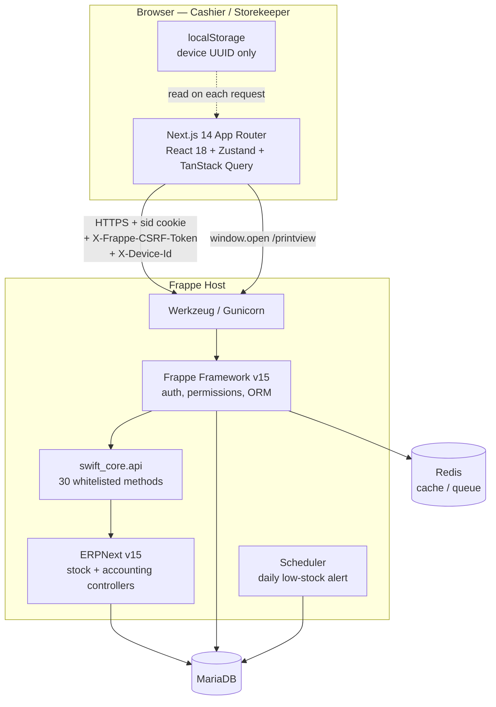

**Two properties of this diagram matter most.**

First, the arrow from `swift_core.api` to ERPNext is one-directional and total: Swift calls ERPNext controllers, and ERPNext writes to the database. Swift itself performs almost no direct writes to transactional tables. Second, printing bypasses the frontend entirely — the browser opens Frappe's own print view on the Frappe origin, which is why receipt assets resolve correctly.

---

## Backend Architecture

### Application Structure

`swift_core` is a standard Frappe app with a deliberately flat interior.

```
swift_core/
├── hooks.py       ← Frappe reads this to discover the app
├── api.py         ← every endpoint and every helper (~2,783 lines)
├── stock/
│   └── low_stock.py
└── swift/doctype/swift_pos_settings/
```

`hooks.py` is almost entirely commented-out boilerplate. Only two declarations are active:

```python
fixtures = [
    {"dt": "Role"}, {"dt": "Role Profile"}, {"dt": "Workspace"},
    {"dt": "Module Def"}, {"dt": "Item Group"}, {"dt": "Price List"},
    {"dt": "Mode of Payment"}, {"dt": "POS Profile"},
    {"dt": "Custom Field", "filters": [["dt", "in", ["Sales Invoice"]]]},
]

scheduler_events = {
    "daily": ["swift_core.stock.low_stock.check_low_stock"]
}
```

There are **no document event hooks**. Swift does not subscribe to `on_submit`, `validate`, or any other ERPNext document lifecycle event. All behaviour is initiated by an HTTP request. This is important when debugging: if something happens to a document, an API call caused it, not a hook.

### There Is No Service Layer

This is the single most consequential structural fact about the backend, and it should be understood before reading any code.

`api.py` contains three kinds of function, interleaved in one file:

| Kind | Marker | Count | Reachable from HTTP |
|---|---|---|---|
| Endpoints | `@frappe.whitelist()` | 30 | Yes |
| Private helpers | leading `_` | ~30 | No |
| Shared resolvers | no underscore, not whitelisted | several | No |

There is no `services/`, no `controllers/`, no per-domain module. Business logic lives directly inside the endpoint functions, with common concerns factored into helpers in the same file.

> **Note**
> This is not a recommendation — it is a description. Splitting `api.py` is listed as technical debt in `18_Future_Roadmap.md`. Until that happens, treat "the backend" and "`api.py`" as synonyms.

### Layered View of a Request

Even without a service layer, every write endpoint follows the same internal sequence. Understanding this five-step shape makes all 30 endpoints readable:

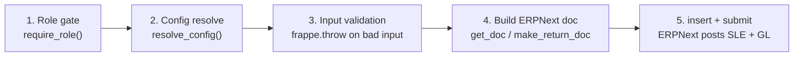

1. **Role gate.** `require_role("Swift Cashier")` or `_require_any_role(...)` raises `frappe.PermissionError` before anything else happens.
2. **Config resolve.** `resolve_config()` reads `Swift POS Settings`, follows the link to the `POS Profile`, and returns company, warehouse, price list, currency, cost center, and payment modes. No business value is hardcoded.
3. **Input validation.** Explicit `frappe.throw()` calls with translated messages.
4. **Document construction.** A native ERPNext document is built in memory.
5. **Submit.** `.insert()` then `.submit()`. ERPNext's controllers post the Stock Ledger Entries and GL Entries.

### Configuration Resolution

Configuration is a two-hop lookup, and both hops are required:

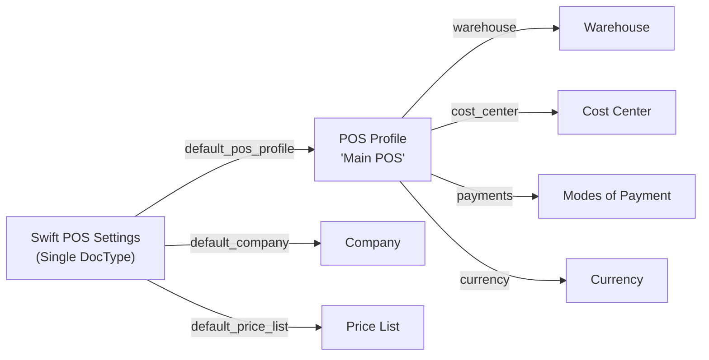

`Swift POS Settings` is a Frappe **Single** — one row, no name, edited in the desk. It holds six fields; the three `reqd` links are the entry point to everything else. See `04_Database.md`.

> **Warning**
> The warehouse resolved from the POS Profile is `Stores - S`, which in the reference configuration is a **group** warehouse. Group warehouses cannot hold stock. Swift works around this at runtime by resolving a real leaf warehouse per line (`_sale_warehouse`). This workaround, and the bug it once caused on returns, is documented in `09_Return_Workflow.md` and `17_Troubleshooting.md`.

### Security Model

Three independent layers, all server-side:

| Layer | Mechanism | Enforced by |
|---|---|---|
| Authentication | `sid` session cookie | Frappe |
| CSRF | `X-Frappe-CSRF-Token` header on writes | Frappe |
| Authorization | `require_role()` / `_require_any_role()` at the top of each endpoint | `swift_core` |

Frappe's own DocType permission system is a fourth layer, but Swift partially bypasses it with `ignore_permissions=True` on specific document operations. The rationale — and why that is defensible here — is explained in `02_Backend.md` and `14_Permissions.md`.

---

## Frontend Architecture

### Component Hierarchy

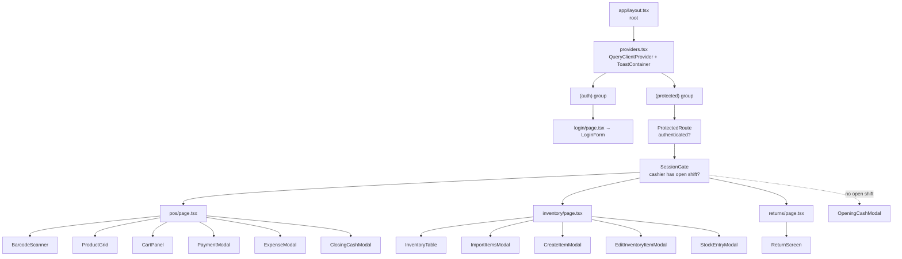

The `(protected)` layout composes two gates in sequence. `ProtectedRoute` answers "is there a valid session?" by calling `me()`. `SessionGate` then answers, **for cashiers only**, "is there an open shift?" — and if not, it renders `OpeningCashModal` non-dismissibly over a blocking spinner. A cashier physically cannot reach the POS screen without opening a shift. Storekeepers skip the second gate entirely.

### State Management

State is split across two systems by ownership, which is the cleanest thing about the frontend:

| System | Owns | Stores / keys |
|---|---|---|
| **Zustand** | Client-only state | `authStore`, `cartStore`, `posSessionStore`, `uiStore` |
| **TanStack Query** | Server-owned state | `["item_search", …]`, inventory queries |

**No Zustand store uses `persist` middleware.** Nothing survives a page reload except the device UUID in `localStorage`. Auth state is rehydrated by calling `me()` on mount. This is correct for a cookie-based system: the cookie is the source of truth, and a stale client-side "logged in" flag can never contradict it.

Query defaults (`providers.tsx`):

```ts
staleTime: 5 * 60 * 1000,   // 5 minutes
gcTime:   10 * 60 * 1000,   // 10 minutes
retry: 1,
refetchOnWindowFocus: false,
```

`refetchOnWindowFocus: false` is deliberate for a POS: a cashier switching windows must not trigger a refetch that reorders the product grid mid-transaction.

### Data Fetching

Every request goes through one axios instance (`lib/axios.ts`) wrapped by one typed module (`lib/api.ts`). No component calls `fetch` or constructs a URL. The axios instance applies four transformations:

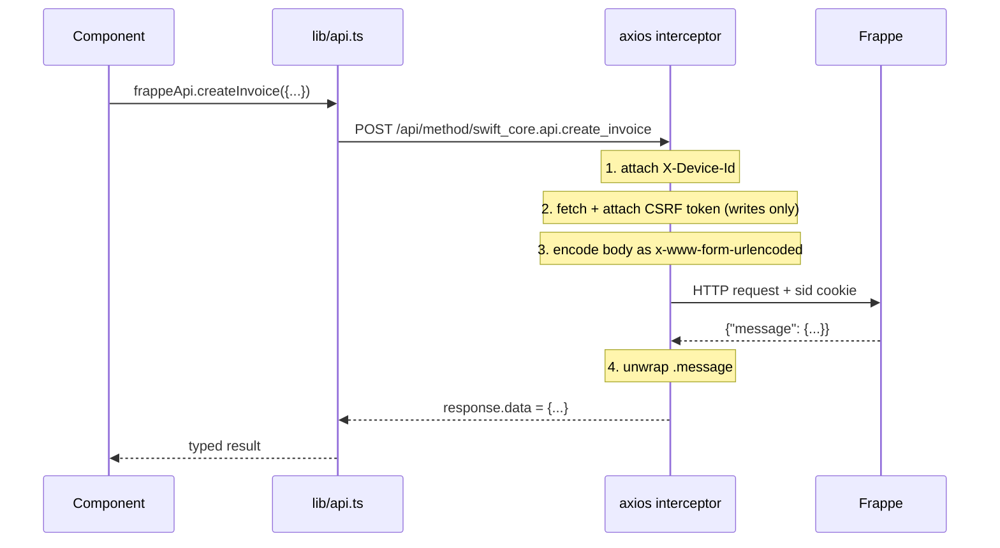

Two details are worth internalising:

**Form encoding.** Frappe whitelisted methods expect `application/x-www-form-urlencoded`, not JSON. The request interceptor converts object bodies into `URLSearchParams`, `JSON.stringify`-ing any nested object or array. This is why `items` and `payments` arrive at the backend as JSON strings and every endpoint that accepts them calls `json.loads` on a string input.

**Response unwrapping.** Frappe wraps every whitelisted return value in `{"message": ...}`. The response interceptor strips that wrapper, so `response.data` is the payload itself.

### Error Handling

`extractFrappeError()` (`lib/utils.ts`) normalises Frappe's several error shapes into one string, in priority order:

1. `_server_messages` — a JSON-encoded array of JSON-encoded objects (Frappe's `frappe.throw` format). Double-parsed.
2. `exception` — first line, with the leading exception class stripped.
3. `message` — if a plain string.
4. `statusText`, then generic fallbacks.

The response interceptor additionally handles two statuses globally:

- **400 with `/csrf/i` in the body** → clear the cached token, fetch a fresh one, retry **once**. The match is deliberately narrow: Frappe returns 400 for ordinary validation failures too, and a blanket 400 retry would double-submit invoices.
- **401** → clear the token, clear `authStore`, hard-redirect to `/login`.

---

## The Request/Response Cycle

A complete round trip, using invoice creation as the example:

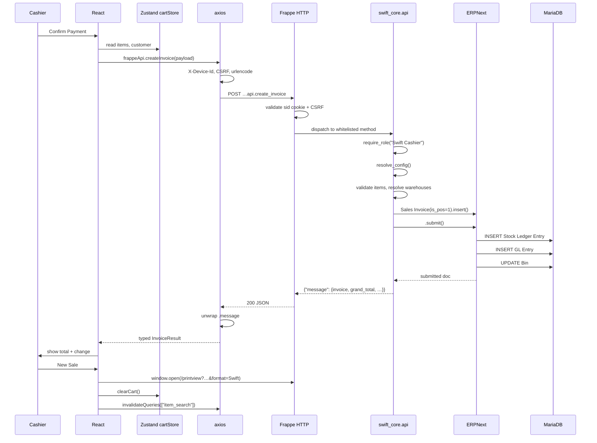

On failure at any server step, Frappe rolls back the transaction, returns a non-2xx with `_server_messages`, `extractFrappeError` unwraps it, and the modal shows the message with the cart intact so the cashier can retry.

---

## Authentication Flow

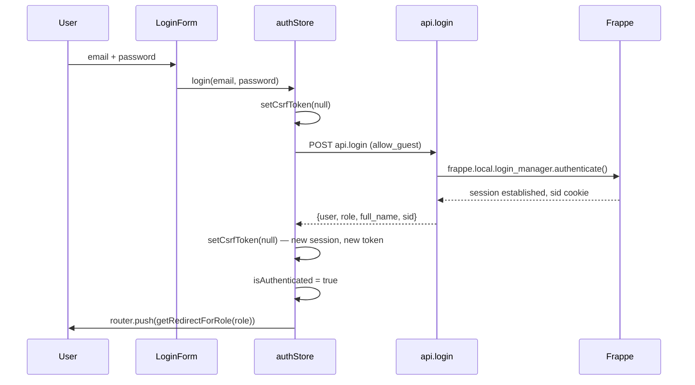

`login` is the only `allow_guest` endpoint and the only one exempt from the CSRF interceptor — it necessarily runs before a session exists. The CSRF token is cleared twice, before and after, because a new session invalidates any token cached from a previous one (including one from a Frappe desk session in another tab).

Role determines the landing route:

| Role | Redirect |
|---|---|
| `Swift Cashier` | `/pos` |
| `Swift Storekeeper` | `/inventory` |
| anything else | `/login` |

Full detail in `06_Authentication.md`.

---

## POS Flow

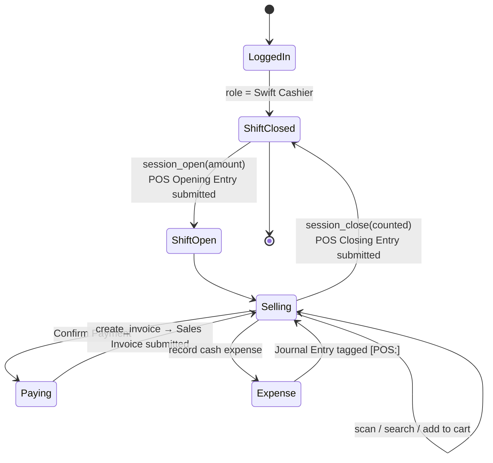

A heartbeat fires every 30 seconds while a shift is open (`useSessionHeartbeat`), keeping the session's last-activity timestamp current. Full detail in `07_POS_Workflow.md`.

## Sales Flow

The sale is one submitted document, and ERPNext does the posting:

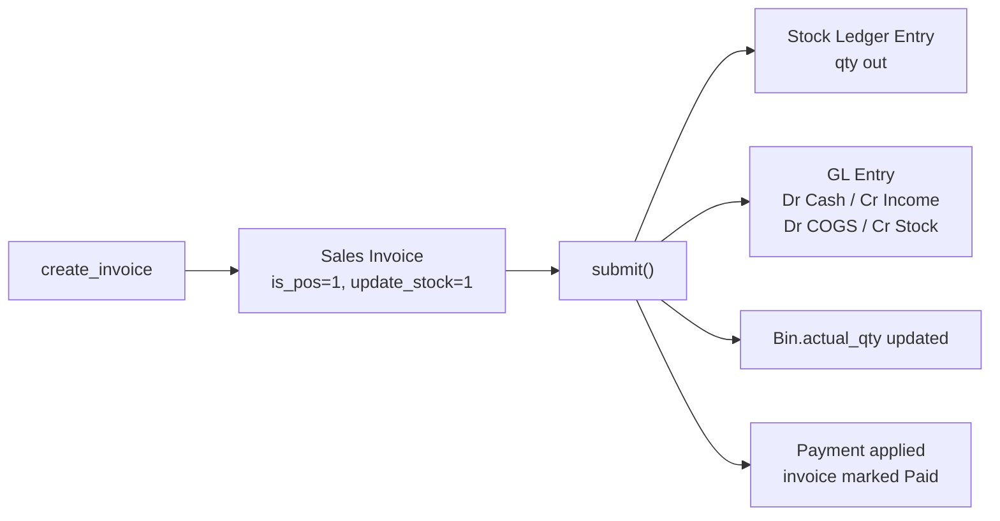

Detail in `08_Sales_Workflow.md`.

## Return Flow

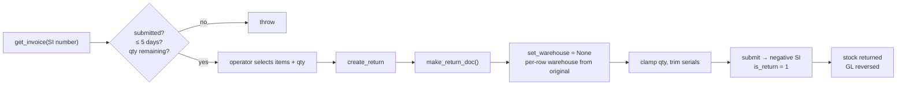

Returns are keyed on invoice number only. The `set_warehouse = None` step is not cosmetic: without it, ERPNext pushes the POS Profile's group warehouse down onto every row and the Stock Ledger Entry is rejected. Detail in `09_Return_Workflow.md`.

## Inventory Flow

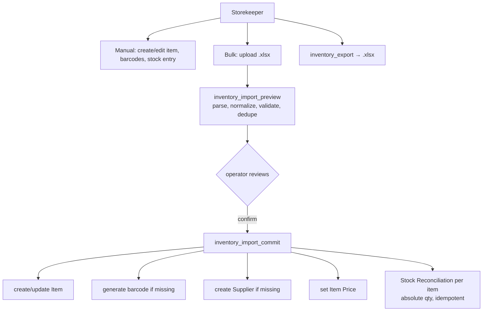

Import is deliberately two-phase: preview computes and validates everything without writing, and commit re-does the work transactionally with a per-item savepoint so one bad row cannot abort the batch. Detail in `10_Stock_Workflow.md`.

## Print Flow

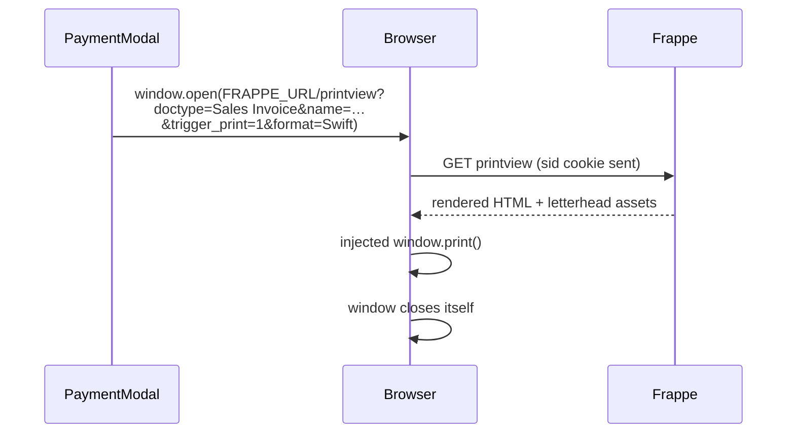

The receipt is **not** rendered by React. It is Frappe's own print view, opened as a real window on the Frappe origin. Two reasons, both learned from failures:

1. **Origin.** Letterhead assets are stored root-relative (`/files/...`). Inside an iframe on `localhost:3000` they resolve against the wrong host and the logo breaks.
2. **Viewport width.** The browser derives print scale from layout width. A narrow popup produced a different scale than the desk's full-width print page, so fonts and receipt size came out wrong.

`trigger_print=1` makes Frappe inject `window.print()` and a self-close. Detail in `16_Printing.md`.

---

## Architectural Constraints

These are enforced rules for anyone extending the system. Violating them breaks the guarantees above.

| Constraint | Reason |
|---|---|
| Do not create custom transactional DocTypes | Native documents keep ERPNext reporting and upgrades working |
| Do not write Stock Ledger Entries or GL Entries directly | ERPNext controllers own posting; manual writes desynchronise the books |
| Do not bypass ERPNext validation | Validation is what prevents negative stock and unbalanced entries |
| Do not enable "Allow Negative Stock" | A sale with insufficient stock must fail |
| Do not hardcode company, warehouse, price list, UOM, or item group | All must resolve from configuration |
| Do not use raw SQL unless unavoidable | The ORM applies permissions and keeps the cache coherent |
| Keep `POS Opening/Closing Entry` for shifts only | They must not post stock, GL, payments, or consolidated invoices |
