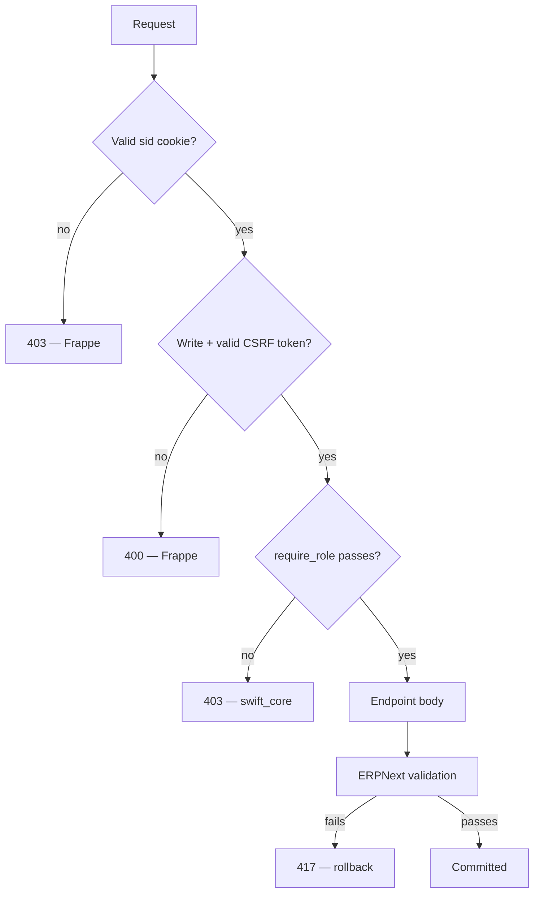
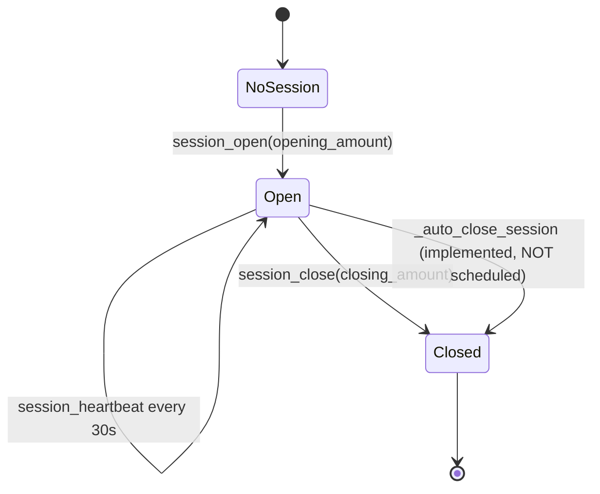

# 02 — Backend

## Scope

This document explains how the `swift_core` backend is built: its structure, how endpoints are registered and routed, every hook, every shared utility, the security model, and how sessions are handled. Endpoint-by-endpoint request and response detail lives in `05_API.md`; this document explains the machinery those endpoints run inside.

---

## App Structure

```
apps/swift_core/
├── pyproject.toml
├── .pre-commit-config.yaml
├── license.txt                       MIT
├── README.md                         bench scaffolding, not project docs
└── swift_core/
    ├── __init__.py                   __version__ = "0.0.1"
    ├── hooks.py                      app metadata, fixtures, scheduler
    ├── api.py                        ~2,783 lines — all endpoints + all logic
    ├── modules.txt                   "swift"
    ├── patches.txt                   empty (no migration patches)
    ├── config/__init__.py            empty
    ├── templates/                    empty scaffolding
    ├── stock/low_stock.py            daily alert
    ├── swift/doctype/swift_pos_settings/
    └── fixtures/                     9 JSON files
```

Thirteen Python files exist. Two contain logic: `api.py` and `stock/low_stock.py`. The rest are `__init__.py` files, empty scaffolding, or a controller with no body.

### The Single-Module Design

`api.py` holds every endpoint and every helper. There is no service layer, no router module, and no per-domain package.

**Consequences you will feel immediately:**

- Every backend change is a change to one file. Merge conflicts are likely if two people work concurrently.
- Import cycles are impossible, so helpers can be reordered freely.
- Finding code means searching `api.py`, not navigating a tree.
- There is no unit-testable seam between HTTP handling and business logic. This is the main reason the app has no tests.

Splitting this file is tracked in `18_Future_Roadmap.md`. Until then, `api.py` *is* the backend.

### Module Docstring Is Stale

The docstring at the top of `api.py` references a module path (`swift_pos.api.v1.api`) and a file (`hooks_snippet.py`) that do not exist in this app. It predates a rename. **Do not trust it.** The correct base path is `swift_core.api`, confirmed by `hooks.py`, by the frontend's `API_BASE_PATH`, and by the actual file location.

---

## Endpoint Registration and Routing

### How Registration Works

Swift defines no URL routes. Frappe exposes any function decorated with `@frappe.whitelist()` at a URL derived from its dotted Python path:

```
/api/method/<module.path>.<function_name>
```

For `swift_core/api.py`, that is:

```
/api/method/swift_core.api.create_invoice
```

The frontend hardcodes the prefix once, in `src/config/constants.ts`:

```ts
export const API_BASE_PATH = "/api/method/swift_core.api";
```

There is no versioning in the path. Adding an endpoint requires only adding a decorated function; no registration step, no route table.

### HTTP Method Enforcement

Every endpoint except `login` declares its allowed methods, and Frappe rejects mismatches with **405**:

```python
@frappe.whitelist(methods=["POST"])
def create_invoice(items=None, payments=None, customer=None):
```

| Method | Endpoints |
|---|---|
| `GET` | `me`, `session_current`, `item_by_barcode`, `item_search`, `get_invoice`, `session_invoices`, `get_item`, `validate_barcode`, `get_stock_entry`, `list_warehouses`, `list_import_warehouses`, `list_item_groups`, `list_suppliers`, `pos_config`, `inventory_list`, `inventory_export` |
| `POST` | `login`, `logout`, `session_open`, `session_heartbeat`, `session_close`, `create_invoice`, `create_return`, `create_item`, `add_item_barcode`, `add_serial_number`, `create_stock_entry`, `create_expense`, `inventory_import_preview`, `inventory_import_commit` |
| `PUT` | `update_item`, `update_inventory_item` |
| `DELETE` | `remove_item_barcode` |

### Guest Access

Exactly one endpoint is reachable without a session:

```python
@frappe.whitelist(allow_guest=True, methods=["POST"])
def login(email=None, password=None):
```

Every other endpoint returns **403** to an unauthenticated caller before its body runs.

### Argument Handling

Frappe passes request parameters as **strings**. Endpoints that accept structured data therefore accept either a JSON string or an already-parsed object, because the frontend's axios interceptor `JSON.stringify`s nested values into form fields:

```python
if isinstance(items, str):
    items = json.loads(items)
```

`update_item` uses `**fields` to accept an arbitrary field set, then filters against an allow-list (see *Utilities* below).

---

## The Complete Endpoint Inventory

All 30 whitelisted methods, with signature, line number, and the role gate enforced on entry. Full request/response detail is in `05_API.md`.

### Authentication and Session

| Line | Signature | Method | Role gate |
|---|---|---|---|
| 94 | `login(email=None, password=None)` | POST | *(guest)* |
| 122 | `logout()` | POST | authenticated |
| 129 | `me()` | GET | authenticated |
| 157 | `session_current()` | GET | `Swift Cashier` |
| 176 | `session_open(opening_amount=None)` | POST | `Swift Cashier` |
| 241 | `session_heartbeat(opening_entry=None, state="idle")` | POST | `Swift Cashier` |
| 345 | `session_close(closing_amount=None)` | POST | `Swift Cashier` |

### Selling

| Line | Signature | Method | Role gate |
|---|---|---|---|
| 451 | `item_by_barcode(barcode=None)` | GET | `Swift Cashier` |
| 499 | `item_search(q=None)` | GET | `Swift Cashier` |
| 532 | `create_invoice(items=None, payments=None, customer=None)` | POST | `Swift Cashier` |
| 808 | `get_invoice(invoice_name)` | GET | `Swift Cashier` |
| 851 | `session_invoices(opening_entry)` | GET | `Swift Cashier` |
| 1249 | `create_expense(amount=None, expense_account=None, remarks=None)` | POST | `Swift Cashier` |

### Returns

| Line | Signature | Method | Role gate |
|---|---|---|---|
| 676 | `create_return(invoice_name, items=None, reason=None)` | POST | `Swift Cashier` |

### Items and Stock

| Line | Signature | Method | Role gate |
|---|---|---|---|
| 871 | `create_item(item_name=None, item_group=None, uom=None, opening_stock=0, warehouse=None, item_code=None, barcodes=None, valuation_rate=None, selling_price=None)` | POST | `Swift Storekeeper` |
| 949 | `update_item(item_code, **fields)` | PUT | `Swift Storekeeper` |
| 987 | `get_item(item_code)` | GET | either role |
| 1024 | `validate_barcode(barcode)` | GET | `Swift Storekeeper` |
| 1033 | `add_item_barcode(item_code, barcode)` | POST | `Swift Storekeeper` |
| 1051 | `remove_item_barcode(item_code, barcode)` | DELETE | `Swift Storekeeper` |
| 1067 | `add_serial_number(item_code, serial_no)` | POST | `Swift Storekeeper` |
| 1099 | `create_stock_entry(stock_entry_type=None, items=None)` | POST | `Swift Storekeeper` |
| 1156 | `get_stock_entry(name)` | GET | `Swift Storekeeper` |

### Reference Data

| Line | Signature | Method | Role gate |
|---|---|---|---|
| 1166 | `list_warehouses()` | GET | `Swift Storekeeper` |
| 1172 | `list_import_warehouses()` | GET | `Swift Storekeeper` |
| 1206 | `list_item_groups()` | GET | `Swift Storekeeper` |
| 1212 | `list_suppliers()` | GET | `Swift Storekeeper` |
| 1227 | `pos_config()` | GET | either role |

### Inventory Management

| Line | Signature | Method | Role gate |
|---|---|---|---|
| 2114 | `inventory_import_preview()` | POST | `Swift Storekeeper` |
| 2408 | `inventory_import_commit()` | POST | `Swift Storekeeper` |
| 2660 | `inventory_list(search=None, supplier=None, barcode=None, limit=100, start=0)` | GET | `Swift Storekeeper` |
| 2667 | `inventory_export(search=None, supplier=None, barcode=None)` | GET | `Swift Storekeeper` |
| 2706 | `update_inventory_item(...)` | PUT | `Swift Storekeeper` |

> **Note**
> Three endpoints are implemented and reachable but **not called by the frontend**: `session_invoices`, `add_serial_number`, and `get_stock_entry`. They are functional API surface with no UI. This is not dead code — it is unused API. Treat it as supported when writing clients.

---

## Hooks

`hooks.py` is mostly commented-out boilerplate from `bench new-app`. This section documents everything that is **active**, and states plainly what is not.

### App Metadata

```python
app_name = "swift_core"
app_title = "swift"
app_publisher = "moustafa"
app_description = "a mangment system"
app_email = "moustafa@swift.com"
app_license = "mit"
```

*(The typo in `app_description` is present in the source.)*

### Fixtures

```python
fixtures = [
    {"dt": "Role"},
    {"dt": "Role Profile"},
    {"dt": "Workspace"},
    {"dt": "Module Def"},
    {"dt": "Item Group"},
    {"dt": "Price List"},
    {"dt": "Mode of Payment"},
    {"dt": "POS Profile"},
    {"dt": "Custom Field", "filters": [["dt", "in", ["Sales Invoice"]]]},
]
```

Only the `Custom Field` entry is filtered. The other eight export **every record of that DocType on the site**, including records owned by Frappe and ERPNext. This has real consequences on `bench migrate` — see `15_Fixtures.md`.

### Scheduler Events

```python
scheduler_events = {
    "daily": ["swift_core.stock.low_stock.check_low_stock"]
}
```

**One scheduled job exists.** It sends the daily low-stock email.

> **Warning**
> `auto_close_inactive_sessions()` (line 1345) has a docstring stating it runs "every 5 minutes via cron". **It is not registered in `scheduler_events` and therefore never runs automatically.** Inactive sessions are not auto-closed in the deployed system. See `17_Troubleshooting.md`.

### Hooks That Are NOT Configured

Stated explicitly so nobody goes looking:

| Hook | Status |
|---|---|
| `doc_events` | **Not configured.** Swift subscribes to no document lifecycle events. |
| `override_whitelisted_methods` | **Not configured.** |
| `permission_query_conditions` / `has_permission` | **Not configured.** No row-level permission logic. |
| `before_install` / `after_install` / `after_migrate` | **Not configured.** No setup automation. |
| `app_include_js` / `app_include_css` | **Not configured.** Swift ships no desk assets. |
| `website_route_rules`, `portal_menu_items` | **Not configured.** No public web pages. |
| `jinja` methods | **Not configured.** |
| `patches.txt` | **Empty.** No migration patches have ever been written. |

The absence of `doc_events` is a genuine architectural property: **all Swift behaviour is request-initiated.** If a document changed, an API call did it.

---

## Utilities

Roughly thirty non-whitelisted helpers live in `api.py`. These are the ones you must understand to read any endpoint.

### Configuration Resolution

```python
def get_settings():          # line 32  — the Swift POS Settings Single
def get_pos_profile_doc():   # line 37  — follows default_pos_profile
def resolve_config():        # line 44  — the merged config dict
```

`resolve_config()` is called by nearly every endpoint and returns:

| Key | Source |
|---|---|
| `company` | `Swift POS Settings.default_company` |
| `pos_profile` | `Swift POS Settings.default_pos_profile` |
| `price_list` | `Swift POS Settings.default_price_list` |
| `warehouse` | `POS Profile.warehouse` |
| `currency` | `POS Profile.currency` |
| `cost_center` | `POS Profile.cost_center` |
| `payment_modes` | `POS Profile.payments[]` |

This is the mechanism that satisfies the "never hardcode configurable values" rule. Any new endpoint needing a business value must call `resolve_config()` rather than embedding a literal.

### Role Gates

```python
def require_role(role):              # line 63
def _require_any_role(*roles):       # line 69
```

Both raise `frappe.PermissionError` (HTTP **403**) when the current user lacks the role. `System Manager` and `Administrator` are treated as satisfying any gate, so administrators can exercise the API. Details in `14_Permissions.md`.

### Device Identity

```python
def current_device_id():   # line 81
```

Reads the `X-Device-Id` request header, which the frontend sets from a UUID persisted in `localStorage`. Used to enforce single-device sessions when `allow_multi_device_session` is `0`.

### Stock Resolution

```python
def _available_qty(item_code, company):                              # line 399
def _stock_warehouses(company):                                      # line 415
def _sale_warehouse(item_code, qty, company, preferred=None):        # line 427
```

`_stock_warehouses()` returns only **leaf** warehouses (`is_group = 0`) for the company. `_sale_warehouse()` picks a warehouse that actually holds enough stock for the line.

This trio exists because the configured POS warehouse (`Stores - S`) is a **group** node, and group warehouses cannot hold stock. Rather than requiring reconfiguration, Swift resolves a real leaf warehouse per line at sale time.

> **Warning**
> This is the root of the historic return bug. `create_invoice` sets `inv.set_warehouse = config["warehouse"]` — the group node — while individual rows carry real leaf warehouses. On return, ERPNext copies `set_warehouse` and pushes it down onto every row, producing `Group node warehouse is not allowed to select for transactions`. `create_return` explicitly clears it. See `09_Return_Workflow.md`.

### Shift Closing

```python
def _build_closing_from_opening(closing, opening_doc, closing_amount):  # line 259
```

Populates a `POS Closing Entry` from its opening. Three deliberate behaviours:

1. **`pos_transactions` is left empty.** Populating it would make ERPNext attempt POS-Invoice consolidation, which would double-post stock and GL — the sales are already submitted `Sales Invoice` documents.
2. **Expected cash is reduced by shift expenses**, found by their `[POS:<opening_name>]` user-remark tag.
3. Difference = counted − expected, returned to the cashier.

### Auto-Close

```python
def auto_close_inactive_sessions():                      # line 1345
def _auto_close_session(opening_entry_name, user):       # line 1386
```

`_auto_close_session` impersonates the session owner with `frappe.set_user(user)` and restores `Administrator` in a `finally` block. The impersonation is necessary because the closing entry must be attributed to the cashier, not to the scheduler.

**Neither function is scheduled.** They are complete, correct, and unreachable in normal operation.

### Import Pipeline

The Excel importer is the largest subsystem, spanning roughly lines 1502–2500.

| Helper | Line | Purpose |
|---|---|---|
| `_normalize_text` | 1502 | Strips 17 invisible Unicode codepoints, applies NFC composition |
| `_match_key` | 1537 | Casefolded key for fuzzy matching |
| `_first_existing` | 1547 | First record matching filters, oldest first |
| `_resolve_company` / `_resolve_item_group` / `_resolve_stock_uom` / `_resolve_warehouse` / `_resolve_price_list` | 1559–1618 | Configured-value resolution with fallbacks |
| `_import_config` | 1631 | Assembles the import context |
| `_generate_barcode` | 1717 | Generates a barcode when a row has none |
| `_ensure_supplier` | 1754 | Finds or creates a Supplier |
| `_set_item_price` | 1799 | Creates/updates an Item Price |
| `_find_item_by_name` | 1837 | Normalized name lookup |
| `_parse_import_rows` | 1884 | Sheet → row dicts via column aliases |
| `_validate_import_row` | 1970 | Per-row validation with typed numeric parsing |
| `_collapse_duplicate_rows` / `_merge_import_rows` | 2021 / 2060 | Duplicate handling within one sheet |
| `_read_uploaded_xlsx` | 2089 | Reads upload; **`.xlsx` only, 10 MB limit** |
| `_apply_import_row` | 2168 | Creates/updates the Item |
| `_reconcile_stock` | 2292 | Per-item Stock Reconciliation with savepoints |
| `_inventory_rows` | 2502 | Shared query for list and export |

The Unicode normalization exists because supplier sheets arrive in Arabic, where invisible directional marks and non-composed forms make naive string comparison fail. See `10_Stock_Workflow.md`.

### Return Validation

```python
def _returnable_invoice(invoice_name):   # line 777
```

The single source of truth for return eligibility: the invoice must exist, be submitted, not itself be a return, and fall inside the five-day window. Called by both `get_invoice` (to display) and `create_return` (to enforce), so the screen and the submit path cannot disagree.

---

## Security Model

### Defence Layers



| Layer | Enforced by | Failure |
|---|---|---|
| Session | Frappe (`sid` cookie) | 403 |
| CSRF | Frappe (`X-Frappe-CSRF-Token`) | 400 |
| Role | `swift_core` role gates | 403 |
| Business validation | endpoint bodies (`frappe.throw`) | 417 |
| Document integrity | ERPNext controllers | 417 |

Frontend role checks (`ProtectedRoute`, `getRedirectForRole`) are **UX only**. Every endpoint re-checks server-side. A user calling the API directly with a valid cashier cookie cannot reach storekeeper endpoints.

### RBAC Implementation

Only two roles are enforced in code:

```python
require_role("Swift Cashier")
require_role("Swift Storekeeper")
_require_any_role("Swift Cashier", "Swift Storekeeper")
```

Other roles exist in fixtures (`Owner`, `Manager`, `Cashier`, `Technician`, `HR Officer`, `Accountant`), but **no endpoint gates on them**. They are desk-level roles for ERPNext screens, not API roles. `14_Permissions.md` covers this in full.

### Input Validation

| Threat | Mitigation |
|---|---|
| **SQL injection** | The ORM (`frappe.get_all`, `get_doc`, `db.get_value`) is used throughout; parameters are bound. |
| **Mass assignment** | `update_item` filters against `EDITABLE_ITEM_FIELDS = ("item_name", "item_group", "description", "disabled")`. Fields outside the tuple are silently dropped, so no client can set `valuation_rate` or `is_stock_item`. |
| **File upload abuse** | `_read_uploaded_xlsx` accepts `.xlsx` only and caps size at 10 MB. |
| **Over-return** | Quantities clamped against remaining returnable qty, computed from prior returns. |
| **Negative stock** | Never enabled. Insufficient stock fails the submit. |
| **XSS** | The API returns JSON; React escapes by default. **One exception:** `low_stock.py` interpolates item names into HTML via f-strings for the alert email. See `17_Troubleshooting.md`. |

### The `ignore_permissions=True` Question

`ignore_permissions=True` appears about 25 times. This looks alarming and needs a precise explanation.

**What it does:** skips Frappe's *DocType-level* permission check for that one operation.

**What it does not do:** skip the role gate. Every one of these calls sits inside a function that already called `require_role()`. Authorization has been decided before the document is touched.

**Why it is necessary here:** `Swift Cashier` and `Swift Storekeeper` are deliberately **not** granted desk-level write permission on `Sales Invoice`, `Stock Entry`, `Journal Entry`, or `Item`. That is the point — a cashier must be unable to open the Frappe desk and hand-edit an invoice. But the API must create those documents *on the cashier's behalf* within a controlled workflow. `ignore_permissions=True` is what lets the endpoint do the one specific thing the role is allowed to do, without granting the role broad document access.

The security posture is therefore:

> **Authorization is enforced at the API boundary, not at the DocType boundary.**

This is a legitimate pattern, and it holds **only** as long as every whitelisted endpoint begins with a role gate. Verified: all 30 do, except `login` (guest by design), `logout`, and `me` (which require only authentication).

> **Warning — When Extending**
> If you add an endpoint that calls `ignore_permissions=True` **without** a preceding `require_role()`, you create a privilege-escalation hole reachable by any authenticated user. This is the single most dangerous mistake available in this codebase. The checklist in `13_Coding_Standards.md` covers it.

### Known Security Findings

Recorded from source inspection; not yet remediated.

| # | Finding | Location | Impact |
|---|---|---|---|
| 1 | `Swift POS Settings` grants `write` **and** `delete` to `Swift Cashier` and `Swift Storekeeper` | `swift_pos_settings.json` permissions | A cashier with desk access can repoint company, POS profile, or price list — the configuration root for every endpoint |
| 2 | Low-stock alert interpolates item names into HTML with f-strings | `low_stock.py` | HTML injection into the alert email via a crafted item name |
| 3 | Hardcoded recipient address | `low_stock.py:43` | Alerts cannot be redirected without a code change |
| 4 | `list_warehouses` applies no company filter | `api.py:1166` | In a multi-company site, warehouses of other companies are listed |

Finding 1 is the most serious. Remediation is proposed in `18_Future_Roadmap.md`.

---

## Session Handling

### Two Distinct Meanings of "Session"

These are constantly confused. They are unrelated.

| | Frappe session | POS shift session |
|---|---|---|
| **What** | Authenticated login | Cashier's cash-drawer shift |
| **Stored in** | `sid` cookie + Frappe session table | `POS Opening Entry` / `POS Closing Entry` |
| **Created by** | `login` | `session_open` |
| **Ended by** | `logout` | `session_close` |
| **Applies to** | All users | Cashiers only |

A cashier can be logged in with no open shift — that is exactly the state `SessionGate` blocks on.

### Frappe Session Lifecycle

`login` delegates to `frappe.local.login_manager.authenticate()` and `.post_login()`. Swift does not implement password checking, hashing, or session token generation. On success it returns `user`, `role`, `full_name`, and `sid`, and Frappe sets the `sid` cookie.

The returned `role` is the *Swift* role — the first of `Swift Cashier` / `Swift Storekeeper` found on the user — not the full role list. That single value drives frontend routing.

### POS Shift Lifecycle



`session_open` (line 176):
1. Gates on `Swift Cashier`.
2. Rejects a second open shift for the same user.
3. If `allow_multi_device_session = 0`, rejects an open shift bound to a different `X-Device-Id`.
4. Creates and submits a `POS Opening Entry` with the counted float.

`session_close` (line 345) computes expected cash from cash sales minus tagged expenses, creates and submits the `POS Closing Entry`, and returns `expected_amount` and `difference`.

`session_heartbeat` (line 241) updates last-activity every 30 seconds. It exists to feed the auto-close logic — which is not scheduled — so **at present the heartbeat has no functional effect**. It is harmless and would become meaningful the moment auto-close is registered.

### Single-Device Enforcement

Controlled by `Swift POS Settings.allow_multi_device_session` (default `0` = single device enforced).

The device ID is a client-generated UUID in `localStorage`, sent as `X-Device-Id`. It is an **operational control, not a security control** — it prevents a cashier from accidentally running two tills, but it is trivially spoofable by a determined client. Do not rely on it for security.
