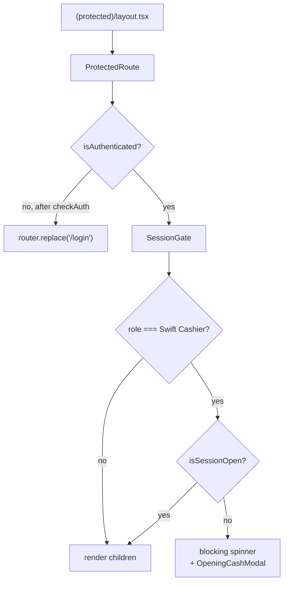
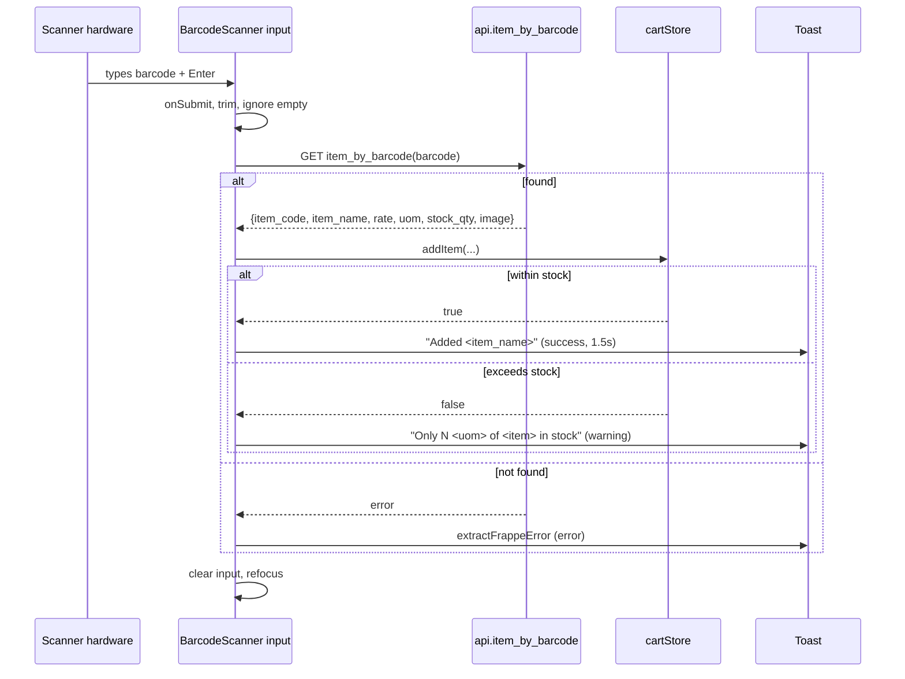

# 03 — Frontend

## Scope

The frontend is `swift-pos-frontend`, a standalone Next.js 14 application. It renders every screen a cashier or storekeeper sees. It contains **no business logic and no database access** — every operation is a call to a `swift_core` endpoint.

---

## Folder Structure

```
front/
├── package.json
├── tsconfig.json                   strict: true, @/* → ./src/*
├── next.config.mjs
├── tailwind.config.ts
├── .gitignore
├── logo/                           receipt logo asset
├── api.py                          ⚠ backend staging copy — NOT part of the build
└── src/
    ├── app/                        App Router
    │   ├── layout.tsx
    │   ├── providers.tsx
    │   ├── page.tsx                "/" role-based redirect
    │   ├── (auth)/
    │   │   ├── layout.tsx
    │   │   └── login/page.tsx
    │   └── (protected)/
    │       ├── layout.tsx          ProtectedRoute + SessionGate
    │       ├── pos/page.tsx
    │       ├── inventory/page.tsx
    │       └── returns/page.tsx
    ├── components/common/          Spinner, Button, Input, Modal, Toast
    ├── config/
    │   ├── env.ts
    │   └── constants.ts
    ├── lib/
    │   ├── axios.ts                the single HTTP client
    │   ├── api.ts                  typed endpoint wrappers
    │   ├── utils.ts                cn, device ID, error extraction
    │   └── formatting.ts           currency, date, time
    ├── stores/                     authStore, cartStore, posSessionStore, uiStore
    ├── types/                      api, auth, pos, cart, common
    └── features/
        ├── auth/
        │   ├── components/         LoginForm, ProtectedRoute
        │   ├── hooks/useAuth.ts
        │   └── services/authService.ts
        ├── pos/
        │   ├── components/         ProductGrid, CartPanel, BarcodeScanner,
        │   │                       PaymentModal, OpeningCashModal,
        │   │                       ClosingCashModal, ExpenseModal
        │   └── hooks/useSessionHeartbeat.ts
        ├── inventory/components/   ItemList, ItemDetail, InventoryTable,
        │                           CreateItemModal, EditInventoryItemModal,
        │                           StockEntryModal, ImportItemsModal
        └── returns/components/     ReturnScreen
```

49 TypeScript files. The organising principle is **feature folders for domain code, flat shared folders for infrastructure**. A component belongs in `features/<domain>/components/` unless it is domain-agnostic, in which case it goes in `components/common/`.

> **Warning — `front/api.py`**
> This is a copy of the *backend* `swift_core/api.py`, kept here because the development workflow edits it here and copies it into the bench. It is Python, it is not imported by anything in `src/`, and it is excluded by `.gitignore`. Do not mistake it for frontend code. See `12_Developer_Guide.md`.

---

## React Architecture

### App Router and Route Groups

Two route groups partition the app by authentication requirement. Route groups (parentheses) do not appear in URLs:

| Directory | URL | Guard |
|---|---|---|
| `app/page.tsx` | `/` | none — redirects by role |
| `app/(auth)/login/page.tsx` | `/login` | none |
| `app/(protected)/pos/page.tsx` | `/pos` | `ProtectedRoute` + `SessionGate` |
| `app/(protected)/inventory/page.tsx` | `/inventory` | `ProtectedRoute` + `SessionGate` |
| `app/(protected)/returns/page.tsx` | `/returns` | `ProtectedRoute` + `SessionGate` |

### Client Components Throughout

Every interactive file carries `"use client"`. There is no server-side data fetching, no Server Action, and no use of the App Router's server capabilities beyond routing and layout composition.

This is a deliberate consequence of the auth model: authentication is a `sid` cookie scoped to the **Frappe** origin, and all data fetching is browser-side with `withCredentials: true`. A server component on the Next.js host has no access to that cookie. The app is effectively a single-page application that uses Next.js for routing and build tooling.

### Provider Composition

```tsx
// app/providers.tsx
function makeQueryClient() {
  return new QueryClient({
    defaultOptions: {
      queries: {
        staleTime: 5 * 60 * 1000,
        gcTime: 10 * 60 * 1000,
        retry: 1,
        refetchOnWindowFocus: false,
      },
    },
  });
}
```

The client is created inside `useState(makeQueryClient)` so it is constructed once per browser session rather than once per module evaluation — the standard guard against sharing a cache across requests during SSR.

`ReactQueryDevtools` is mounted only when `process.env.NODE_ENV === "development"`, so it is absent from production bundles.

### The Two-Gate Protection Pattern



**`ProtectedRoute`** calls `checkAuth()` on mount if not already authenticated, showing `FullPageSpinner` while `isChecking`. It also enforces an optional `allowedRoles` prop by redirecting to the role's home route — though the protected layout does not currently pass that prop, so route-level role restriction is available but unused.

**`SessionGate`** applies only to cashiers. With no open shift it renders a non-dismissible `OpeningCashModal` (`showCloseButton={false}`, `closeOnOverlayClick={false}`) over a blocking spinner. There is no way past it except opening a shift.

> **Note**
> Because `/returns` sits inside `(protected)` with no `allowedRoles`, a storekeeper who navigates there directly loads the screen. The **backend** gates `get_invoice` and `create_return` on `Swift Cashier`, so every action fails with 403. The security boundary holds; the UX is imperfect. Noted in `18_Future_Roadmap.md`.

---

## State Management — Zustand

Four stores, no middleware, no persistence.

> **Note**
> **No store uses `persist`.** Only the device UUID is in `localStorage`. All application state is lost on reload and rebuilt from the server. This is correct for cookie-based auth: the cookie is the source of truth and a stale client flag can never contradict it.

### `authStore`

| State | Type |
|---|---|
| `user` | `string \| null` |
| `role` | `UserRole \| null` |
| `fullName` | `string \| null` |
| `isAuthenticated` | `boolean` |
| `isLoading` | `boolean` |
| `error` | `string \| null` |

| Action | Behaviour |
|---|---|
| `login(email, password)` | Clears CSRF, calls `login`, clears CSRF again, sets identity. Re-throws so callers can react. |
| `logout()` | Calls `logout`, ignores server failure, clears CSRF and all state. |
| `checkAuth()` | Calls `me()`; on failure resets to the initial state. Never throws. |
| `clearAuth()` | Local reset — called by the axios 401 handler. |
| `clearError()` | Clears the error field. |

The CSRF token is cleared **twice** during login, before and after. A new session invalidates any previously cached token, including one obtained from a Frappe desk session in another browser tab.

`checkAuth` deliberately swallows errors: a failed `me()` means "not logged in", which is a normal state, not an error to surface.

### `cartStore`

| State | Type |
|---|---|
| `items` | `CartItem[]` |
| `customer` | `string \| null` |

| Action | Returns | Behaviour |
|---|---|---|
| `addItem(item)` | `boolean` | `false` if requested qty exceeds `stock_qty` |
| `updateQty(item_code, qty)` | `boolean` | `qty <= 0` removes the line; over-stock returns `false` |
| `removeItem(item_code)` | — | Removes the line |
| `clearCart()` | — | Empties items **and** clears customer |
| `setCustomer(customer)` | — | Sets the customer |
| `getTotal()` | `number` | Σ `rate × qty` |
| `getItemCount()` | `number` | Σ `qty` |

The `boolean` return on `addItem` / `updateQty` is the notable design choice: the store refuses the mutation and lets the caller decide how to inform the user, rather than throwing or silently clamping. `BarcodeScanner` uses it to show `Only N <uom> of <item> in stock`.

This is **client-side pre-validation only**. The backend re-checks stock at submit and is the real enforcement point.

### `posSessionStore`

| State | Type |
|---|---|
| `openingEntry` | `string \| null` |
| `openingTime` | `string \| null` |
| `openingAmount` | `number \| null` |
| `isSessionOpen` | `boolean` |
| `isChecking` / `isOpening` | `boolean` |
| `error` | `string \| null` |

| Action | Behaviour |
|---|---|
| `checkCurrentSession()` | Calls `session_current`; sets shift state from `exists` |
| `openSession(amount)` | Calls `session_open`; re-throws on failure |
| `closeSession(amount)` | Calls `session_close`; returns `{closing_entry, expected_amount, difference}` |
| `clearSession()` / `clearError()` | Local resets |

> **Warning — Known Defect**
> `closeSession` returns only `closing_entry`, `expected_amount`, and `difference`. But `ClosingCashModal` reads `result.total_expenses` to render the "Expenses (deducted)" row. That property is never populated, so the row is **always hidden** — even when the backend deducted expenses from expected cash. The displayed difference is still correct; only the explanatory line is missing. Fix documented in `17_Troubleshooting.md`.
>
> Relatedly, `SessionOpenResponse` declares `period_start_time`, but the store reads `data.period_start_date`. `openingTime` is therefore `undefined` after opening a shift, though it is populated correctly by `checkCurrentSession` on reload.

### `uiStore`

Holds `showOpeningCashModal`, `isLoggingOut`, and the toast queue. Toast IDs come from a module-level counter (`toast-1`, `toast-2`, …) rather than a random UUID — sufficient because IDs need only be unique within one page lifetime.

`isLoggingOut` exists to suppress the flash of a login redirect while logout is in flight; `SessionGate` renders "Logging out…" instead of bouncing the user.

---

## Axios Configuration

`lib/axios.ts` is the only place HTTP is configured. Everything else calls `lib/api.ts`.

```ts
const apiClient = axios.create({
  baseURL: env.FRAPPE_URL,
  withCredentials: true,
});
```

`withCredentials: true` is mandatory — it sends the Frappe `sid` cookie cross-origin. Without it every request is anonymous.

### Request Interceptor

Four steps, in order:

**1. Device ID.** `X-Device-Id` from `getOrCreateDeviceId()` — a `crypto.randomUUID()` persisted in `localStorage` under `swift_pos_device_id`.

**2. CSRF token (writes only).** Frappe requires `X-Frappe-CSRF-Token` on writes when a session cookie is present. The token is fetched lazily from the supported session endpoint and cached in a module variable:

```ts
const CSRF_ENDPOINT = "/api/method/frappe.sessions.get_csrf_token";
```

Concurrent fetches are de-duplicated through a single in-flight promise, so a burst of writes triggers one token request.

`login` is exempt — it is `allow_guest` and necessarily runs before a session exists.

**3. Form encoding.** Frappe whitelisted methods expect `application/x-www-form-urlencoded`. Object bodies are converted to `URLSearchParams`, with nested objects and arrays `JSON.stringify`-ed:

```ts
if (typeof value === "object") {
  params.append(key, JSON.stringify(value));
} else {
  params.append(key, String(value));
}
```

`undefined` and `null` values are skipped entirely, so optional parameters are omitted rather than sent as the string `"undefined"`. `URLSearchParams` and `FormData` bodies pass through untouched — this is what lets the Excel upload work.

**This is why every backend endpoint accepting `items` or `payments` calls `json.loads` on a string.**

### Response Interceptor

**Success:** unwraps Frappe's envelope, so `response.data` is the payload rather than `{message: payload}`.

**Failure:** two global behaviours.

*CSRF retry.* Retried **once**, and only on a confirmed CSRF failure:

```ts
const isCsrfFailure = status === 400 && /csrf/i.test(serverText);
```

The narrowness is deliberate and important. Frappe returns 400 for ordinary validation errors too; a blanket 400 retry would double-submit non-idempotent writes and could create duplicate invoices. The `__csrfRetried` flag prevents a retry loop.

*401 handling.* Clears the token, clears `authStore`, and hard-navigates to `/login` via `window.location.href` (not the router) to guarantee a clean state teardown.

### Error Extraction

`extractFrappeError()` normalises Frappe's error shapes in priority order:

1. **`_server_messages`** — a JSON-encoded array of JSON-encoded objects. Double-parsed; this is what `frappe.throw()` produces and carries the human-readable message.
2. **`exception`** — first line only, leading exception class stripped.
3. **`message`** — when a plain string.
4. `statusText` → `"An error occurred"` → `"An unexpected error occurred"`.

---

## TanStack Query

### Configuration

| Option | Value | Rationale |
|---|---|---|
| `staleTime` | 5 min | Item and inventory data changes slowly |
| `gcTime` | 10 min | Cache survives navigation between screens |
| `retry` | 1 | One retry; avoids hammering a failing backend |
| `refetchOnWindowFocus` | `false` | **Critical for POS** — a cashier alt-tabbing must not reorder the product grid mid-sale |

### Cache Invalidation

The system uses explicit invalidation at the point of mutation rather than broad refetching. The canonical example is in `PaymentModal.handleDone()`:

```ts
queryClient.invalidateQueries({ queryKey: ["item_search"] });
```

A completed sale reduces stock, so cached search results are stale. Invalidating refetches in the background, keeping the grid's quantities and out-of-stock states correct without a page reload — which would destroy the cashier's session state.

### Mutations

Mutations are **not** implemented with `useMutation`. Every write is a direct `async` call to `frappeApi.*` inside a component handler, with `isSubmitting` / `isLoading` tracked in local `useState`.

This is a consistent, deliberate pattern across the codebase, not an oversight — but it means writes do not benefit from `useMutation`'s retry, rollback, or optimistic-update machinery. Migrating is proposed in `18_Future_Roadmap.md`.

---

## Routing and Protected Routes

Routes are centralised in `config/constants.ts`:

```ts
export const ROUTES = {
  LOGIN: "/login",
  POS: "/pos",
  INVENTORY: "/inventory",
} as const;
```

> **Note**
> `/returns` is **not** in `ROUTES`. It is a real, reachable route with a page file, but it is navigated to by literal string rather than through the constant. Adding it is a trivial consistency fix.

Role-based redirection is one function:

```ts
// features/auth/services/authService.ts
export function getRedirectForRole(role: UserRole | null): string {
  switch (role) {
    case ROLES.CASHIER:      return ROUTES.POS;
    case ROLES.STOREKEEPER:  return ROUTES.INVENTORY;
    default:                 return ROUTES.LOGIN;
  }
}
```

Used in three places: after login (`useAuth`), on the root page, and by `ProtectedRoute` when `allowedRoles` rejects the current role.

`useAuth.handleLogout` uses `window.location.href` rather than the router, forcing a full page load that guarantees every store and cache is discarded.

---

## Reusable Components

### `components/common/`

| Component | Key props |
|---|---|
| `Button` | `variant: "primary" \| "secondary" \| "danger"`, `size: "sm" \| "md" \| "lg"`, `isLoading`, `disabled`, `className`, plus native button props |
| `Input` | `label`, `error`, `type`, `value`, `onChange`, `disabled`, plus native input props |
| `Modal` | `isOpen`, `onClose`, `title`, `maxWidth`, `showCloseButton`, `closeOnOverlayClick`, `children` |
| `Spinner` / `FullPageSpinner` | `message` |
| `ToastContainer` | none — reads `uiStore` |

`Modal`'s `showCloseButton={false}` + `closeOnOverlayClick={false}` combination is what makes `OpeningCashModal` and the shift-closed confirmation non-dismissible.

`Button.isLoading` renders a spinner and disables the button, which is how every submit path prevents double-submission.

### Feature Components

| Component | Responsibility |
|---|---|
| `LoginForm` | Credential entry; delegates to `useAuth` |
| `ProtectedRoute` | Authentication gate |
| `BarcodeScanner` | Scan/search input; adds to cart |
| `ProductGrid` | Browsable item grid backed by `item_search` |
| `CartPanel` | Line items, qty editing, total |
| `PaymentModal` | Payment, invoice creation, receipt printing |
| `OpeningCashModal` | Shift open |
| `ClosingCashModal` | Shift close and reconciliation summary |
| `ExpenseModal` | Cash expense during a shift |
| `InventoryTable` | Paginated inventory with search/filter |
| `ItemList` / `ItemDetail` | Item browsing |
| `CreateItemModal` / `EditInventoryItemModal` | Item CRUD |
| `StockEntryModal` | Stock receipt/adjustment |
| `ImportItemsModal` | Two-phase Excel import |

### Styling

Tailwind utility classes inline, composed with `cn()`:

```ts
export function cn(...inputs: ClassValue[]) {
  return twMerge(clsx(inputs));
}
```

`twMerge` resolves conflicting Tailwind classes so a `className` prop reliably overrides a component default. A `primary-*` colour scale is defined in `tailwind.config.ts`. Icons come from `lucide-react`.

---

## Barcode Scanning Flow



Design points that make this work with real scanner hardware:

- A hardware barcode scanner is a keyboard that types fast and sends `Enter`. The component needs no device integration — it is a `<form>` with a text input, so `Enter` submits.
- `autoFocus` on mount and `inputRef.current?.focus()` in the `finally` block keep focus on the input permanently. The cashier can scan continuously without touching the mouse.
- The input is cleared **before** the toast, so the next scan is never appended to the previous value.
- The input is `disabled` while a lookup is in flight, preventing interleaved scans.
- The same input doubles as text search (placeholder: `Scan barcode or search...`).

---

## Receipt Generation and Printing

Printing is **not** React rendering. The browser opens Frappe's own print view.

```ts
const printReceipt = (invoiceName: string) => {
  const printUrl =
    `${env.FRAPPE_URL}/printview?doctype=Sales%20Invoice` +
    `&name=${encodeURIComponent(invoiceName)}` +
    `&trigger_print=1&format=Swift&no_letterhead=0`;

  window.open(printUrl, "swift_receipt");
};
```

| Parameter | Purpose |
|---|---|
| `doctype=Sales Invoice` | Swift sales are Sales Invoices, never POS Invoices |
| `name=<invoice>` | URL-encoded invoice name |
| `format=Swift` | The print format, stored **in the database** |
| `no_letterhead=0` | Letterhead enabled — this is what carries the logo |
| `trigger_print=1` | Frappe injects `window.print()` and a self-close |

Two failures drove this design, and both recur if you try to "improve" it by moving the receipt into an iframe or a React component:

1. **Origin.** Letterhead assets are stored root-relative (`/files/...`). Rendered inside the Next.js origin they resolve against `localhost:3000` and the logo breaks. Opening on the Frappe origin resolves them correctly.
2. **Viewport width.** The browser derives print scale from layout width. A narrow popup produced a different scale than Frappe's full-width print page, so the same format printed at the wrong font size and receipt width. Opening at the desk print page's size makes output identical.

The named window target `"swift_receipt"` reuses one window across sales instead of accumulating tabs.

Print is triggered in `handleDone()` — **before** `clearCart()` and `onClose()` — so the "New Sale" button both prints and resets in one action:

```ts
const handleDone = () => {
  if (result) printReceipt(result.invoice);
  clearCart();
  onClose();
  queryClient.invalidateQueries({ queryKey: ["item_search"] });
  showToast("Invoice created successfully", "success");
};
```

> **Warning**
> The `Swift` print format exists only in the site database. It is **not** in any fixture and is not version-controlled. A fresh deployment will not have it, and printing will fall back or fail. See `15_Fixtures.md` and `16_Printing.md`.

---

## Known Frontend Defects

Found by source inspection. All are real and reproducible.

| # | Defect | Location | Effect |
|---|---|---|---|
| 1 | `total_expenses` never returned by `closeSession` | `posSessionStore.ts` vs `ClosingCashModal.tsx:68` | Expenses row never renders on shift close |
| 2 | `period_start_time` vs `period_start_date` mismatch | `types/pos.ts:10` vs `posSessionStore.ts:65` | `openingTime` is `undefined` right after opening a shift |
| 3 | `formatCurrency` defaults to `USD`; every call site omits the currency | `lib/formatting.ts:1` | Amounts render as `$` although the system is entirely **EGP** |
| 4 | `/returns` not in `ROUTES`; no `allowedRoles` on the protected layout | `constants.ts`, `(protected)/layout.tsx` | Storekeepers can load the returns screen; all actions then 403 |
| 5 | `require("@/stores/authStore")` inside the axios error handler | `lib/axios.ts:138` | CommonJS `require` in an ESM module, used to dodge a circular import |

**Defect 3 is the most user-visible.** `pos_config` returns the real currency from the POS Profile (`EGP`), but no component passes it to `formatCurrency`. Every displayed amount — cart total, grand total, change, cash reconciliation — is labelled with a dollar sign. The *numbers* are correct; only the symbol is wrong. Printed receipts are unaffected, since they are rendered by Frappe.

---

## Build and Type Checking

```bash
npm run dev          # development server
npm run build        # production build
npm run start        # serve the production build
npm run lint         # eslint (eslint-config-next)
npm run type-check   # tsc --noEmit
```

`tsconfig.json` sets `strict: true`. `npm run type-check` must pass before any commit — it is the only automated correctness check the project has, since there are no tests.

> **Warning**
> `npm run type-check` has **not** been executed against the current working tree. The defects listed above were found by reading source, not by running the compiler. Run it before deploying. Defects 1 and 2 involve reading properties absent from a declared type and may surface as type errors.
