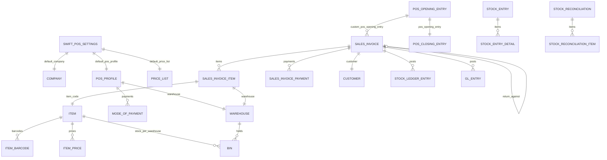

# 04 — Database

## Scope

This document describes every DocType Swift reads or writes, the fields it actually touches, the relationships between them, custom fields, and the database-level constraints that matter.

## The Governing Principle

> **Swift adds exactly one DocType and zero custom transactional tables.**

Every transaction is a native Frappe or ERPNext document. The only DocType `swift_core` defines is `Swift POS Settings`, a Single used purely as a configuration root. This is why ERPNext's reports, dashboards, and upgrade paths continue to work unmodified.

Swift also writes **no SQL DDL**. There are no custom indexes, no triggers, no views, and no stored procedures. `patches.txt` is empty — no schema migration has ever been written for this app. All table structure comes from Frappe and ERPNext.



---

## Custom DocType — `Swift POS Settings`

The configuration root. Every endpoint's business values trace back here.

**File:** `swift_core/swift/doctype/swift_pos_settings/swift_pos_settings.json`
**Module:** `swift` · **Type:** Single (`issingle: 1`) · **Table:** `tabSingles` (key/value rows, not a conventional table)

| Field | Type | Options | Required | Default | Purpose |
|---|---|---|---|---|---|
| `default_company` | Link | `Company` | **Yes** | — | Company for all documents |
| `default_pos_profile` | Link | `POS Profile` | **Yes** | — | Source of warehouse, currency, cost center, payment modes |
| `default_price_list` | Link | `Price List` | **Yes** | — | Selling price list |
| `allow_multi_device_session` | Check | — | No | `0` | `0` = one device per cashier |
| `auto_close_enabled` | Check | — | No | `1` | Intended to enable session auto-close |
| `session_timeout_minutes` | Int | — | No | `60` | Inactivity threshold in minutes |

**Controller:** `swift_pos_settings.py` contains `class SwiftPOSSettings(Document): pass` — **no `validate()` method**.

> **Warning — Two Consequences of the Empty Controller**
>
> 1. **No warehouse validation.** Nothing prevents `default_pos_profile` from pointing at a POS Profile whose `warehouse` is a **group** node. In the reference configuration it does (`Stores - S`), and that is the origin of the group-warehouse bug documented in `09_Return_Workflow.md`. A `validate()` rejecting group warehouses would have prevented it at configuration time.
> 2. **No cross-field checks.** Nothing verifies that `default_price_list` has `selling = 1`, or that the price list currency matches the POS Profile currency.

> **Warning — Permission Finding**
> The DocType's permission block grants `create`, `read`, `write`, `delete`, `email`, `print`, and `share` to **System Manager**, **Swift Cashier**, *and* **Swift Storekeeper**. A cashier with desk access can repoint or delete the configuration root for the entire system. See `14_Permissions.md`.

### `auto_close_enabled` and `session_timeout_minutes` Have No Effect

Both fields are read by `auto_close_inactive_sessions()`, which is **not registered in `scheduler_events`** and therefore never runs. Changing them changes nothing in the deployed system. See `17_Troubleshooting.md`.

---

## Custom Fields

Exactly one custom field is version-controlled, in `fixtures/custom_field.json`:

| Property | Value |
|---|---|
| Name | `Sales Invoice-custom_pos_opening_entry` |
| DocType | `Sales Invoice` |
| Fieldname | `custom_pos_opening_entry` |
| Type | Link → `POS Opening Entry` |
| `insert_after` | `pos_profile` |
| `read_only` | `1` |
| `no_copy` | `1` |

**Why it exists:** `Sales Invoice` has no native link to a POS shift — that relationship belongs to `POS Invoice`, which Swift does not use. Without this field there would be no way to attribute a sale to a shift, and shift reconciliation would be impossible.

`read_only: 1` keeps it out of desk editing; `no_copy: 1` prevents it being carried into an amended or duplicated invoice.

Set at line 563 of `api.py`:

```python
inv.custom_pos_opening_entry = session.name
```

> **Note**
> A comment in `api.py` references `custom_device_id` on `POS Opening Entry` as following the same convention. That field is **not** in `fixtures/custom_field.json` — the fixture is filtered to `["dt", "in", ["Sales Invoice"]]`. If it exists on the site it is not version-controlled and will be missing from a fresh deployment. See `15_Fixtures.md`.

---

## Transactional DocTypes

### `Sales Invoice` — the central document

Every POS sale **and** every return is a `Sales Invoice`.

Fields Swift sets on creation (`create_invoice`, lines 556–565):

| Field | Value | Why |
|---|---|---|
| `is_pos` | `1` | Enables the `payments` child table and POS behaviour |
| `pos_profile` | from config | Drives defaults and print format |
| `company` | from config | — |
| `customer` | argument, else `POS Profile.customer` | Falls back to the walk-in customer |
| `custom_pos_opening_entry` | open session name | Shift attribution |
| `set_warehouse` | `config["warehouse"]` | ⚠ the group node — see warning below |
| `update_stock` | `1` | **Required.** Without it, no Stock Ledger Entry is posted |

Child table `items` (`Sales Invoice Item`) per line: `item_code`, `qty`, `rate` (or `None` to let the price list resolve it), `warehouse` — a **real leaf warehouse** from `_sale_warehouse()`.

Child table `payments`: exactly **one** row, `mode_of_payment` and `amount = grand_total`.

> **Warning — `set_warehouse` vs per-row `warehouse`**
> `set_warehouse` is a header-level "set all rows to this warehouse" convenience. Swift sets it to the configured POS warehouse (a group node) while simultaneously setting real leaf warehouses per row. ERPNext pushes `set_warehouse` down onto rows during validation, and on a return document that overwrites the correct per-row values, producing `Group node warehouse is not allowed to select for transactions`. `create_return` must therefore clear it. This asymmetry is the single most important schema-level gotcha in the system.

Return-specific fields, set by ERPNext's `make_return_doc`:

| Field | Value |
|---|---|
| `is_return` | `1` |
| `return_against` | the original invoice name |
| `items[].qty` | **negative** |
| `items[].sales_invoice_item` | row name of the original line — the link used to recover the original warehouse |

Fields Swift reads: `name`, `posting_date`, `docstatus`, `is_return`, `grand_total`, `net_total`, `status`, `taxes[]`, `customer`, `items[]`.

**Status values encountered:** `Draft` (0), `Paid`, `Return`, `Credit Note Issued`, `Cancelled` (2).

### `POS Opening Entry`

Shift start. Created and submitted by `session_open`.

| Field | Purpose |
|---|---|
| `user` | Owning cashier |
| `pos_profile` | From config |
| `company` | From config |
| `period_start_date` | Shift start timestamp |
| `status` | `Open` → `Closed` |
| `balance_details` | Child table: opening cash float per mode of payment |
| `docstatus` | Always submitted (1) |

Queried by `_get_open_session_for_user(user)` filtering on `user`, `status = "Open"`, `docstatus = 1`.

### `POS Closing Entry`

Shift end. Created and submitted by `session_close` via `_build_closing_from_opening`.

| Field | Purpose |
|---|---|
| `pos_opening_entry` | Link to the opening |
| `period_start_date` / `period_end_date` | Shift bounds |
| `payment_reconciliation` | Child table: expected vs counted per mode |
| `pos_transactions` | **Deliberately left empty** |
| `docstatus` | Submitted (1) |

> **Note — Why `pos_transactions` Is Empty**
> Populating it would trigger ERPNext's POS-Invoice consolidation, which creates consolidated Sales Invoices and posts stock and GL. Swift's sales are **already** submitted Sales Invoices that posted both at sale time. Populating this table would double-post everything. The empty table is the correct and required behaviour.

Expected cash is computed in `_build_closing_from_opening`: cash sales during the shift **minus** cash expenses tagged `[POS:<opening_name>]`.

### `Journal Entry` — shift expenses

`create_expense` records cash taken from the drawer during a shift.

| Field | Value |
|---|---|
| `voucher_type` | Journal Entry |
| `company` | From config |
| `posting_date` | Today |
| `user_remark` | **`[POS:<opening_entry_name>]` + remarks** |
| `accounts` | Two rows: debit expense account, credit cash account |

The `user_remark` tag is load-bearing. It is the **only** link between an expense and a shift — there is no custom Link field — and `_build_closing_from_opening` finds expenses by matching that string to reduce expected cash.

> **Warning**
> Editing or removing the `[POS:...]` prefix from a Journal Entry's `user_remark` silently breaks cash reconciliation for that shift.

### `Stock Entry`

Created by `create_stock_entry` for receipts and adjustments. Child table `Stock Entry Detail` carries `item_code`, `qty`, `s_warehouse`/`t_warehouse`, `basic_rate`.

`create_stock_entry` validates group warehouses explicitly (line 1141) — precedent that the return path originally lacked.

### `Stock Reconciliation`

Used by the importer (`_reconcile_stock`) to set **absolute** quantities rather than deltas, which makes re-running an import idempotent. One reconciliation per item, each inside a savepoint.

> **Note**
> ERPNext raises `EmptyStockReconciliationItemsError` when the target quantity already equals actual quantity. In `_reconcile_stock` this is **caught and treated as success** — it means "already correct", not a failure. Do not "fix" this by letting it propagate.

### `Item`

| Field | Set by | Notes |
|---|---|---|
| `item_code` | `create_item`, importer | Primary key |
| `item_name` | `create_item`, `update_item` | Editable |
| `item_group` | config-resolved | Never hardcoded |
| `stock_uom` | config-resolved | — |
| `is_stock_item` | `1` | — |
| `description` | `update_item` | Editable |
| `disabled` | `update_item` | Editable |
| `barcodes` | child table | See below |

`update_item` restricts writes to an allow-list:

```python
EDITABLE_ITEM_FIELDS = ("item_name", "item_group", "description", "disabled")
```

Anything else is silently dropped. No client can set `valuation_rate`, `is_stock_item`, or `stock_uom` through the API.

### `Item Barcode` (child of `Item`)

| Field | Notes |
|---|---|
| `barcode` | **Globally unique across all Items** — enforced by ERPNext |
| `barcode_type` | Optional |

Uniqueness is why `validate_barcode` and `_barcode_owner` exist: the API checks ownership before attempting an insert, so the user gets a clear message instead of a database error. An Item may have many barcodes; a barcode belongs to exactly one Item.

### `Item Price`

Managed by `_set_item_price`, keyed by `item_code` + `price_list` + `uom`. Updated if present, created if not. `price_list` always comes from configuration.

### `Bin` — the stock quantity table

One row per `item_code` + `warehouse`. **Maintained entirely by ERPNext**; Swift only reads it.

| Field | Used for |
|---|---|
| `actual_qty` | Availability checks, `_sale_warehouse`, low-stock alert |
| `item_code`, `warehouse` | Composite key |

`_available_qty(item_code, company)` sums `actual_qty` across the company's **leaf** warehouses.

> **Warning**
> Bin rows exist only for warehouses that have held the item. A missing row means zero, not an error. All Swift reads use `or 0` to handle this.

### `Stock Ledger Entry` and `GL Entry`

**Swift never writes to either table.** They are posted by ERPNext's controllers during `Sales Invoice.on_submit()` (`update_stock_ledger()` at line 466 and `make_gl_entries()` at line 469 of ERPNext's `sales_invoice.py`).

This is the crux of the POS Invoice → Sales Invoice migration: `POSInvoice.on_submit` calls **neither**, deferring both to consolidation. `SalesInvoice.on_submit` calls both immediately.

`Stock Ledger Entry` is also where group-warehouse rejection happens — `block_transactions_against_group_warehouse()` at `stock_ledger_entry.py:302`, which calls `is_group_warehouse()` at `stock/utils.py:440`.

---

## Master DocTypes

### `Warehouse`

| Field | Significance |
|---|---|
| `name` | Primary key |
| `is_group` | **`1` = cannot hold stock** |
| `company` | Ownership |
| `parent_warehouse` | Tree structure (nested set) |

The `is_group` flag governs more Swift behaviour than any other single field. `_stock_warehouses()` filters to `is_group = 0`; `list_import_warehouses` filters by company; **`list_warehouses` does not filter by company** (a documented finding).

### `Customer`

Read-only from Swift's perspective. `create_invoice` uses the supplied customer or falls back to `POS Profile.customer` (`Walk-in Customer` in the reference config). Swift never creates a Customer.

### `Supplier`

Created on demand by `_ensure_supplier` during import, using normalized-name matching to avoid duplicates from Arabic whitespace and invisible characters.

### `POS Profile` — `Main POS`

The second half of the configuration root. Reference values from `fixtures/pos_profile.json`:

| Field | Value | Effect |
|---|---|---|
| `company` | `swift` | — |
| `warehouse` | `Stores - S` | ⚠ **a group warehouse** |
| `currency` | `EGP` | Returned by `pos_config` |
| `selling_price_list` | `Standard Selling` | — |
| `customer` | `Walk-in Customer` | Default customer |
| `cost_center` | `Main - S` | — |
| `expense_account` | `5111 - Cost of Goods Sold - S` | — |
| `write_off_account` | `5111 - Cost of Goods Sold - S` | — |
| `write_off_limit` | `1.0` | — |
| `update_stock` | `1` | — |
| `print_format` | `POS Invoice` | ⚠ **not** `Swift` — see below |
| `allow_rate_change` | `0` | Cashier cannot change price |
| `allow_discount_change` | `0` | Cashier cannot discount |
| `allow_partial_payment` | `0` | Full payment required |
| `payments` | `Cash` (default), `Insta pay` | Both have **`allow_in_returns: 0`** |
| `item_groups` | Spare Parts, Accessories, All Item Groups | — |
| `country` | `Egypt` | — |

Three findings from this fixture:

1. **`print_format` is `POS Invoice`, but the frontend requests `format=Swift`.** The profile's setting is bypassed by the explicit URL parameter. The `Swift` format is not in any fixture. See `16_Printing.md`.
2. **`allow_in_returns: 0` on both payment modes.** Returns still work because they use ERPNext's return document rather than the POS payment path, but the flags are inconsistent with the feature.
3. **`warehouse` is a group node**, which the entire `_sale_warehouse` mechanism exists to work around.

### `Mode of Payment`

Six records in fixtures. `Cash` and `Insta pay` are both `type: "Cash"` and both map to account `1110 - Cash - S` for company `swift`. `Cheque`, `Credit Card`, `Wire Transfer`, and `Bank Draft` are ERPNext defaults with no account mapping.

> **Note**
> `Insta pay` is typed as **Cash**, not Bank. Both modes therefore post to the same cash account, and both count toward expected cash at shift close. Whether that matches the business's intent is a configuration decision, not a code issue — but it means an Insta pay transaction increases the cash the cashier is expected to have counted.

### `Item Group`

Nine records: `All Item Groups` (the only `is_group: 1`), plus `Products`, `Raw Material`, `Services`, `Sub Assemblies`, `Consumable`, `Accessories`, `scoters`, `Spare Parts`. Seven are ERPNext defaults. `_resolve_item_group` never hardcodes a value.

### `Price List`

Four records, all `EGP`: `Standard Selling` (selling), `Retail` (selling, Egypt), `Wholesale` (selling, Egypt), `Standard Buying` (buying).

### `Company`

Read-only. Referenced as `swift` in fixtures; the abbreviation `S` appears in account and warehouse names (`Stores - S`, `Main - S`).

---

## Relationships

### One-to-Many

| Parent | Child | Link field |
|---|---|---|
| `Sales Invoice` | `Sales Invoice Item` | `parent` |
| `Sales Invoice` | `Sales Invoice Payment` | `parent` |
| `POS Opening Entry` | `Sales Invoice` | `custom_pos_opening_entry` |
| `Item` | `Item Barcode` | `parent` |
| `Item` | `Item Price` | `item_code` |
| `Warehouse` | `Bin` | `warehouse` |
| `Stock Entry` | `Stock Entry Detail` | `parent` |
| `POS Profile` | `POS Payment Method` | `parent` |

### One-to-One

| A | B | Link |
|---|---|---|
| `POS Opening Entry` | `POS Closing Entry` | `pos_opening_entry` |
| `Sales Invoice` (return) | `Sales Invoice` (original) | `return_against` |
| `Sales Invoice Item` (return) | `Sales Invoice Item` (original) | `sales_invoice_item` |

### Many-to-Many

Frappe models these as child tables:

| Relationship | Bridge |
|---|---|
| `POS Profile` ↔ `Mode of Payment` | `POS Payment Method` |
| `POS Profile` ↔ `Item Group` | `POS Item Group` |
| `POS Profile` ↔ `Customer Group` | `POS Customer Group` |
| `Role Profile` ↔ `Role` | `Has Role` |
| `User` ↔ `Role` | `Has Role` |

### The Critical Link: `sales_invoice_item`

For returns, `Sales Invoice Item.sales_invoice_item` points at the original row. ERPNext sets it unconditionally for Sales Invoice returns (`sales_and_purchase_return.py:541–542`).

Swift uses it to recover the original warehouse:

```python
sold_from = {row.name: row.warehouse for row in original.items}
for row in return_doc.items:
    warehouse = sold_from.get(row.sales_invoice_item)
    if warehouse:
        row.warehouse = warehouse
```

> **Note**
> The map is keyed by **row name**, not `item_code`. The same item can appear on two lines drawn from two different warehouses, so keying by `item_code` would return stock to the wrong warehouse. This distinction is the difference between a correct return and a silent inventory error.

---

## Constraints

### Database-Level

| Constraint | Enforced on | Effect |
|---|---|---|
| Primary key | `name` on every DocType | Uniqueness |
| Unique index | `Item Barcode.barcode` | One barcode → one Item, globally |
| Unique index | `Bin` (`item_code`, `warehouse`) | One Bin per pair |
| Foreign-key-like validation | Every Link field | Frappe validates the target exists |
| `docstatus` | All submittable DocTypes | 0 draft, 1 submitted, 2 cancelled |

> **Note**
> Frappe does not create actual SQL `FOREIGN KEY` constraints for Link fields. Referential integrity is enforced in the application layer at validate time. This is why writing directly to the database with SQL is dangerous and why the ORM must be used.

### Application-Level Constraints Swift Relies On

| Constraint | Enforced by |
|---|---|
| Submitted documents are immutable | Frappe `docstatus` |
| Group warehouses cannot hold stock | `block_transactions_against_group_warehouse()` |
| Negative stock rejected | ERPNext Stock Settings (**never** overridden) |
| Return qty ≤ remaining qty | `make_return_doc` + Swift's clamping |
| Serial count must equal line qty | ERPNext; Swift trims serials on partial return |
| GL entries must balance | ERPNext |

### Constraints Swift Adds

| Rule | Where |
|---|---|
| Returns only within 5 days | `_returnable_invoice` |
| Returns only by invoice number | API surface — no other lookup exists |
| One open shift per cashier | `session_open` |
| One device per cashier (optional) | `session_open` + `X-Device-Id` |
| No sale without an open shift | `create_invoice` → **409** |
| Item edits limited to 4 fields | `EDITABLE_ITEM_FIELDS` |
| Upload ≤ 10 MB, `.xlsx` only | `_read_uploaded_xlsx` |

---

## Indexes

**Swift creates none.** All indexes are Frappe/ERPNext defaults: primary key on `name`, indexes on `parent` for child tables, and standard indexes on `Bin`, `Stock Ledger Entry`, and `GL Entry`.

Two Swift query patterns are worth watching as data grows:

| Query | Concern |
|---|---|
| `_inventory_rows` — item search with joins across Item, Bin, Item Price | No custom index; degrades with catalogue size |
| Expense lookup by `user_remark LIKE '%[POS:...]%'` | A `LIKE` on an unindexed text column, run on every shift close |

Neither is a problem at current scale. Both are recorded in `18_Future_Roadmap.md`.
