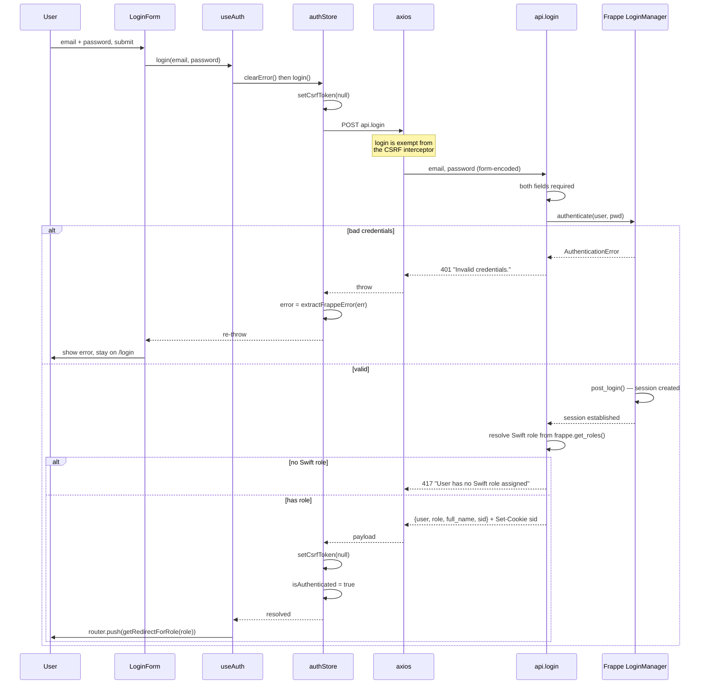
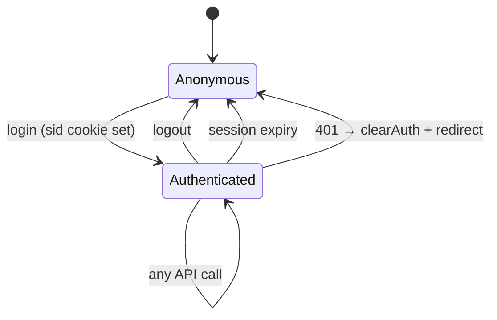
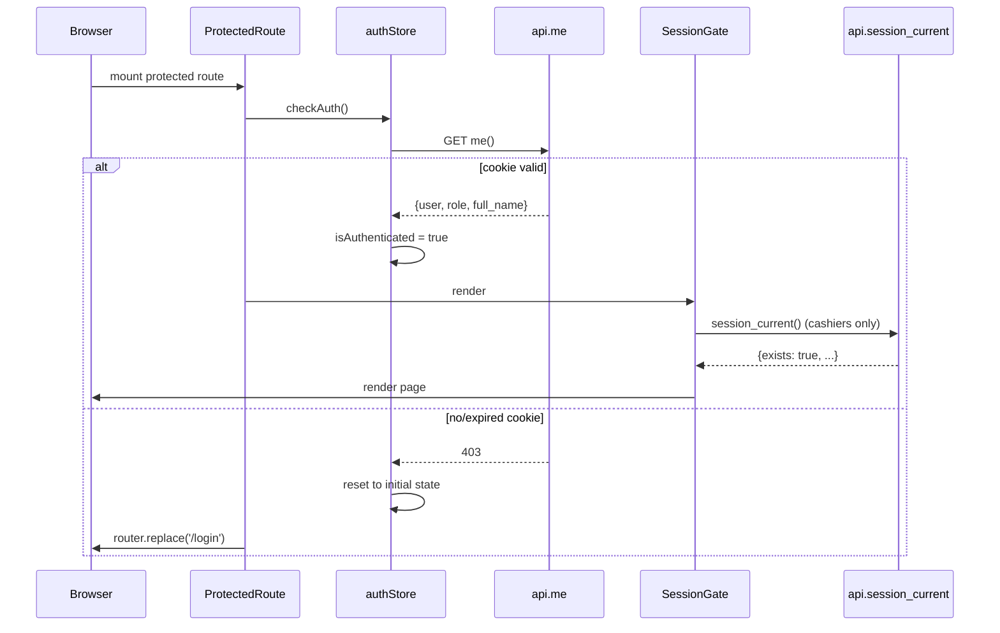
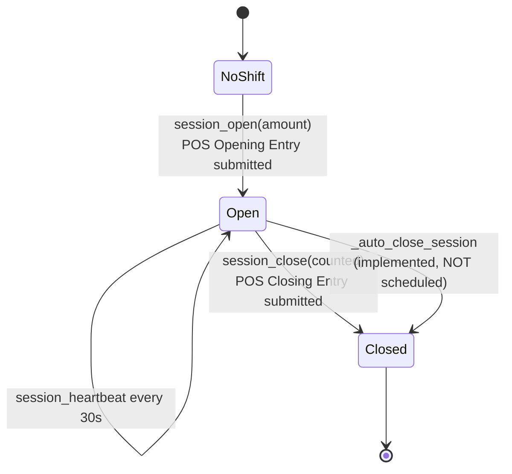
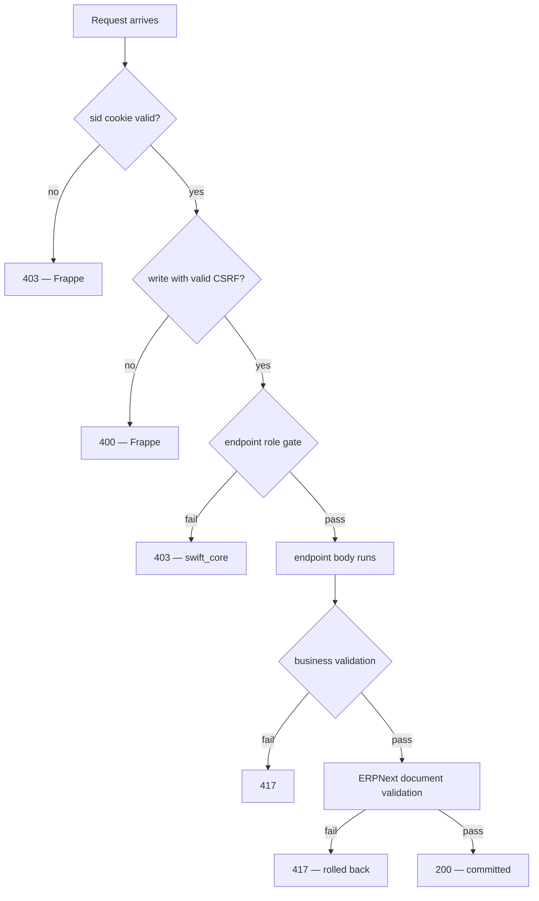

# 06 — Authentication and Authorization

## Summary

Swift does not implement authentication. It delegates entirely to Frappe's `LoginManager` and session machinery, then adds one thing on top: a **role gate at every API endpoint**.

| Concern | Owner |
|---|---|
| Password hashing and verification | Frappe |
| Session creation, storage, expiry | Frappe |
| Cookie issuance and flags | Frappe |
| CSRF token generation and validation | Frappe |
| Rate limiting / brute-force protection | Frappe |
| **Role enforcement per endpoint** | **`swift_core`** |
| **Swift role resolution (single role string)** | **`swift_core`** |

The practical consequence: there is no custom cryptography, no custom token format, and no custom session store to audit in this codebase. Security review should focus on the role gates and on the `ignore_permissions=True` pattern described in `02_Backend.md`.

---

## Login Flow



### Step Detail

**1. `login` is the only guest endpoint.**

```python
@frappe.whitelist(allow_guest=True, methods=["POST"])
def login(email=None, password=None):
```

It is also the only endpoint exempt from the frontend's CSRF interceptor, since it necessarily runs before a session — and therefore before a CSRF token — exists:

```ts
function isAuthEndpoint(url: string) {
  return url.includes(`${API_BASE_PATH}.login`);
}
```

**2. Authentication is delegated.**

```python
login_manager = frappe.auth.LoginManager()
try:
    login_manager.authenticate(user=email, pwd=password)
    login_manager.post_login()
except frappe.exceptions.AuthenticationError:
    frappe.local.response.http_status_code = 401
    frappe.throw(_("Invalid credentials."), frappe.AuthenticationError)
```

`authenticate()` verifies the password; `post_login()` creates the session and sets the cookie. The explicit `http_status_code = 401` override matters — without it Frappe would return 417, and the frontend's 401 handler would not fire.

**3. Swift role resolution collapses many roles into one.**

```python
roles = frappe.get_roles(frappe.session.user)
role = "Swift Cashier" if "Swift Cashier" in roles else (
    "Swift Storekeeper" if "Swift Storekeeper" in roles else None
)
if not role:
    frappe.throw(_("User has no Swift role assigned (Cashier/Storekeeper)."))
```

Three things follow from this:

- A user with **valid credentials but no Swift role is rejected at login**. Administrators who lack a Swift role cannot use the app UI even though they can call the API.
- The response carries **one** role string, not a list. `Swift Cashier` takes precedence.
- A user holding **both** Swift roles is reported as `Swift Cashier` and routed to `/pos`. There is no UI for a dual-role user, and no way to switch. This is a real limitation, not a bug — see `18_Future_Roadmap.md`.

**4. CSRF token cleared twice.** Before the request and after success:

```ts
setCsrfToken(null);           // before
const { data } = await frappeApi.login(email, password);
setCsrfToken(null);           // after
```

A new session invalidates any cached token, including one obtained during a Frappe desk session in another browser tab. Clearing before covers a stale pre-login token; clearing after forces a fresh fetch bound to the new session.

**5. Redirect by role.**

```ts
export function getRedirectForRole(role: UserRole | null): string {
  switch (role) {
    case ROLES.CASHIER:      return ROUTES.POS;         // /pos
    case ROLES.STOREKEEPER:  return ROUTES.INVENTORY;   // /inventory
    default:                 return ROUTES.LOGIN;       // /login
  }
}
```

---

## Session Lifecycle

### Two Different "Sessions"

These are unrelated and are constantly confused:

| | Frappe session | POS shift |
|---|---|---|
| **Represents** | Authenticated login | Cash-drawer shift |
| **Storage** | `sid` cookie + Frappe session table | `POS Opening Entry` / `POS Closing Entry` |
| **Created by** | `login` | `session_open` |
| **Ended by** | `logout`, expiry | `session_close` |
| **Applies to** | Everyone | Cashiers only |
| **Survives reload** | **Yes** (cookie) | **Yes** (database) |

A cashier can be authenticated with no open shift. That is precisely the state `SessionGate` blocks, and it is normal — it happens on every login.

### Frappe Session Lifecycle



**Expiry** is governed by Frappe's `session_expiry` setting in `site_config.json` (default `06:00`, i.e. six hours). This is **environment-specific** and not configured by `swift_core`.

**On expiry**, the next API call returns 401. The axios interceptor then clears the CSRF token, clears `authStore`, and hard-navigates to `/login`:

```ts
if (status === 401 && !isAuthEndpoint(url)) {
  setCsrfToken(null);
  const { useAuthStore } = require("@/stores/authStore");
  useAuthStore.getState().clearAuth();
  if (typeof window !== "undefined") {
    window.location.href = "/login";
  }
}
```

`window.location.href` rather than the Next.js router is deliberate — a full page load guarantees every store and every cached query is discarded.

> **Note**
> An expired session leaves the POS shift **open** in the database. On re-login, `session_current` finds it and the cashier resumes the same shift with the original opening float intact. Nothing is lost. This is the reconnect path that `session_open`'s guard also protects.

### Rehydration on Page Load

Because no Zustand store uses `persist`, a page reload starts with empty client state and rebuilds it:



`checkAuth` swallows its error deliberately: a failed `me()` means "not logged in", which is a normal state rather than a fault to surface.

### POS Shift Lifecycle



Detail in `07_POS_Workflow.md`.

---

## Cookie Management

**All cookies are set by Frappe. `swift_core` sets none and reads none directly.**

### The `sid` Cookie

| Property | Value | Set by |
|---|---|---|
| **Name** | `sid` | Frappe |
| **Value** | Opaque session identifier | Frappe |
| **Domain** | The Frappe host | Frappe / **environment-specific** |
| **Path** | `/` | Frappe |
| **HttpOnly** | Yes | Frappe |
| **Secure** | Set when served over HTTPS | **Environment-specific** |
| **SameSite** | **Environment-specific** — see below | Frappe / reverse proxy |
| **Expiration** | Per `session_expiry` in `site_config.json`, default `06:00` | **Environment-specific** |

Frappe also sets non-sensitive helper cookies (`user_id`, `full_name`, `system_user`) which Swift does not use.

### The Cross-Origin Problem

This is the single most important deployment consideration for authentication.

The frontend and backend are **separate origins**:

```
Frontend:  http://localhost:3000     (Next.js)
Backend:   http://localhost:8000     (Frappe)
```

The `sid` cookie belongs to the **Frappe** origin. For the browser to send it on a cross-origin XHR, two things must both hold:

1. The client sets `withCredentials: true` — done in `lib/axios.ts`.
2. The server sends `Access-Control-Allow-Credentials: true` **and** an explicit `Access-Control-Allow-Origin` (a wildcard is invalid with credentials).

Point 2 is **environment-specific configuration**, not code. It is set in the Frappe site config / reverse proxy, not in `swift_core`.

> **Warning — Production Deployment**
> If the frontend and backend are served from different sites in production, the `sid` cookie must be accepted cross-origin. Modern browsers require `SameSite=None; Secure` for a cross-site cookie, which mandates HTTPS on both origins.
>
> **The more robust option is to avoid cross-site entirely**: serve both from the same registrable domain (for example the app at `pos.example.com` and Frappe at `erp.example.com` with a shared parent, or reverse-proxy the frontend and `/api` under one host). Same-site cookies sidestep the `SameSite=None` requirement and third-party-cookie blocking, which several browsers now apply by default.
>
> Exact values — domains, certificates, proxy rules — are environment-specific and must be decided per deployment. See `11_Deployment.md`.

### Printing Depends on the Cookie Too

Receipt printing opens `{FRAPPE_URL}/printview?...` in a new window. That request is a **top-level navigation** to the Frappe origin, so the browser sends the `sid` cookie as a first-party cookie. If it did not, the print view would return a login page instead of the receipt.

This is another reason the print flow uses `window.open` on the Frappe origin rather than fetching HTML into the app.

---

## CSRF Protection

### Why It Is Needed

Frappe requires `X-Frappe-CSRF-Token` on write requests whenever a session cookie is present. Without it, a cookie-authenticated write is rejected with **400 Invalid Request**.

A comment in `lib/axios.ts` records the practical trigger: this fires whenever another tab (such as the Frappe desk) has set a `sid` cookie.

### Token Acquisition

Fetched lazily on the first write, cached in a module-scoped variable, and tried against two paths because Frappe has moved the getter between versions:

```ts
const CSRF_ENDPOINT = "/api/method/frappe.sessions.get_csrf_token";
```

Concurrent fetches are de-duplicated through a single in-flight promise, so a burst of writes triggers exactly one token request:

```ts
function fetchCsrfToken(): Promise<string | null> {
  if (!csrfInFlight) {
    csrfInFlight = requestCsrfToken().finally(() => { csrfInFlight = null; });
  }
  return csrfInFlight;
}
```

### Attachment

Only on writes, and never on `login`:

```ts
const isWrite = config.method === "post" || config.method === "put" || config.method === "delete";
if (isWrite && typeof window !== "undefined" && !isAuthEndpoint(url)) {
  if (!csrfToken) csrfToken = await fetchCsrfToken();
  if (csrfToken) config.headers["X-Frappe-CSRF-Token"] = csrfToken;
}
```

### Retry — Deliberately Narrow

```ts
const isCsrfFailure = status === 400 && /csrf/i.test(serverText);
```

The narrowness is a safety property, not fussiness. Frappe returns 400 for ordinary validation errors too. A blanket "retry all 400s" would **double-submit non-idempotent writes** and could create duplicate invoices. Matching the CSRF message specifically, and guarding with a `__csrfRetried` flag, means:

- At most one retry.
- Only on a confirmed CSRF failure.
- Never on `login`.

### Token Invalidation

Cleared in four places, all correct:

| Location | Reason |
|---|---|
| Before `login` | Discard a token from a previous session |
| After `login` | New session issues a new token |
| On `logout` | Session gone |
| On 401 | Session invalid |

---

## Permission Resolution

### Resolution Order



### The Role Gate

Two helpers, both raising `frappe.PermissionError` (HTTP 403):

```python
def require_role(role):        # single required role
def _require_any_role(*roles): # any one of several
```

`System Manager` and `Administrator` satisfy every gate, so an administrator can exercise the full API.

**Verified: every one of the 30 whitelisted endpoints begins with a role gate**, except:

| Endpoint | Gate | Justification |
|---|---|---|
| `login` | none | Guest by necessity |
| `logout` | authenticated only | Any logged-in user may end their own session |
| `me` | authenticated only | Returns only the caller's own identity |

### Frontend Checks Are Not Security

`ProtectedRoute`, `SessionGate`, and `getRedirectForRole` are **UX conveniences**. They can all be bypassed by calling the API directly. Every endpoint re-checks server-side, so bypassing them achieves nothing:

- A storekeeper who navigates to `/returns` loads the screen, then receives 403 from `get_invoice` and `create_return`.
- A cashier who calls `create_item` directly receives 403.

> **Note**
> This is the correct division of responsibility, but it produces one rough edge: `/returns` has no `allowedRoles` restriction, so a storekeeper sees a screen where nothing works rather than being redirected. Cosmetic, not a security issue. Recorded in `18_Future_Roadmap.md`.

### The `ignore_permissions=True` Pattern

Roughly 25 document operations pass `ignore_permissions=True`. This is intentional and load-bearing.

`Swift Cashier` and `Swift Storekeeper` are deliberately **not** granted desk write permission on `Sales Invoice`, `Stock Entry`, `Journal Entry`, or `Item`. A cashier must not be able to open the Frappe desk and hand-edit an invoice. But the API must create those documents on the cashier's behalf inside a controlled workflow.

`ignore_permissions=True` skips the **DocType-level** check for that one operation. It does **not** skip the role gate, which has already run at the top of the function.

> **Warning**
> The security model therefore rests on one invariant: **every whitelisted endpoint that calls `ignore_permissions=True` must first call a role gate.** Adding an endpoint that violates this creates a privilege-escalation hole reachable by any authenticated user. The review checklist in `13_Coding_Standards.md` covers it.

---

## Roles

### Roles Enforced in Code

Only two:

```ts
export const ROLES = {
  CASHIER: "Swift Cashier",
  STOREKEEPER: "Swift Storekeeper",
} as const;
```

```ts
export type UserRole = "Swift Cashier" | "Swift Storekeeper";
```

### Roles Present in Fixtures But Not Enforced

`fixtures/role.json` contains roughly 60 roles — every role on the site, not only Swift's. Custom business roles among them:

| Role | Referenced by any endpoint? |
|---|---|
| `Swift Cashier` | **Yes** |
| `Swift Storekeeper` | **Yes** |
| `Owner` | No |
| `Manager` | No |
| `Cashier` | No |
| `Technician` | No |
| `HR Officer` | No |
| `Accountant` | No |

These exist for **desk-level** access to ERPNext screens. They grant nothing in the Swift API. A user with only `Manager` cannot log into the Swift frontend at all — `login` rejects them for having no Swift role.

Full analysis in `14_Permissions.md`.

### Role Profiles

`fixtures/role_profile.json` defines twelve profiles that bundle roles for easier user assignment:

| Profile | Roles bundled |
|---|---|
| `cashier` | `Cashier`, `Analytics`, **`Swift Cashier`** |
| `storekeeper` | **`Swift Storekeeper`** |
| `Owner` | `Owner` |
| `Manager` | `Manager` |
| `Technician` | `Technician` |
| `HR Officer` | `HR User`, `HR Officer`, `HR Manager`, `Interviewer` |
| `Accountant` | `Accountant`, `Accounts Manager`, `Accounts User`, `Analytics`, `Dashboard Manager`, `Sales Manager`, `Sales Master Manager`, `Sales User`, `Stock User`, `Stock Manager` |
| `Inventory` | `Stock User`, `Stock Manager`, `Item Manager` |
| `Manufacturing` | `Stock User`, `Manufacturing User`, `Manufacturing Manager` |
| `Accounts` | `Accounts User`, `Accounts Manager` |
| `Sales` | `Sales User`, `Stock User`, `Sales Manager` |
| `Purchase` | `Item Manager`, `Stock User`, `Purchase User`, `Purchase Manager` |

The last five are ERPNext defaults. `cashier` and `storekeeper` are the two that matter for Swift — assigning one of those profiles is how a user gains frontend access.

> **Note**
> The `cashier` profile grants the desk roles `Cashier` and `Analytics` in addition to `Swift Cashier`. Combined with the `Swift POS Settings` permission finding below, a cashier with desk access has more reach than the POS UI suggests.

---

## Device Identification

Not authentication, but part of session control.

```ts
export function getOrCreateDeviceId(): string {
  if (typeof window === "undefined") return "";
  let id = localStorage.getItem(DEVICE_ID_KEY);   // "swift_pos_device_id"
  if (!id) {
    id = crypto.randomUUID();
    localStorage.setItem(DEVICE_ID_KEY, id);
  }
  return id;
}
```

Sent as `X-Device-Id` on **every** request. Read server-side by `current_device_id()` and stored on the opening entry as `custom_device_id`.

Used by `session_open` when `allow_multi_device_session = 0`:

```python
other_device_open = frappe.db.exists("POS Opening Entry", {
    "user": frappe.session.user,
    "status": "Open",
    "docstatus": 1,
    "custom_device_id": ["!=", device_id],
})
if other_device_open:
    frappe.local.response.http_status_code = 409
    frappe.throw(_("An active session already exists on another device."))
```

> **Warning**
> This is an **operational control, not a security control**. The ID is client-generated and trivially spoofable. It prevents a cashier accidentally running two tills; it does not stop a determined user. Never rely on it for authorization.
>
> Clearing browser storage generates a new device ID, which will block shift opening until the existing shift is closed. Recovery is documented in `17_Troubleshooting.md`.

---

## Token-Based Access

> **This system does not use token-based authentication.**

There is no JWT, no bearer token, no OAuth flow, and no API key handling anywhere in `swift_core` or the frontend. Authentication is **exclusively** cookie-based session authentication.

The `sid` value returned by `login` is the session identifier, already delivered as an `HttpOnly` cookie. The frontend receives it in the response body but **does not store or use it** — it is not written to `localStorage`, and no code reads `LoginResponse.sid`.

Frappe itself supports `api_key` / `api_secret` token pairs via an `Authorization: token` header. Swift does not use, document, or provision them. An integration needing non-browser access would use that Frappe mechanism directly, and it would still pass through the same `require_role` gates.

---

## Security Findings

From source inspection. Not yet remediated.

| # | Finding | Location | Severity |
|---|---|---|---|
| 1 | `Swift POS Settings` grants `write` **and** `delete` to `Swift Cashier` and `Swift Storekeeper` | `swift_pos_settings.json` | **High** — a cashier with desk access can repoint or delete the configuration root for every endpoint |
| 2 | `role.json` fixture exports all ~60 site roles | `fixtures/role.json` | Medium — overwrites site role definitions on `bench migrate` |
| 3 | Device ID is client-generated and unverified | `utils.ts` / `api.py:81` | Low — by design; do not treat as security |
| 4 | Login rejects users lacking a Swift role, but only after successful authentication | `api.py:110` | Informational — no credential oracle, since a wrong password fails earlier with a distinct 401 |

Finding 1 is the one to fix first. Proposed remediation is in `18_Future_Roadmap.md`.

---

## Practical Checks

**Verify a session is live:**

```bash
curl -i -b "sid=<your_sid>" \
  "http://localhost:8000/api/method/swift_core.api.me"
```

Expected: `200` with `{"message":{"user":"...","role":"Swift Cashier","full_name":"..."}}`.
A `403` means the session is invalid or expired.

**Verify the role gate rejects correctly** — call a storekeeper endpoint with a cashier session:

```bash
curl -i -b "sid=<cashier_sid>" \
  "http://localhost:8000/api/method/swift_core.api.list_suppliers"
```

Expected: `403`. Any other result means the gate is missing and must be investigated immediately.
