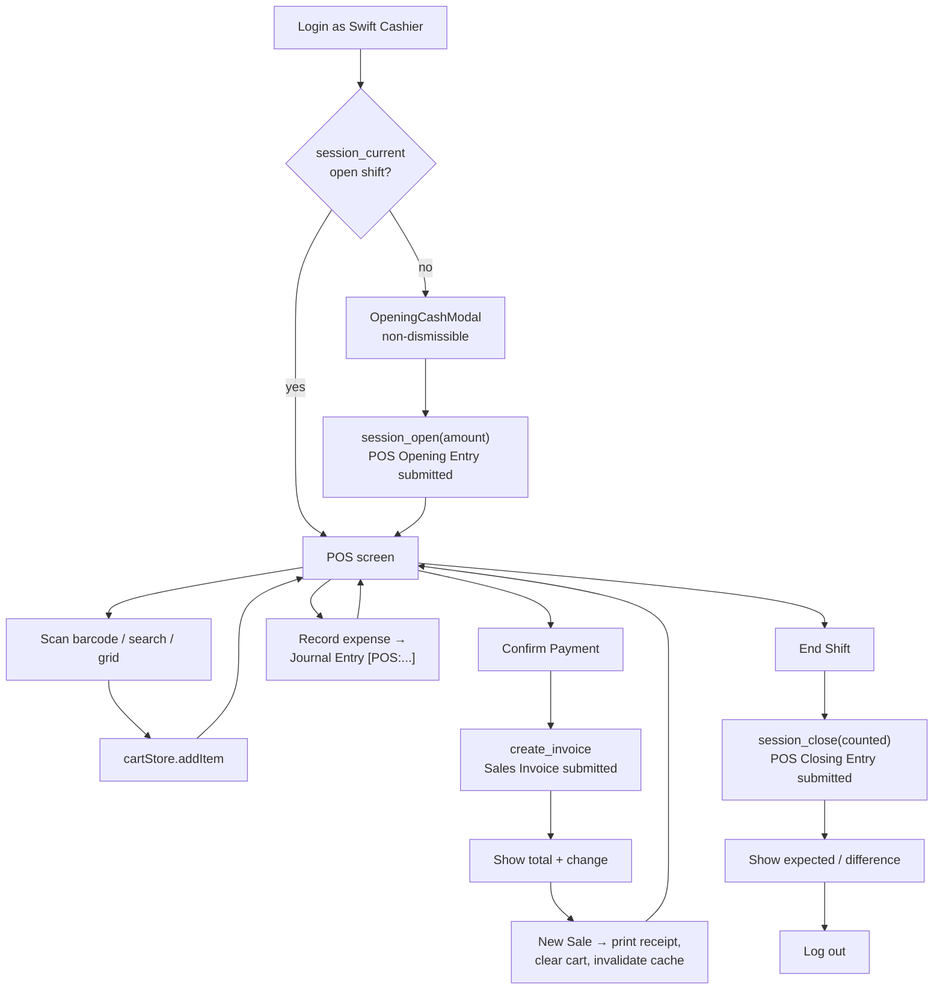
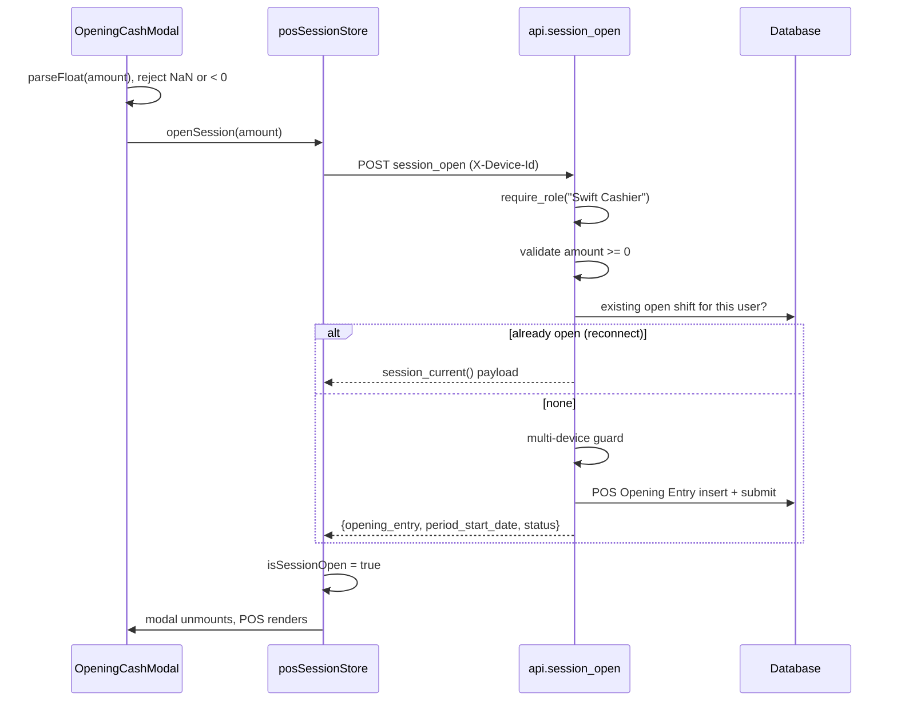
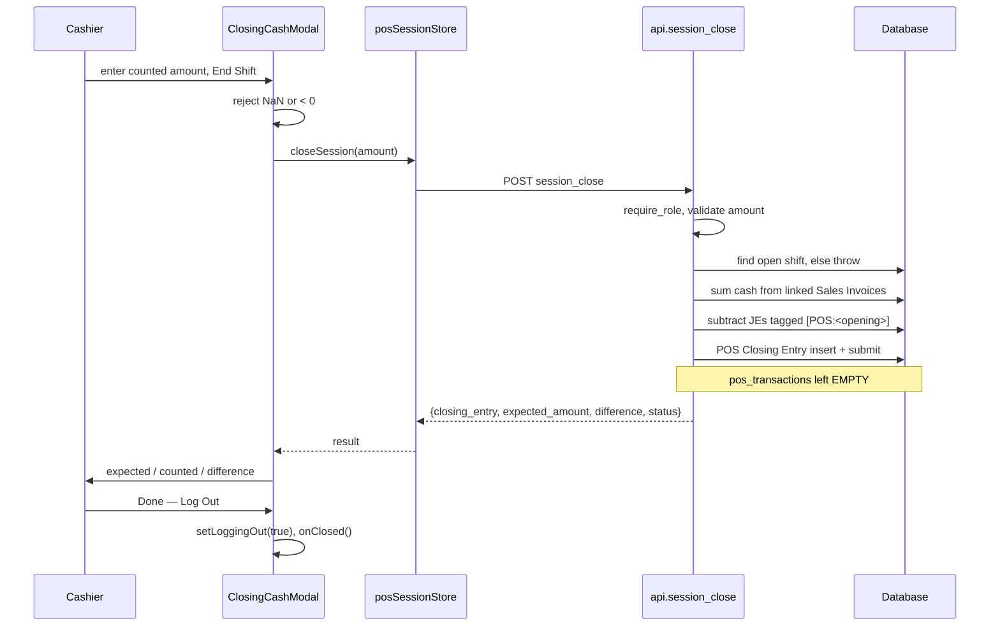

# 07 — POS Workflow

## The Complete Shift



A heartbeat fires every 30 seconds throughout, from `useSessionHeartbeat`.

---

## Stage 1 — Opening a Shift

### What the Cashier Sees

After login, `SessionGate` calls `session_current`. With no open shift it renders a blocking spinner ("Please start your shift to continue.") and `OpeningCashModal` with `showCloseButton={false}` and `closeOnOverlayClick={false}`. **The modal cannot be dismissed.** There is no path to the POS screen without opening a shift.

The cashier counts the cash in the drawer and enters the total.

### What Happens



The opening entry is created with `user` forced to the session user, company and profile from configuration, one `balance_details` row holding the counted float against the POS Profile's first payment mode, and `custom_device_id` set from the request header.

### Error Handling and Recovery

| Failure | Message | Recovery |
|---|---|---|
| Empty / non-numeric amount | `Please enter a valid amount (0 or more).` | Client-side; modal stays open, nothing sent |
| Negative amount | `opening_amount must be zero or positive.` | Re-enter |
| Shift open on another device | `An active session already exists on another device.` (409) | Close the shift on the other device, or set `allow_multi_device_session = 1` |
| POS Profile has no payment mode | `POS Profile has no Mode of Payment configured.` | Configuration fix — add a Mode of Payment to the profile |
| Not a cashier | 403 | Wrong role; the user should not be on this screen |
| Network failure | `extractFrappeError` output | Modal stays open with the cart-less state intact; retry |

**Reconnect is safe.** If the browser crashed or the session expired mid-shift, `session_open` finds the existing entry and returns it rather than creating a duplicate. The cashier resumes the same shift with the original float. This guard is why a double-submitted modal cannot produce two shifts.

> **Warning — Device ID Lockout**
> Clearing browser storage generates a new device UUID. With `allow_multi_device_session = 0`, the cashier is then blocked from opening a shift because the existing entry carries the old ID. Resolution is in `17_Troubleshooting.md`.

---

## Stage 2 — Barcode Scanning

### How Scanner Hardware Works Here

A hardware barcode scanner presents itself as a keyboard: it types the barcode rapidly and sends `Enter`. No device integration exists or is needed. `BarcodeScanner` is a `<form>` with a single text input, so `Enter` triggers submit.

Three properties make continuous scanning work:

- `autoFocus` on mount, plus `inputRef.current?.focus()` in the `finally` block — focus returns to the input after **every** scan, success or failure. The cashier never touches the mouse.
- The input is cleared **before** the toast fires, so the next scan is never appended to the previous value.
- The input is `disabled` while a lookup is in flight, preventing interleaved scans from racing.

### Flow

```mermaid
sequenceDiagram
    participant H as Scanner
    participant I as BarcodeScanner
    participant A as api.item_by_barcode
    participant C as cartStore
    participant T as Toast

    H->>I: barcode + Enter
    I->>I: trim; ignore if empty
    I->>A: GET item_by_barcode
    alt found and enabled
        A-->>I: {item_code, item_name, rate, uom, stock_qty, image}
        I->>C: addItem(...)
        alt within available stock
            C-->>I: true
            I->>T: "Added <item_name>" (success, 1500ms)
        else would exceed stock
            C-->>I: false
            I->>T: "Only N <uom> of <item> in stock" (warning)
        end
    else not found / disabled
        A-->>I: error
        I->>T: extractFrappeError (error)
    end
    I->>I: clear value, refocus
```

### Error Handling

| Failure | Toast | Cart |
|---|---|---|
| Unknown barcode | `Item {barcode} not found.` (404) | Unchanged |
| Disabled item | `Item {code} is disabled.` | Unchanged |
| Zero stock | `Only 0 <uom> of <item> in stock` | Unchanged |
| Would exceed stock | `Only N <uom> of <item> in stock` | Unchanged |
| Not a cashier | 403 message | Unchanged |
| Network | Network error text | Unchanged |

Every failure leaves the cart untouched and focus in the input. A refused scan is never silently ignored — `cartStore.addItem` returns `false` specifically so the caller can tell the cashier why.

---

## Stage 3 — Item Search

The same input doubles as text search (placeholder `Scan barcode or search...`), and `ProductGrid` is backed by `item_search`, which matches item code, item name, or barcode.

Results are cached by TanStack Query under `["item_search", q]` with a 5-minute `staleTime`. `refetchOnWindowFocus` is `false` — a cashier switching windows must not have the grid reorder mid-transaction.

Zero-stock items **are** returned, so the grid can show them as unavailable rather than hiding them. Disabled items are excluded.

---

## Stage 4 — Adding Items to the Cart

`cartStore` holds lines client-side. Nothing is sent to the server until payment.

| Action | Guard |
|---|---|
| `addItem` | Returns `false` if `existing.qty + requested > stock_qty`, or if `stock_qty <= 0` |
| `updateQty` | `qty <= 0` removes the line; exceeding `stock_qty` returns `false` |
| `removeItem` | Always succeeds |
| `clearCart` | Clears items **and** customer |

Quantities for an existing line accumulate: scanning the same item twice yields one line with `qty = 2`.

> **Note**
> These checks are **advisory**. `stock_qty` was captured when the item was fetched and can be stale — another till may have sold the last unit since. The authoritative check runs in `create_invoice`, which re-reads availability at submit time and refuses the sale. The client-side check exists to give immediate feedback, not to guarantee anything.

---

## Stage 5 — Payment

### What the Cashier Sees

`PaymentModal` shows the line items, the cart total, buttons for each mode of payment from `pos_config`, and an "Amount Given" field pre-filled with the cart total. `min` is set to the cart total, so the browser rejects underpayment.

### Flow

```mermaid
sequenceDiagram
    participant U as Cashier
    participant M as PaymentModal
    participant A as api.create_invoice
    participant E as ERPNext
    participant D as Database

    U->>M: choose mode, enter amount given, Confirm
    M->>M: isSubmitting = true (button disabled)
    M->>A: POST create_invoice {items, payments, customer?}
    A->>A: require_role, parse JSON, reject empty
    A->>D: open shift? else 409
    A->>A: resolve_config()
    A->>A: aggregate qty per item across lines
    loop each line
        A->>D: item exists and enabled?
        A->>D: _available_qty >= total?
        A->>D: _sale_warehouse — a leaf holding the full qty
    end
    A->>E: set_missing_values + calculate_taxes_and_totals
    A->>E: append single payment row = grand_total
    A->>E: insert + submit
    E->>D: Stock Ledger Entry, GL Entry, Bin update
    A-->>M: {invoice, grand_total, net_total, taxes, status, stock_warnings}
    M->>M: result set; amountGiven reset to grand_total
    M->>U: Payment Received, totals, change
```

### Change Calculation

```ts
const grandTotal = result?.grand_total ?? cartTotal;
const change = Math.max(0, parseFloat(amountGiven || "0") - grandTotal);
```

Before submission the cart total is used; afterwards the **actual post-tax grand total** from the server. `amountGiven` is re-set to `grand_total` on success, so if taxes changed the total, change is computed against the real figure rather than the pre-tax estimate.

### Payment Constraints

> **Warning — Single Mode Only**
> Only `payments[0].mode_of_payment` is used, and the amount is **overridden server-side to `grand_total`**. Additional payment rows are ignored and any client-supplied amount is discarded.
>
> **Split payments across two modes are not supported.** The UI offers only one selected mode, matching the backend. The override is deliberate: the client sends a pre-tax cart total, which would not match the post-tax grand total.

The POS Profile also sets `allow_partial_payment: 0`, `allow_rate_change: 0`, and `allow_discount_change: 0` — the cashier cannot part-pay, reprice, or discount.

### Error Handling

| Failure | Code | Message | Cart |
|---|---|---|---|
| No open shift | 409 | `No active POS session — open a shift first.` | **Preserved** |
| Item vanished | 404 | `Item {0} not found.` | **Preserved** |
| Item disabled | 417 | `Item {0} is disabled.` | **Preserved** |
| Out of stock | 409 | `{0} is out of stock.` | **Preserved** |
| Insufficient stock | 409 | `Only {0} of {1} available in stock.` | **Preserved** |
| Stock split across warehouses | 409 | `{0} has {1} in stock but not in a single warehouse. Transfer stock before selling.` | **Preserved** |
| Empty cart | 417 | `items array cannot be empty.` | — |
| ERPNext validation | 417 | varies | **Preserved** |

**Recovery is the important property here.** On any failure the error renders inside the modal, `isSubmitting` resets, and **the cart is untouched**. The cashier can remove the problem line and retry. Nothing partial is written — Frappe rolls the transaction back.

The `isSubmitting` flag disabling the submit button is the only guard against double-submission, and it is sufficient because the request is awaited before the flag clears.

> **Note — The Split-Warehouse Error**
> `{item} has {n} in stock but not in a single warehouse` occurs when total stock across warehouses covers the quantity but no **single** warehouse does. Swift will not split one line across warehouses. Resolution is a stock transfer, not a code change.

### Stock Warnings

After submission the endpoint checks each item's Bin at the configured warehouse and returns `stock_warnings` for any negative quantity. `PaymentModal` renders these in an amber panel.

In normal operation this list is empty — negative stock is never enabled. A non-empty list indicates pre-existing negative stock from before that policy, or a data problem worth investigating.

---

## Stage 6 — Invoice Creation

The sale is a submitted `Sales Invoice` with `is_pos = 1` and `update_stock = 1`. Submission posts Stock Ledger Entries, GL Entries, and Bin updates immediately.

Key fields:

| Field | Value |
|---|---|
| `is_pos` | `1` |
| `update_stock` | `1` |
| `pos_profile`, `company` | from config |
| `customer` | argument, else `POS Profile.customer` |
| `custom_pos_opening_entry` | the open shift |
| `set_warehouse` | configured POS warehouse (**a group node**) |
| `items[].warehouse` | a real **leaf** warehouse per line |

Full accounting detail in `08_Sales_Workflow.md`. The `set_warehouse` / per-row asymmetry is explained in `04_Database.md` and matters for returns.

---

## Stage 7 — Receipt Printing

Printing is triggered by **New Sale**, not by a separate button:

```ts
const handleDone = () => {
  if (result) printReceipt(result.invoice);
  clearCart();
  onClose();
  queryClient.invalidateQueries({ queryKey: ["item_search"] });
  showToast("Invoice created successfully", "success");
};
```

Print happens **before** the modal unmounts, so one action both prints and resets for the next sale.

```ts
const printUrl =
  `${env.FRAPPE_URL}/printview?doctype=Sales%20Invoice` +
  `&name=${encodeURIComponent(invoiceName)}` +
  `&trigger_print=1&format=Swift&no_letterhead=0`;
window.open(printUrl, "swift_receipt");
```

The receipt is Frappe's own print view opened as a real window on the Frappe origin — not React output. Two failures forced this design:

1. **Origin.** Letterhead assets are root-relative (`/files/...`); inside the Next.js origin they resolve against `localhost:3000` and the logo breaks.
2. **Viewport width.** The browser derives print scale from layout width. A narrow popup produced a different scale than Frappe's full-width print page, so the same format printed at the wrong font size and receipt width.

The named target `"swift_receipt"` reuses one window rather than accumulating tabs.

### Error Handling

| Failure | Symptom | Resolution |
|---|---|---|
| Popup blocked | No print window; sale still completed | Allow popups for the app origin |
| `Swift` format missing | Wrong layout or an error page | The format is **not** in any fixture — see `15_Fixtures.md` |
| Logo missing | Blank space in the header | Letterhead asset issue — `16_Printing.md` |
| Session expired | Login page in the print window | Re-login, then reprint from the desk |

> **Note**
> Printing failure does **not** affect the sale. The invoice is already submitted, stock and GL are posted. A receipt can always be reprinted from the Frappe desk. Never re-run a sale because printing failed.

---

## Stage 8 — Recording Expenses

Cash removed from the drawer mid-shift (petty cash, courier fees) is recorded through `ExpenseModal` → `create_expense`, producing a Journal Entry that debits the chosen expense account and credits cash.

The entry's `user_remark` is prefixed **`[POS:<opening_entry>]`**. That tag is the only link between the expense and the shift, and `session_close` matches on it to reduce expected cash.

| Failure | Message |
|---|---|
| Missing/invalid amount | validation message |
| Missing account | `expense_account is required.` |
| No open shift | `No active POS session` |

> **Warning**
> Editing or removing the `[POS:...]` prefix from a Journal Entry's `user_remark` silently breaks cash reconciliation for that shift. The expense will still post to the accounts but will no longer reduce expected cash, and the drawer will appear over by that amount.

---

## Stage 9 — Closing the Shift

### What the Cashier Sees

`ClosingCashModal` asks the cashier to count the drawer and enter the total. After submission it shows expected cash, counted cash, and the difference — green when zero, red otherwise.

### Flow



Expected cash = cash sales during the shift − tagged expenses. Difference = counted − expected; negative means short.

`pos_transactions` is left **empty** deliberately. Populating it would trigger ERPNext's POS-Invoice consolidation, which posts stock and GL — already done at sale time. Populating it would double-post everything.

### Error Handling

| Failure | Message | Recovery |
|---|---|---|
| Invalid amount | `Please enter a valid amount (0 or more).` | Client-side; re-enter |
| No open shift | `No active POS session` | Already closed; log out |
| ERPNext validation | varies | Investigate the closing entry in the desk |
| Network | error text | **Retry is safe** — nothing was written |

The confirmation modal is non-dismissible (`showCloseButton={false}`, `onClose={() => {}}`) so the cashier must acknowledge the reconciliation before logging out.

> **Warning — Known Defect**
> `ClosingCashModal` renders an "Expenses (deducted)" row from `result.total_expenses`, but `session_close` does not return that field and `posSessionStore.closeSession` does not pass it through. **The row never appears**, even when expenses were deducted.
>
> The `difference` shown is still correct — expenses *are* subtracted server-side. Only the explanatory line is missing, so a cashier who recorded expenses sees an unexplained gap between sales and expected cash. Fix in `17_Troubleshooting.md`.

---

## Automatic Session Closing

`auto_close_inactive_sessions()` (line 1345) and `_auto_close_session()` (line 1386) are fully implemented. They read `auto_close_enabled` and `session_timeout_minutes` from `Swift POS Settings`, find shifts whose last heartbeat exceeds the timeout, and close them — impersonating the owning cashier via `frappe.set_user(user)` with `finally: frappe.set_user("Administrator")` so the closing entry is attributed correctly.

> **Warning — This Never Runs**
> `auto_close_inactive_sessions` is **not registered in `scheduler_events`**. `hooks.py` schedules only the daily low-stock alert. Its docstring claims it runs "every 5 minutes via cron"; that is inaccurate.
>
> Consequences in the deployed system:
> - Abandoned shifts stay open indefinitely.
> - `auto_close_enabled` and `session_timeout_minutes` have **no effect**.
> - The 30-second heartbeat is recorded but never consumed, so it currently has no functional purpose.
>
> Shifts must be closed manually, either by the cashier or by an administrator in the desk. Registration instructions are in `17_Troubleshooting.md`.

---

## Failure Recovery Summary

| Point of failure | State afterwards | Recovery |
|---|---|---|
| During login | No session | Retry |
| During shift open | No shift, or the existing one | Retry — the reconnect guard prevents duplicates |
| Browser crash mid-shift | Shift still open | Re-login; `session_current` restores it |
| Session expiry mid-shift | Shift still open | Re-login; same shift resumes |
| Scan failure | Cart unchanged | Rescan |
| Invoice creation failure | **Nothing written** (rolled back); cart preserved | Fix the line, retry |
| Print failure | **Invoice already posted** | Reprint from the desk — never re-run the sale |
| Expense failure | No Journal Entry | Retry |
| Shift close failure | Shift still open | Retry |
| Abandoned shift | Open indefinitely | Close manually — auto-close is not scheduled |

The invariant worth remembering: **every write is a single submitted document inside one transaction.** There is no multi-step write that can leave the system half-finished. Either a document is submitted or nothing happened.
