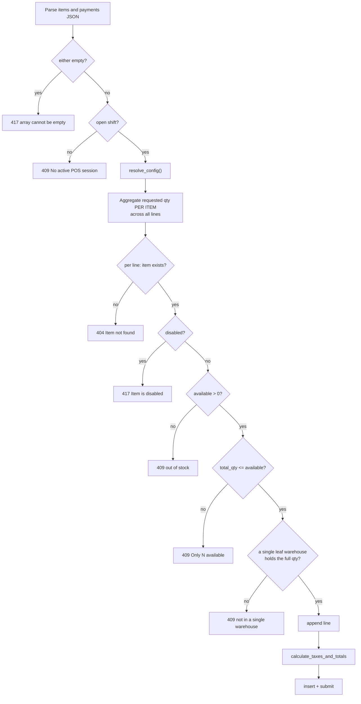
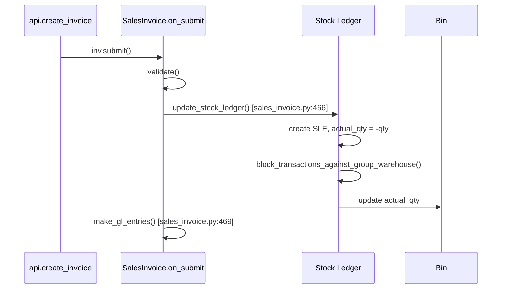

# 08 — Sales Workflow

## The Central Decision

> **Every POS sale is an ERPNext `Sales Invoice` with `is_pos = 1`, submitted immediately.**
> Swift does **not** use ERPNext's `POS Invoice` doctype.

The reason is recorded directly in the source at `api.py:552-555`:

```python
# Sales Invoice, not POS Invoice: POSInvoice.on_submit omits update_stock_ledger()
# and make_gl_entries() entirely, so stock and accounting only posted at closing
# via consolidation. SalesInvoice.on_submit posts both immediately. is_pos=1 keeps
# the payments table and POS behaviour; update_stock=1 drives the Stock Ledger.
```

| | `POS Invoice` | `Sales Invoice` (`is_pos=1`) |
|---|---|---|
| Stock Ledger at submit | **No** — deferred to consolidation | **Yes** |
| GL Entries at submit | **No** — deferred to consolidation | **Yes** |
| Payments child table | Yes | Yes (via `is_pos`) |
| Books correct immediately | No | **Yes** |
| Requires a closing/consolidation step | Yes | No |

ERPNext's `SalesInvoice.on_submit` calls `update_stock_ledger()` (line 466) and `make_gl_entries()` (line 469). `POSInvoice.on_submit` calls neither. That single difference is the whole rationale.

**The trade-off is explicit:** one submitted document per sale means more Stock Ledger and GL rows than a consolidated approach would produce. This business accepted that cost in exchange for books that are correct at the moment of sale, with no reconciliation step and no window during which stock and accounts disagree.

`POS Opening Entry` and `POS Closing Entry` are retained for shift and cash tracking, but they no longer post stock, GL, payments, or consolidated invoices.

---

## Creation

### Entry Point

`create_invoice(items, payments, customer=None)` — `api.py:532`, `POST`, gated on `Swift Cashier`.

### Document Header

```python
inv = frappe.new_doc("Sales Invoice")
inv.is_pos = 1
inv.pos_profile = config["pos_profile"]
inv.company = config["company"]
inv.customer = customer or frappe.db.get_value("POS Profile", config["pos_profile"], "customer")
inv.custom_pos_opening_entry = session.name
inv.set_warehouse = config["warehouse"]
inv.update_stock = 1
```

| Field | Purpose |
|---|---|
| `is_pos = 1` | Enables the `payments` child table and POS behaviour |
| `update_stock = 1` | **Mandatory.** Without it no Stock Ledger Entry is posted and stock never moves |
| `custom_pos_opening_entry` | Links the sale to the shift — the only shift attribution that exists |
| `set_warehouse` | The configured POS warehouse, which is a **group** node |
| `customer` | Falls back to the profile's `Walk-in Customer` |

Every value comes from `resolve_config()`. Nothing is hardcoded.

### Line Items

Each row is appended with a **real leaf warehouse**, not the header warehouse:

```python
inv.append("items", {
    "item_code": row["item_code"],
    "qty": flt(row["qty"]),
    "rate": flt(row.get("rate") or 0) or None,
    "warehouse": warehouse,     # from _sale_warehouse()
})
```

`rate` uses `flt(...) or None`: a falsy rate becomes `None`, letting ERPNext resolve the price from the configured price list. A client cannot sell at zero.

> **Warning — The `set_warehouse` Asymmetry**
> The header carries a **group** warehouse while rows carry **leaf** warehouses. ERPNext pushes `set_warehouse` down onto rows during validation, but by then Swift has already set per-row values that survive on the sale path.
>
> On the **return** path this becomes a live bug: `make_return_doc` copies `set_warehouse`, ERPNext pushes the group node onto every row, and the Stock Ledger Entry is rejected with `Group node warehouse is not allowed to select for transactions`. `create_return` must explicitly clear it. See `09_Return_Workflow.md`.

### Payments

```python
mode = payments[0]["mode_of_payment"]
inv.append("payments", {
    "mode_of_payment": mode,
    "amount": grand_total,
})
```

Exactly one row. The amount is the **post-tax `grand_total`**, computed server-side.

> **Warning**
> Only `payments[0]` is used; additional rows are ignored, and any client-supplied amount is discarded. **Split payments are not supported.** The override exists because the client sends a pre-tax cart total, which would not match the post-tax total.

---

## Validation

Validation happens in a specific order, and the order matters.



### Quantity Aggregation

The subtle and important step:

```python
requested = {}
for row in items:
    requested[row["item_code"]] = requested.get(row["item_code"], 0) + flt(row["qty"])
```

Availability is checked against the **combined** quantity per item, not per line. Two lines of 3 units cannot together sell 5 units when only 5 exist. Without this aggregation, each line would independently pass a check against the same 5 units.

### Stock Availability

`_available_qty(item_code, company)` sums `Bin.actual_qty` across the company's **leaf** warehouses.

`_sale_warehouse(item_code, qty, company, preferred)` then finds a single leaf warehouse holding the full quantity, preferring the configured one.

> **Note — Why "not in a single warehouse" Exists**
> If total stock across warehouses covers the quantity but no individual warehouse does, the sale is refused:
>
> `{item} has {n} in stock but not in a single warehouse. Transfer stock before selling.`
>
> Swift will not split one line across warehouses. That would require multiple rows for one cart line and complicate returns, since each row would need its own warehouse restored. The resolution is an operational stock transfer, not a code change.

### Negative Stock Is Never Permitted

```python
# No negative-stock override. Availability is enforced per line below, so the
# sale is refused instead of driving a warehouse negative. The previous code
# flipped Stock Settings.allow_negative_stock globally for the duration of the
# sale, which affected every concurrent user and stayed on if the process died.
```

This comment records a removed anti-pattern. The old code toggled a **global** setting for the duration of a sale, which affected every concurrent user and remained enabled if the process died mid-sale. Availability is now checked per line and the sale simply fails.

> **Warning**
> Do not re-introduce any code that enables `allow_negative_stock`, temporarily or otherwise. A sale with insufficient stock must fail.

---

## Stock Deduction

Swift writes **no** stock records. ERPNext does it during `submit()`.



For each line ERPNext creates a `Stock Ledger Entry` with negative `actual_qty` against that row's warehouse, recalculates valuation per the item's method, and updates the `Bin` row.

The group-warehouse guard lives here: `block_transactions_against_group_warehouse()` at `stock_ledger_entry.py:302`, calling `is_group_warehouse()` at `stock/utils.py:440`. This is what rejects any attempt to move stock against a group node — including the return-path bug.

---

## GL Entries

Also entirely ERPNext's work, via `make_gl_entries()`.

A cash POS sale produces two balanced pairs:

**Revenue**

| Account | Dr | Cr |
|---|---|---|
| Cash (from Mode of Payment) | grand_total | |
| Income / Sales | | net_total |
| Tax payable (if any) | | tax_amount |

**Cost of goods**

| Account | Dr | Cr |
|---|---|---|
| Cost of Goods Sold | valuation | |
| Stock In Hand | | valuation |

Accounts resolve from configuration, never from Swift code:

| Account | Source |
|---|---|
| Cash | `Mode of Payment.accounts.default_account` → `1110 - Cash - S` |
| Income | POS Profile `income_account`, else Company default |
| COGS / expense | POS Profile `expense_account` → `5111 - Cost of Goods Sold - S` |
| Stock In Hand | Warehouse or Company default |
| Cost Center | POS Profile `cost_center` → `Main - S` |

> **Note**
> In the reference fixture, `income_account` is empty on the POS Profile, so ERPNext falls back to the Company's default income account. Both `expense_account` and `write_off_account` are set to `5111 - Cost of Goods Sold - S`. Whether that is the intended write-off account is a configuration decision, not a code issue.

Because both modes of payment (`Cash` and `Insta pay`) are typed `Cash` and map to the same account `1110 - Cash - S`, **both count toward expected cash at shift close.** An Insta pay transaction increases the cash the cashier is expected to have counted. This is a configuration consequence worth confirming against business intent.

---

## Payment Application

With `is_pos = 1` and a payments row totalling `grand_total`, ERPNext marks the invoice **Paid** at submission. `outstanding_amount` becomes zero and no separate `Payment Entry` is created — the payments table settles the invoice inline. This is the point of POS mode.

`status` in the response is therefore normally `Paid`.

---

## Bin Updates

`Bin` holds one row per item + warehouse and is maintained entirely by ERPNext.

| Field | Effect of a sale |
|---|---|
| `actual_qty` | Decreased by the line quantity |
| `stock_value` | Recalculated |
| `valuation_rate` | Recalculated per the item's valuation method |

Swift only ever **reads** Bin — for `_available_qty`, `_sale_warehouse`, the inventory list, and the low-stock alert.

A Bin row exists only for warehouses that have held the item; a missing row means zero. All Swift reads use `or 0`.

After a sale the frontend invalidates `["item_search"]` so the grid reflects new quantities without a reload:

```ts
queryClient.invalidateQueries({ queryKey: ["item_search"] });
```

---

## Stock Warnings

After submission the endpoint checks each item's Bin **at the configured POS warehouse**:

```python
stock_qty = flt(frappe.db.get_value(
    "Bin", {"item_code": row["item_code"], "warehouse": config["warehouse"]}, "actual_qty"
) or 0)
if stock_qty < 0:
    stock_warnings.append(f"{row['item_code']}: {stock_qty} in stock")
```

`PaymentModal` renders these in an amber panel.

> **Note**
> This check reads the **configured** warehouse (`Stores - S`, a group node), not the leaf warehouse the sale drew from. A group warehouse has no Bin row, so the lookup returns `None` → `0`, which is not negative. **In practice this list is effectively always empty.** It is a diagnostic for pre-existing negative stock rather than a check on the current sale, and its usefulness is limited by reading the wrong warehouse. Recorded in `18_Future_Roadmap.md`.

---

## Response

```python
return {
    "invoice": inv.name,
    "grand_total": grand_total,
    "net_total": flt(inv.net_total),
    "taxes": taxes,           # [{description, tax_amount, rate}]
    "status": inv.status,
    "stock_warnings": stock_warnings,
}
```

`PaymentModal` uses `grand_total` for the change calculation, `net_total` and `taxes` for the breakdown, and `invoice` for the print URL.

---

## Impact on Financial Reports

Because sales are ordinary submitted `Sales Invoice` documents, every standard ERPNext report works with no Swift-specific handling:

| Report | Effect |
|---|---|
| General Ledger | Revenue, tax, cash, COGS, and stock entries appear immediately |
| Trial Balance | Balanced at all times |
| Profit and Loss | Revenue and COGS recognised at sale time |
| Balance Sheet | Cash up, inventory down |
| Accounts Receivable | Empty for POS sales — they are paid at creation |
| Sales Register | Every POS sale listed |
| Stock Ledger | One entry per line |
| Stock Balance / Projected Qty | Current at all times |
| Item-wise Sales History | Complete |
| Gross Profit | Correct — both revenue and COGS post together |

This is the payoff for using `Sales Invoice`: no consolidation step, no reporting gap, and no period during which stock and accounts disagree.

### Shift Reporting

Sales are attributable to a shift through `custom_pos_opening_entry`. This is a `Link` field, so it can be used as a filter or a group-by in a report builder view of `Sales Invoice`.

`session_invoices(opening_entry)` returns a shift's invoices over the API. It is **implemented but not called by the frontend** — there is no shift-report screen. Building one is proposed in `18_Future_Roadmap.md`.

---

## Cancellation and Amendment

Swift exposes **no endpoint to cancel a Sales Invoice.** This is deliberate: the return workflow is the sanctioned way to reverse a sale, and it preserves the audit trail.

Cancellation through the Frappe desk is possible for an administrator and reverses the Stock Ledger and GL entries. It should be a last resort — a cancelled invoice breaks the shift's cash reconciliation, because expected cash is computed from submitted invoices linked to the shift, and the drawer will then appear over by that amount.

> **Warning**
> Prefer a return over a cancellation for any completed sale. Returns are designed for it, keep the audit trail intact, and do not distort shift reconciliation.

---

## Complete Worked Example

**Cart:** 2 × Brake Pad Set @ 250, 1 × Oil Filter @ 85. No tax configured. Payment: Cash 585.

**Request**

```http
POST /api/method/swift_core.api.create_invoice
Content-Type: application/x-www-form-urlencoded
X-Frappe-CSRF-Token: <token>
X-Device-Id: 3f9c1e2a-...
Cookie: sid=<session>

items=[{"item_code":"ITEM-001","qty":2,"rate":250},{"item_code":"ITEM-002","qty":1,"rate":85}]&payments=[{"mode_of_payment":"Cash","amount":585}]
```

**Response**

```json
{
  "message": {
    "invoice": "ACC-SINV-2026-00187",
    "grand_total": 585.0,
    "net_total": 585.0,
    "taxes": [],
    "status": "Paid",
    "stock_warnings": []
  }
}
```

**Database effects**

| Table | Change |
|---|---|
| `Sales Invoice` | 1 submitted document, `is_pos=1`, `custom_pos_opening_entry` set |
| `Sales Invoice Item` | 2 rows, each with a leaf warehouse |
| `Sales Invoice Payment` | 1 row, Cash 585.00 |
| `Stock Ledger Entry` | 2 entries: −2 ITEM-001, −1 ITEM-002 |
| `GL Entry` | Dr Cash 585 / Cr Income 585, plus Dr COGS / Cr Stock at valuation |
| `Bin` | `actual_qty` reduced for both items |

**Then:** the receipt window opens, the cart clears, `["item_search"]` is invalidated, and 585.00 is added to the shift's expected cash.
