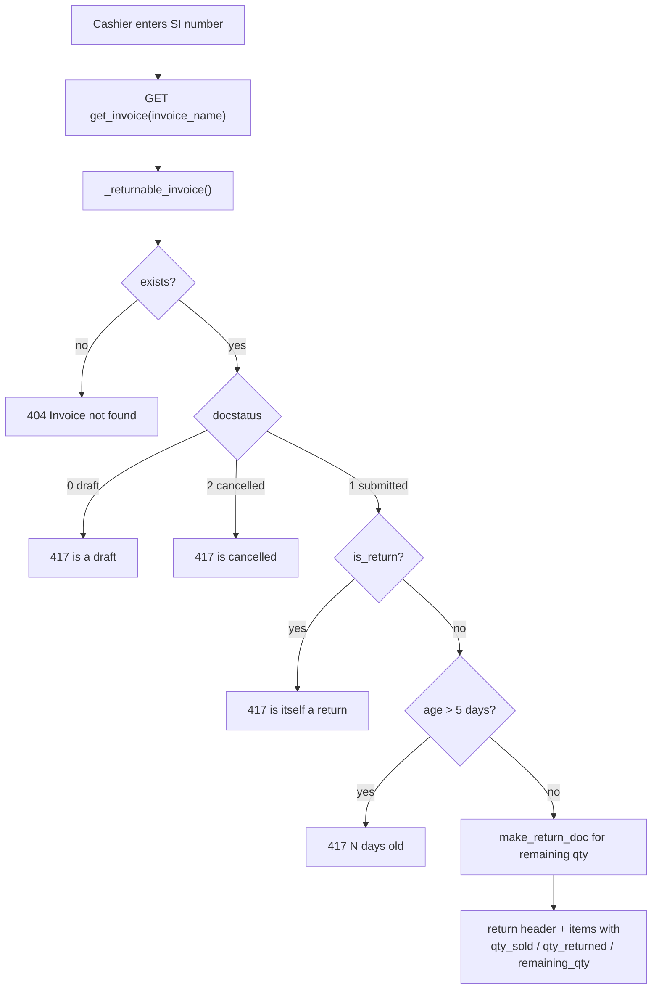
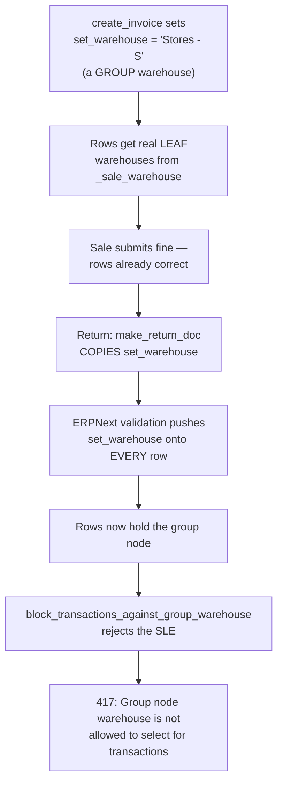

# 09 — Return Workflow

## Business Rules

These are enforced server-side and are not negotiable from the client.

| Rule | Enforcement |
|---|---|
| Returns are located **by Sales Invoice number only** | No other lookup endpoint exists |
| Returns accepted within **5 days** of the posting date | `_returnable_invoice` |
| Cannot return a draft invoice | `_returnable_invoice` |
| Cannot return a cancelled invoice | `_returnable_invoice` |
| Cannot return a return | `_returnable_invoice` |
| Cannot exceed remaining quantity per item | `create_return` clamping |
| Cannot return an already fully-returned invoice | `create_return` |
| Stock returns to the warehouse it was **sold from** | `create_return` per-row warehouse restore |
| Serial numbers preserved and trimmed to quantity | `create_return` |
| Uses **native ERPNext return documents** | `make_return_doc` |
| Only `Swift Cashier` may process returns | `require_role` |

> **Note — No Search by Customer, Item, or Barcode**
> This is a deliberate business rule, not a missing feature. There is no endpoint to find invoices by customer, item, date range, or barcode. The customer must present the invoice number. This prevents fishing for returnable invoices and keeps every return traceable to a specific sale.

---

## The Five-Day Window

```python
RETURN_WINDOW_DAYS  # module-level constant

days = date_diff(nowdate(), doc.posting_date)
if days > RETURN_WINDOW_DAYS:
    frappe.throw(
        _("Invoice {0} is {1} days old. Returns are only accepted within {2} days.").format(
            invoice_name, days, RETURN_WINDOW_DAYS
        )
    )
```

Measured in **whole days** from `posting_date` to today, not in hours. An invoice posted five days ago is still returnable; six days is refused.

The window is checked **twice** — once by `get_invoice` when the screen loads, and again by `create_return` at submit. This is deliberate:

```python
# Re-checks the return policy at submit time rather than trusting whenever
# the screen was loaded; throws if the invoice is not returnable.
original = _returnable_invoice(invoice_name)
```

A screen left open overnight cannot submit a return that has since expired.

---

## Stage 1 — Initiation and Lookup

The cashier opens `/returns` and enters an invoice number. `ReturnScreen` calls `get_invoice`.



### Response

```json
{
  "name": "ACC-SINV-2026-00187",
  "customer": "Walk-in Customer",
  "customer_name": "Walk-in Customer",
  "posting_date": "2026-07-30",
  "posting_time": "14:22:08",
  "currency": "EGP",
  "net_total": 585.0,
  "total_taxes_and_charges": 0.0,
  "discount_amount": 0.0,
  "grand_total": 585.0,
  "items": [
    {
      "item_code": "ITEM-001",
      "item_name": "Brake Pad Set",
      "uom": "Nos",
      "rate": 250.0,
      "amount": 500.0,
      "discount_amount": 0.0,
      "qty_sold": 2.0,
      "qty_returned": 0.0,
      "remaining_qty": 2.0
    }
  ]
}
```

Remaining quantities come from ERPNext's own `make_return_doc`, which already accounts for prior returns, so the screen and the submit path derive their ceilings from the same source.

### Not Restricted to the Caller's Shift

Recorded in the source:

```python
# Deliberately not restricted to the caller's own session. A return is
# presented days later, by whichever cashier is on shift, so the previous
# ownership check rejected virtually every genuine return.
```

Any cashier can process any returnable invoice. The five-day policy is the control that matters, and the response is limited to the fields the Return screen renders.

> **Warning — Known Defect in Displayed Quantities**
> Line 820 builds the remaining map keyed by `item_code`:
> ```python
> remaining = {row.item_code: abs(flt(row.qty)) for row in returnable.items}
> ```
> When the **same item appears on two lines** of one invoice, the second row overwrites the first. `remaining_qty` and `qty_returned` are then wrong for that item — typically showing only the last line's quantity.
>
> **The submit path is not affected.** `create_return` sums per item (see Stage 3), so an over-return is still refused. The consequence is a display error: the screen may show a lower ceiling than is actually available, so a legitimate return can appear impossible. The fix is to sum rather than overwrite, mirroring `create_return`. See `17_Troubleshooting.md`.

---

## Stage 2 — Full vs Partial

The distinction is made by whether `items` is supplied.

| Return type | Request |
|---|---|
| **Full** | Omit `items` entirely |
| **Partial** | Supply `items=[{item_code, qty}, ...]` |

```http
# Full return — everything still returnable
invoice_name=ACC-SINV-2026-00187&reason=Defective

# Partial return — one unit of one item
invoice_name=ACC-SINV-2026-00187&items=[{"item_code":"ITEM-001","qty":1}]&reason=Customer changed mind
```

A "full" return returns everything **still returnable**, not everything originally sold. After a prior partial return, a full return covers only the remainder.

---

## Stage 3 — Quantity Clamping

### Building the Ceilings

```python
remaining = {}
for row in return_doc.items:
    remaining[row.item_code] = remaining.get(row.item_code, 0) + abs(flt(row.qty))
if not any(remaining.values()):
    frappe.throw(_("Invoice {0} has already been fully returned.").format(invoice_name))
```

`make_return_doc` has already set each row's quantity to what is still returnable — ERPNext computes `qty = -1 * (original_qty - already_returned)` at `sales_and_purchase_return.py:532`. Those are therefore the authoritative ceilings.

Two properties follow:

- **Summing per item is required.** The client selects by item, not by row. If the same item sits on two rows of 3 and 2, the ceiling must be 5. Keying by `item_code` without summing would give 2, silently refusing a legitimate return of 5. *(This is exactly the bug still present in `get_invoice`.)*
- **A fully-returned invoice yields all zeroes**, which is what makes the duplicate-return check reliable.

### Validating the Request

```python
requested = {row["item_code"]: flt(row["qty"]) for row in items}

for item_code, qty in requested.items():
    if qty <= 0:
        continue
    allowed = remaining.get(item_code, 0)
    if qty > allowed:
        frappe.throw(
            _("Cannot return {0} of {1}. Only {2} remaining.").format(qty, item_code, allowed)
        )
```

> **Note**
> The comment in the source states the reasoning plainly: *"The client is not trusted with quantities — an over-return would post stock and GL that never existed on the original sale."* An over-return would create inventory and reverse revenue that was never recorded.

### Spreading Across Rows

```python
outstanding = dict(requested)
filtered_items = []
for row in return_doc.items:
    qty = outstanding.get(row.item_code)
    if not qty or qty <= 0:
        continue
    take = min(qty, abs(flt(row.qty)))
    if take <= 0:
        continue
    # ... serial trimming ...
    row.qty = -take
    outstanding[row.item_code] = qty - take
    filtered_items.append(row)
if not filtered_items:
    frappe.throw(_("None of the requested items match the original invoice."))
return_doc.items = filtered_items
```

Each requested quantity is spread across that item's rows **in order**, taking as much as each row allows before moving to the next. Rows contributing nothing are dropped.

This matters because rows may sit in **different warehouses**. Spreading in row order returns stock from the rows it was actually sold on, so each unit goes back where it came from.

Quantities stay **negative** — that is what makes the document a return.

---

## Stage 4 — Warehouse Restoration

This is the fix for the most significant bug this workflow has had.

```python
return_doc.set_warehouse = None
sold_from = {row.name: row.warehouse for row in original.items}
for row in return_doc.items:
    warehouse = sold_from.get(row.sales_invoice_item)
    if warehouse:
        row.warehouse = warehouse
```

### Why `set_warehouse = None` Is Required



`set_warehouse` is a header-level "apply this warehouse to all rows" convenience. The configured POS warehouse is a **group** node (`Stores - S`, `is_group = 1`), and group warehouses cannot hold stock — enforced at `stock_ledger_entry.py:302` via `stock/utils.py:440`.

Setting per-row warehouses is **not sufficient**, because ERPNext overwrites them from the header during validation. The header value must be cleared.

### Why Keyed by Row Name

`sold_from` maps **row name → warehouse**, and lookup uses `row.sales_invoice_item`:

```python
sold_from = {row.name: row.warehouse for row in original.items}
warehouse = sold_from.get(row.sales_invoice_item)
```

ERPNext sets `sales_invoice_item` on each return row to the original row's name, unconditionally for Sales Invoice returns (`sales_and_purchase_return.py:541-542`).

> **Warning**
> Keying by `item_code` instead of row name would be **wrong**. The same item can appear on two lines drawn from two different warehouses, and an `item_code` key would collapse them and return stock to whichever warehouse happened to be last. That is a silent inventory error — the return succeeds, quantities balance, but the stock is in the wrong place.

### Why `default_warehouse_for_sales_return` Does Not Interfere

ERPNext's `make_return_doc` accepts an optional third argument that overrides the return warehouse (`sales_and_purchase_return.py:546-547`):

```python
if default_warehouse_for_sales_return:
    target_doc.warehouse = ...
```

Swift **does not pass it**, so the override never fires and Swift's own per-row assignment is authoritative. Do not add that argument — it would defeat the sold-from logic.

---

## Stage 5 — Serial Numbers

```python
if row.get("serial_no"):
    serials = [s for s in str(row.serial_no).split("\n") if s.strip()]
    if len(serials) > take:
        row.serial_no = "\n".join(serials[: int(take)])
```

`make_return_doc` populates `serial_no` with **every serial still returnable** for that row, sized to the full remaining quantity (`update_non_bundled_serial_nos`, `sales_and_purchase_return.py:570-577`):

```python
serial_nos = list(set(get_serial_nos(source_doc.serial_no)) - set(returned_serial_nos))
target_doc.serial_no = "\n".join(serial_nos)
```

On a partial return the quantity is reduced but the serial list is not, so ERPNext rejects the row for a serial/quantity mismatch. Trimming to `take` fixes it.

> **Note**
> The serials kept are the **first `take`** from the list, which is set-derived and therefore not in a meaningful order. For a partial return of serialized stock, the specific serials recorded may not be the physical units the customer handed back. Quantities and accounting are correct; serial-level tracking is approximate. Selecting specific serials would require a UI for it — recorded in `18_Future_Roadmap.md`.

Batch and serial bundles are handled by ERPNext at `sales_and_purchase_return.py:549-568`; Swift does not touch them.

---

## Stage 6 — Reason

```python
if reason:
    # Native Sales Invoice field; no custom field needed for the return note.
    return_doc.remarks = reason
```

Written to the native `remarks` field. No custom field was added.

---

## Stage 7 — Submission

```python
return_doc.flags.ignore_permissions = True
return_doc.insert(ignore_permissions=True)
return_doc.submit()

return {"return_invoice": return_doc.name, "status": "Return"}
```

`ignore_permissions` is safe here for the same reason as `create_invoice`: the role gate ran first, and the document was built from the original invoice with quantities clamped to what that invoice contained.

---

## Stock Restoration

ERPNext posts the reversal during `submit()`:

| Effect | Detail |
|---|---|
| `Stock Ledger Entry` | One per row with **positive** `actual_qty`, against the sold-from warehouse |
| `Bin.actual_qty` | Increased |
| Valuation | Recalculated |

Swift writes nothing to either table.

---

## Refund Processing and Ledger

The return document reverses the original accounting:

| Account | Original sale | Return |
|---|---|---|
| Cash | Dr grand_total | **Cr** grand_total |
| Income | Cr net_total | **Dr** net_total |
| Tax | Cr tax | **Dr** tax |
| COGS | Dr valuation | **Cr** valuation |
| Stock In Hand | Cr valuation | **Dr** valuation |

The original invoice's status becomes `Credit Note Issued`; the return document's status is `Return`.

> **Warning — Physical Refund Is Outside the System**
> Swift creates the accounting reversal. It does **not** integrate with any payment gateway and does not automate card refunds. Handing cash back is a manual step.
>
> Because the return credits the cash account, it **reduces the shift's expected cash**. A cash refund therefore reconciles correctly at shift close, provided the cashier actually paid the money out. A return processed without paying the customer will leave the drawer over.

> **Note — `allow_in_returns` Is 0**
> Both modes of payment in the POS Profile fixture have `allow_in_returns: 0`. Returns still work because they use ERPNext's return document rather than the POS payment path. The flag is inconsistent with the feature but has no effect on the implemented flow.

---

## Complete Worked Example

**Original:** `ACC-SINV-2026-00187`, posted 2026-07-30 — 2 × ITEM-001 @ 250 (from `Stores - Main - S`), 1 × ITEM-002 @ 85. Total 585.00.

**Request** — return 1 × ITEM-001, three days later:

```http
POST /api/method/swift_core.api.create_return
Content-Type: application/x-www-form-urlencoded
X-Frappe-CSRF-Token: <token>
Cookie: sid=<session>

invoice_name=ACC-SINV-2026-00187&items=[{"item_code":"ITEM-001","qty":1}]&reason=Customer changed mind
```

**Response**

```json
{
  "message": {
    "return_invoice": "ACC-SINV-2026-00191",
    "status": "Return"
  }
}
```

**Effects**

| Table | Change |
|---|---|
| `Sales Invoice` | New submitted doc, `is_return=1`, `return_against=ACC-SINV-2026-00187`, `remarks="Customer changed mind"` |
| `Sales Invoice Item` | 1 row, `qty = -1`, `warehouse = Stores - Main - S`, `sales_invoice_item` → original row |
| `Stock Ledger Entry` | +1 ITEM-001 into `Stores - Main - S` |
| `GL Entry` | Cr Cash 250 / Dr Income 250; Cr COGS / Dr Stock at valuation |
| `Bin` | ITEM-001 `actual_qty` +1 |
| Original invoice | Status → `Credit Note Issued` |
| Shift | Expected cash reduced by 250 |

**A second lookup** now reports `qty_sold: 2.0`, `qty_returned: 1.0`, `remaining_qty: 1.0` for ITEM-001, and ITEM-002 unchanged at 1 remaining.

---

## Error Reference

| Code | Message | Cause | Resolution |
|---|---|---|---|
| 404 | `Invoice {0} not found.` | Wrong number | Verify the number on the receipt |
| 417 | `Invoice {0} is a draft and cannot be returned.` | `docstatus = 0` | Should not occur — POS invoices submit immediately |
| 417 | `Invoice {0} is cancelled and cannot be returned.` | `docstatus = 2` | Cancelled sales cannot be returned |
| 417 | `{0} is itself a return and cannot be returned.` | `is_return = 1` | Return the original invoice |
| 417 | `Invoice {0} is {1} days old. Returns are only accepted within {2} days.` | Outside the window | Policy decision; requires an administrator acting in the desk |
| 417 | `Invoice {0} has already been fully returned.` | Nothing remaining | Verify prior returns |
| 417 | `Cannot return {0} of {1}. Only {2} remaining.` | Over-return | Reduce the quantity |
| 417 | `None of the requested items match the original invoice.` | Wrong item codes | Verify against the invoice |
| 417 | `Group node warehouse is not allowed to select for transactions` | **Should no longer occur** | See below |
| 417 | Serial/quantity mismatch | **Should no longer occur** | See below |
| 403 | Permission error | Not a cashier | Storekeepers cannot process returns |

### If the Group-Warehouse Error Reappears

The fix is `return_doc.set_warehouse = None` plus per-row restoration in `create_return`. If the error returns, check in order:

1. Is `return_doc.set_warehouse = None` still present in `create_return`?
2. Was the bench copy of `api.py` updated and `bench restart` run? *(The frontend `api.py` is a staging copy — see `12_Developer_Guide.md`.)*
3. Do the original invoice's rows carry leaf warehouses? An invoice created before `_sale_warehouse` existed may hold a group warehouse on its rows, and there is nothing valid to restore.
4. Was `default_warehouse_for_sales_return` added as a third argument to `make_return_doc`? It must not be.

### If Serial/Quantity Mismatch Reappears

Check that the serial-trimming block is still inside the row loop and executes **before** `row.qty = -take`. Trimming after the quantity assignment, or outside the loop, reintroduces the fault.
