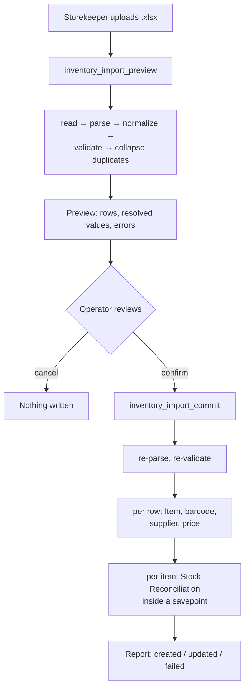

# 10 — Stock and Inventory Workflow

## Scope

Everything the storekeeper does: warehouse selection, stock entries, the Excel importer, export, and barcode and supplier handling. All endpoints in this document are gated on **`Swift Storekeeper`**.

---

## Warehouse Selection

### Group vs Leaf

This distinction governs more behaviour than any other single concept in the stock layer.

| | Group warehouse (`is_group = 1`) | Leaf warehouse (`is_group = 0`) |
|---|---|---|
| Can hold stock | **No** | Yes |
| Has `Bin` rows | No | Yes |
| Valid on a transaction | **No** | Yes |
| Purpose | Tree organisation | Actual storage |

ERPNext rejects any stock movement against a group warehouse in `block_transactions_against_group_warehouse()` (`stock_ledger_entry.py:302`), which calls `is_group_warehouse()` (`stock/utils.py:440`).

> **Warning**
> The configured POS warehouse in the reference setup is `Stores - S`, which **is a group warehouse**. Swift works around this at sale time by resolving a real leaf warehouse per line. Understanding this is essential to understanding both the sales and return paths. See `08_Sales_Workflow.md` and `09_Return_Workflow.md`.

### The Two Listing Endpoints

| Endpoint | Company filter | Group filter |
|---|---|---|
| `list_warehouses` | **No** | — |
| `list_import_warehouses` | **Yes** | Yes |

> **Warning**
> `list_warehouses` applies **no company filter**. On a multi-company site it returns warehouses belonging to other companies. `list_import_warehouses` was written correctly and filters by the configured company. Recorded in `18_Future_Roadmap.md`.

### Resolution in Code

```python
def _stock_warehouses(company):      # leaf warehouses only (is_group = 0)
def _available_qty(item_code, company)   # sums Bin.actual_qty across those
def _sale_warehouse(item_code, qty, company, preferred=None)
```

`_sale_warehouse` returns a single leaf warehouse holding the **full** requested quantity, preferring the configured one. Returning `None` produces the "not in a single warehouse" error — Swift will not split one sale line across warehouses.

`_resolve_warehouse(company, preferred)` serves the import path, falling back to a configured value rather than a hardcoded name.

---

## Stock Entries

`create_stock_entry(stock_entry_type, items)` — `api.py:1099`, `POST`, `Swift Storekeeper`.

Used for receiving stock and making adjustments. Creates and submits a native ERPNext `Stock Entry`.

| Parameter | Type | Required |
|---|---|---|
| `stock_entry_type` | string | Yes |
| `items` | JSON array | Yes |

Each item carries `item_code`, `qty`, and a warehouse (`s_warehouse` for issues, `t_warehouse` for receipts), optionally `basic_rate`.

**Group warehouses are validated explicitly** at line 1141 — this endpoint had the guard the return path originally lacked.

| Error | Code |
|---|---|
| Missing type or items | 417 |
| Group warehouse selected | 417 |
| ERPNext validation failure | 417 |
| Not a storekeeper | 403 |

Submission posts Stock Ledger Entries and updates Bins. Swift writes neither directly.

`get_stock_entry(name)` retrieves one. **Not called by the frontend.**

---

## Bin Updates

`Bin` is ERPNext's stock quantity table — one row per item + warehouse. **Swift only reads it.**

| Reader | Purpose |
|---|---|
| `_available_qty` | Sale availability |
| `_sale_warehouse` | Warehouse selection |
| `_inventory_rows` | Inventory list and export |
| `check_low_stock` | Daily alert |
| `create_invoice` | Post-sale stock warnings |

A Bin row exists only for warehouses that have held the item. **A missing row means zero, not an error** — every Swift read uses `or 0`.

---

## Negative Stock Prevention

Three layers, all active:

| Layer | Mechanism |
|---|---|
| Client | `cartStore.addItem` refuses quantities above `stock_qty` |
| API | `create_invoice` re-checks `_available_qty` per item, aggregated across lines |
| ERPNext | Rejects the submit if the Stock Ledger would go negative |

The source records a removed anti-pattern:

```python
# No negative-stock override. Availability is enforced per line below, so the
# sale is refused instead of driving a warehouse negative. The previous code
# flipped Stock Settings.allow_negative_stock globally for the duration of the
# sale, which affected every concurrent user and stayed on if the process died.
```

> **Warning**
> Never re-introduce code that toggles `allow_negative_stock`. It is a **global** setting: enabling it for one sale affects every concurrent user, and a crash mid-sale leaves it permanently on. A sale with insufficient stock must fail.

---

## The Excel Importer

The largest subsystem in the backend, spanning roughly lines 1440–2500.

### Two-Phase Design



**Preview writes nothing** and is safe to call repeatedly. **Commit re-does all parsing and validation** rather than trusting anything from the preview — the file is the only input, so a tampered or stale preview cannot influence what is written.

### File Constraints

`_read_uploaded_xlsx()` (line 2089):

| Constraint | Value |
|---|---|
| Format | **`.xlsx` only** |
| Maximum size | **10 MB** |

`.xls`, `.csv`, and everything else are rejected.

### Column Aliases

Headers are matched case-insensitively against an alias table, so sheets from different suppliers work without editing:

| Canonical field | Accepted headers |
|---|---|
| `item_name` | `item_name`, `description`, *(plus name variants)* |
| `qty` | `qty`, `quantity`, `stock`, `current stock` |
| `supplier` | `supplier`, `vendor` |
| `cost_price` | `cost price`, `cost`, `buying price`, `buying_price`, `purchase price` |
| `selling_price` | `selling price`, `selling_price`, `price` |
| `barcode` | `barcode` |

**Required columns:**

```python
REQUIRED_IMPORT_COLUMNS = ("item_name", "qty")
```

Everything else is optional. A sheet lacking a recognisable name or quantity column is rejected outright.

### Export Round-Trips

```python
EXPORT_COLUMNS = (
    ("item_name", "Name"),
    ("barcode", "Barcode"),
    ("qty", "QTY"),
    ("supplier", "Supplier"),
    ("cost_price", "Cost Price"),
    ("selling_price", "Selling Price"),
)
```

Export headers are **deliberately untranslated English**, because they must round-trip through `IMPORT_COLUMN_ALIASES`. The source explains both reasons: translating them would break re-import, and translating at module load would freeze them to whichever language was active on first import.

**This makes export → edit → import a supported workflow.**

---

## Unicode Normalization

The importer's most unusual component, and it exists for a concrete reason.

### The Problem

Arabic sheets exported from Excel carry characters that are invisible but not equal to a space. Two rows that look identical produce two different keys, so the same item is created twice — and the second insert collides on `Item.name`, making the row **vanish from the import** without an obvious cause.

### The 17 Stripped Codepoints

Built from ordinals rather than literals, because as literals they are unreviewable in a diff and indistinguishable in an editor:

| Codepoint | Name |
|---|---|
| `U+200B` | Zero width space |
| `U+200C` | Zero width non-joiner |
| `U+200D` | Zero width joiner |
| `U+200E` | Left-to-right mark |
| `U+200F` | Right-to-left mark |
| `U+061C` | Arabic letter mark |
| `U+202A` | Left-to-right embedding |
| `U+202B` | Right-to-left embedding |
| `U+202C` | Pop directional formatting |
| `U+202D` | Left-to-right override |
| `U+202E` | Right-to-left override |
| `U+2066` | Left-to-right isolate |
| `U+2067` | Right-to-left isolate |
| `U+2068` | First strong isolate |
| `U+2069` | Pop directional isolate |
| `U+FEFF` | Byte order mark |
| `U+00AD` | Soft hyphen |

### Normalization Steps

`_normalize_text(value)` also handles NBSP (`U+00A0`), narrow NBSP (`U+202F`), and Arabic tatweel padding, then applies **NFC composition**.

NFC is used because Arabic letters with diacritics have both precomposed and decomposed encodings, and **MariaDB compares byte forms**. NFC is the composing form, so text is never rewritten into a different visual form.

`_match_key(value)` produces a casefolded key for comparison. Matching uses the key; **storage uses the normalized original**, so display text is preserved.

> **Note**
> This is not defensive over-engineering. Without it, an Arabic supplier sheet silently drops rows — the hardest class of import bug to diagnose, because the file looks correct and no error is raised.

---

## Duplicate Handling

Two mechanisms, for two different problems.

**Within one sheet** — `_collapse_duplicate_rows` (2021) and `_merge_import_rows` (2060) combine rows whose normalized names match, so a sheet listing the same item twice does not attempt two inserts.

**Against existing data** — `_find_item_by_name` (1837) looks up an existing Item by normalized name, so re-importing updates rather than duplicating.

---

## Automatic Creation

The importer creates supporting records on demand rather than requiring pre-setup.

### Items

`_apply_import_row` (2168) creates the Item if no normalized-name match exists, otherwise updates it. `item_group`, `stock_uom`, and `warehouse` come from `_resolve_item_group`, `_resolve_stock_uom`, and `_resolve_warehouse` — **never hardcoded**.

### Barcodes

`_generate_barcode` (1717) generates one when a row has none; `_ensure_barcode` (1740) attaches it. A row with a barcode keeps it.

Barcodes are **globally unique** across all Items (enforced by ERPNext), which is why `validate_barcode` and `_barcode_owner` exist — the API checks ownership first so the user gets a clear message rather than a database error.

### Suppliers

`_ensure_supplier` (1754) finds or creates a Supplier using normalized-name matching, so `"مورد الأدوات"` with an invisible mark does not create a second record.

### Prices

`_set_item_price` (1799) creates or updates an `Item Price` keyed by item + price list + UOM. The price list comes from `_resolve_price_list(preferred, buying_or_selling)`, so cost prices go to a buying list and selling prices to a selling list.

---

## Stock Reconciliation

How the importer sets quantities — and the reason imports are safely repeatable.

```python
def _reconcile_stock(applied, config):   # line 2292
```

**One `Stock Reconciliation` per item, each inside its own savepoint.**

### Absolute, Not Delta

The sheet's `qty` is the **target** quantity, not an amount to add. Importing a sheet that says 50 sets stock to 50, whether it was 0, 30, or 80 before.

> **Note — Idempotence**
> Because quantities are absolute, **re-running the same file is safe**. This is deliberate: a partially failed import can be re-run without double-counting. A delta-based importer would corrupt stock on every retry.

### Per-Item Savepoints

Each reconciliation is wrapped so a single failing item does not abort the batch. Successful rows commit; failures are reported per row.

### EmptyStockReconciliationItemsError Is Success

ERPNext raises `EmptyStockReconciliationItemsError` when the target quantity already equals the actual quantity — there is nothing to reconcile.

`_reconcile_stock` **catches this and treats it as success**, because it means "already correct".

> **Warning**
> Do not "fix" this by letting the exception propagate. It is the expected outcome for any unchanged row, and on a re-run it is the outcome for **most** rows. Letting it through would report a successful no-op import as a total failure.

---

## Import Validation

`_validate_import_row` (1970) checks each row and collects errors rather than aborting, so the preview can show every problem at once.

An inner `number(raw, label, default=None, required=False)` helper parses numeric cells, tolerating blanks, thousands separators, and stray whitespace, and produces a labelled error on genuinely unparseable input.

| Rule | Behaviour |
|---|---|
| `item_name` required | Row rejected if blank |
| `qty` required and numeric | Row rejected if missing or unparseable |
| `cost_price` / `selling_price` optional, numeric | Rejected only if present and unparseable |
| `supplier` optional | Created if new |
| `barcode` optional | Generated if absent |

---

## Import Errors

| Error | Cause | Resolution |
|---|---|---|
| Rejected file type | Not `.xlsx` | Save as `.xlsx` |
| File too large | Over 10 MB | Split the sheet |
| No recognisable columns | Headers unmatched | Rename to a supported alias |
| Missing `item_name` / `qty` column | Required columns absent | Add them |
| Row-level numeric error | Unparseable cell | Fix the cell |
| Barcode already used | Belongs to another item | Remove or correct the barcode |
| Reconciliation failure for one item | Item-specific issue | Reported per row; other rows still commit |
| 403 | Not a storekeeper | Wrong role |

**Recovery:** fix the sheet and re-import. Because reconciliation is absolute, re-importing corrected rows alongside already-successful ones is safe.

---

## Inventory Listing

`inventory_list(search, supplier, barcode, limit=100, start=0)` — `api.py:2660`.

Backed by `_inventory_rows` (2502), which joins Item, Bin, and Item Price and includes a `price_map(price_list)` helper for cost and selling prices. Offset pagination via `limit` / `start`.

`update_inventory_item` (2706, `PUT`) edits a row including price and supplier — broader than `update_item`, which is restricted to four fields.

---

## Inventory Export

`inventory_export(search, supplier, barcode)` — `api.py:2667`.

Same filters as the list, no pagination. Shares `_inventory_rows`, so **export always matches what the list shows**.

Returns binary `.xlsx` outside the JSON envelope:

```python
frappe.local.response.filename = ...
frappe.local.response.filecontent = ...
frappe.local.response.type = "binary"
```

> **Warning — The 417 Export Failure**
> Because the response type is `binary`, a bare `frappe.throw()` inside this endpoint produces a malformed response that reaches the client as **HTTP 417 with no usable body**. This was the historic export failure, and a comment in the source records it.
>
> Error paths in this endpoint must set the status code explicitly rather than relying on `throw`. Any new binary-response endpoint has the same constraint.

Clients must handle a binary body, not JSON.

---

## Barcode Management

| Endpoint | Method | Purpose |
|---|---|---|
| `validate_barcode(barcode)` | GET | Free, or which item owns it |
| `add_item_barcode(item_code, barcode)` | POST | Attach |
| `remove_item_barcode(item_code, barcode)` | DELETE | Detach |

Barcodes are globally unique. `validate_barcode` exists so the UI can check before assignment and show a clear message instead of surfacing a database uniqueness error.

An Item may have many barcodes; a barcode belongs to exactly one Item. This supports the real case of one product carrying both a manufacturer barcode and an internal label.

`item_by_barcode` (cashier-facing) is the read path used at the counter.

---

## Serial Numbers

`add_serial_number(item_code, serial_no)` — `api.py:1067`, `POST`, `Swift Storekeeper`.

Creates a `Serial No` record. **Not called by the frontend** — there is no serial-number UI. Serialized items are handled by ERPNext on the sale and return paths, and returns trim serial lists to match reduced quantities (see `09_Return_Workflow.md`).

---

## Low Stock Alert

`swift_core/stock/low_stock.py`, registered as the **only** scheduled job:

```python
scheduler_events = {
    "daily": ["swift_core.stock.low_stock.check_low_stock"]
}
```

```python
def check_low_stock():
    bins = frappe.get_all("Bin", filters={"actual_qty": ["<=", 2]},
        fields=["item_code", "warehouse", "actual_qty"])
    if not bins:
        return
    ...
    recipients = ["swiftdraft85@gmail.com"]
    frappe.sendmail(recipients=recipients, subject="⚠️ Low Stock Alert", message=message)
```

> **Warning — Four Defects in 50 Lines**
> 1. **Hardcoded recipient** (`swiftdraft85@gmail.com`, line 43). Violates the "never hardcode configurable values" rule; alerts cannot be redirected without a code change.
> 2. **Hardcoded threshold** (`<= 2`). Not configurable, and not sensible for every item — a fast-moving consumable and a rarely-sold part need different thresholds.
> 3. **No company filter.** On a multi-company site it reports every company's stock.
> 4. **HTML built with f-string interpolation** of `item_code`. An item name containing HTML is injected into the alert email.
>
> Additionally, Bin rows for **group** warehouses are not excluded, though in practice groups have no Bin rows.
>
> Remediation is proposed in `18_Future_Roadmap.md`.

---

## Complete Import Example

**Sheet** (`stock_july.xlsx`):

| Name | Barcode | QTY | Supplier | Cost Price | Selling Price |
|---|---|---|---|---|---|
| Brake Pad Set | 6221031492013 | 50 | Cairo Auto Parts | 180 | 250 |
| Oil Filter | | 30 | Cairo Auto Parts | 60 | 85 |
| فلتر هواء | 6221031492099 | 25 | مورد القاهرة | 40 | 65 |

**Preview** returns three parsed rows with resolved item group, UOM, warehouse, and price lists; a generated barcode for Oil Filter; and no errors. **Nothing is written.**

**Commit** then:

| Row | Actions |
|---|---|
| Brake Pad Set | Item created/updated, barcode attached, supplier ensured, cost + selling prices set, stock reconciled to **50** |
| Oil Filter | Same, with a **generated** barcode |
| فلتر هواء | Same; name and supplier **normalized** (invisible marks stripped, NFC applied) before matching and storage |

**Re-running the identical file** produces no changes. Each reconciliation raises `EmptyStockReconciliationItemsError`, which is caught and counted as success.
