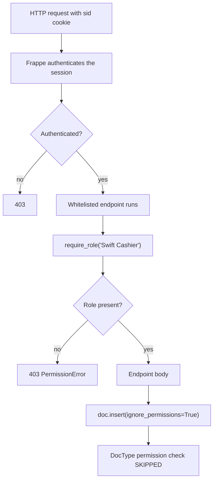
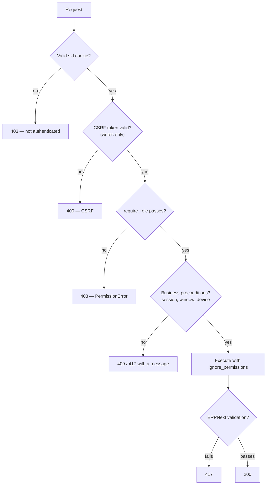

# 14 — Permissions and Roles

## How Authorization Actually Works

Swift's authorization model has one control point, and understanding it is more important than any table in this document.



Every write endpoint in `api.py` calls `ignore_permissions=True`. That is deliberate — Swift's two roles hold no ERPNext DocType permissions, so without it a cashier could not create a Sales Invoice at all.

The consequence is stated plainly:

> **Warning — The Role Gate Is the Entire Authorization Model**
> `ignore_permissions=True` bypasses the DocType permission check. The `require_role()` call at the top of the function is therefore the **only** thing preventing an authenticated user from performing that operation.
>
> An endpoint that calls `ignore_permissions` without a role gate above it is exploitable by anyone who can log in. This is checklist item #1 in `13_Coding_Standards.md` for that reason.

### The Two Gate Helpers

```python
def require_role(role):                    # api.py:63
def _require_any_role(*roles):             # api.py:69
```

`require_role("Swift Cashier")` demands exactly that role. `_require_any_role("Swift Cashier", "Swift Storekeeper")` accepts either — used by `get_item` and `pos_config`, the two endpoints both roles legitimately need.

Both raise `frappe.PermissionError`, which Frappe returns as **HTTP 403**.

### Administrator Bypass

Frappe's `Administrator` user bypasses permission checks framework-wide. It does **not** bypass `require_role()` — that helper checks the role list, and `Administrator` holds no Swift roles by default. An administrator must be granted `Swift Cashier` or `Swift Storekeeper` explicitly to use Swift's API, or work through the desk instead.

---

## The Two Roles That Matter

Swift defines exactly **two** roles that its code checks:

```ts
export const ROLES = {
  CASHIER: "Swift Cashier",
  STOREKEEPER: "Swift Storekeeper",
} as const;
```

```ts
export type UserRole = "Swift Cashier" | "Swift Storekeeper";
```

Every one of the 30 endpoints is gated on one of these two, or on either. **No other role name appears in any gate.**

Login enforces this too — `login()` resolves the user's Swift role and throws if they hold neither. A user without a Swift role cannot authenticate to the Swift frontend at all, regardless of what other roles they have.

---

## Role Profiles

Roles are assigned through **Role Profiles**, not individually. The `role_profile.json` fixture ships twelve:

| Role Profile | Roles granted | Grants a Swift role? |
|---|---|---|
| `cashier` | Cashier, Analytics, **Swift Cashier** | **Yes** |
| `storekeeper` | **Swift Storekeeper** | **Yes** |
| `Owner` | (ERPNext roles) | No |
| `Manager` | (ERPNext roles) | No |
| `Technician` | (ERPNext roles) | No |
| `Accountant` | 10 ERPNext accounting roles | No |
| `HR Officer` | HR User, HR Officer, HR Manager, Interviewer | No |
| `Accounts` | (ERPNext roles) | No |
| `Sales` | (ERPNext roles) | No |
| `Purchase` | (ERPNext roles) | No |
| `Inventory` | (ERPNext roles) | No |
| `Manufacturing` | (ERPNext roles) | No |

> **Note**
> Only `cashier` and `storekeeper` grant access to the Swift frontend. The other ten profiles configure **desk** access for back-office staff — accountants, HR, management. They are ERPNext role bundles that happen to ship in Swift's fixture set; Swift's own code never references them.

Assign a profile in the desk: **User** → the user → **Role Profile**.

---

## Swift Cashier

### Responsibilities

Operating the point of sale: opening and closing shifts, ringing sales, processing returns within the five-day window, and recording petty-cash expenses.

### Endpoints

| Endpoint | Purpose |
|---|---|
| `session_current` | Find the caller's open shift |
| `session_open` | Open a shift with a counted opening float |
| `session_heartbeat` | Keep the session marked active |
| `session_close` | Close the shift with a counted amount |
| `session_invoices` | List a shift's invoices *(implemented, not used by the UI)* |
| `item_by_barcode` | Scan an item |
| `item_search` | Search items by name or code |
| `create_invoice` | Complete a sale |
| `create_return` | Process a return |
| `get_invoice` | Look up an invoice for return |
| `create_expense` | Record a petty-cash expense |
| `get_item` | Read one item *(shared with storekeeper)* |
| `pos_config` | Read POS configuration *(shared)* |

### Cannot Do

- Create, update, or import items
- Manage barcodes or suppliers
- Create stock entries
- Export inventory
- Any storekeeper endpoint — all return **403**

### What the Fixture Actually Grants

The `cashier` Role Profile grants three roles: `Cashier`, `Analytics`, and `Swift Cashier`.

> **Warning**
> `Cashier` and `Analytics` are **ERPNext desk roles**, not Swift roles. They give the user access to parts of the Frappe desk that the POS frontend never exposes.
>
> If cashiers should only ever use the Swift frontend, review whether they need desk access at all. Consider setting **User Type: Website User**, or removing the extra roles from the profile. This is a hardening decision, not a defect — but it is worth making deliberately rather than inheriting it.

---

## Swift Storekeeper

### Responsibilities

Everything to do with inventory: item master data, barcodes, suppliers, stock entries, and the Excel import/export cycle.

### Endpoints

| Endpoint | Purpose |
|---|---|
| `create_item` | Create an item with opening stock |
| `update_item` | Update a limited field set |
| `get_item` | Read one item *(shared with cashier)* |
| `validate_barcode` | Check whether a barcode is free |
| `add_item_barcode` | Attach a barcode |
| `remove_item_barcode` | Detach a barcode |
| `add_serial_number` | Create a Serial No *(implemented, no UI)* |
| `create_stock_entry` | Receive or adjust stock |
| `get_stock_entry` | Read a stock entry *(implemented, no UI)* |
| `list_warehouses` | List warehouses |
| `list_import_warehouses` | List import-eligible warehouses |
| `list_item_groups` | List item groups |
| `list_suppliers` | List suppliers |
| `inventory_import_preview` | Parse and validate an `.xlsx` |
| `inventory_import_commit` | Apply a validated import |
| `inventory_list` | Paged inventory listing |
| `inventory_export` | Download inventory as `.xlsx` |
| `update_inventory_item` | Edit an inventory row |
| `pos_config` | Read POS configuration *(shared)* |

### Cannot Do

- Open or close a POS shift
- Create a sale
- Process a return
- Record an expense
- Any cashier endpoint — all return **403**

### What the Fixture Grants

The `storekeeper` Role Profile grants exactly one role: `Swift Storekeeper`. No desk roles. This is the tighter of the two profiles.

---

## The Other Roles

The roles below appear in the `role_profile.json` fixture and in the ~60-entry `role.json` fixture. **Swift's code checks none of them.** They configure ERPNext desk access for staff who do not use the POS frontend.

Documented here because the fixture ships them and someone will ask what they do.

| Role Profile | Intended user | Swift API access | Desk access |
|---|---|---|---|
| **Owner** | Business owner | None | ERPNext roles per the fixture |
| **Manager** | Store manager | None | ERPNext roles per the fixture |
| **Technician** | Service/repair staff | None | ERPNext roles per the fixture |
| **Accountant** | Bookkeeping | None | 10 ERPNext accounting roles |
| **HR Officer** | HR staff | None | HR User, HR Officer, HR Manager, Interviewer |
| **Accounts** | Accounts team | None | ERPNext roles per the fixture |
| **Sales** | Sales team | None | ERPNext roles per the fixture |
| **Purchase** | Purchasing | None | ERPNext roles per the fixture |
| **Inventory** | Stock back-office | None | ERPNext roles per the fixture |
| **Manufacturing** | Production | None | ERPNext roles per the fixture |

> **Note**
> A person can hold more than one profile. A manager who also works the till needs the `cashier` profile in addition to `Manager` — the `Manager` profile alone will not let them log into the Swift frontend, because `login()` requires a Swift role.

### Administrator

Frappe's built-in superuser. Full desk access, bypasses DocType permissions. Does **not** bypass `require_role()`. Use it for configuration, fixtures, and migrations — not for daily operation.

---

## Custom Permission Logic

Beyond the role gates, Swift enforces four rules in code. None of them is a Frappe permission rule; all are conditions inside endpoints.

### 1. Session Ownership

`_get_open_session_for_user()` finds only the **calling user's** open shift. A cashier cannot see, heartbeat, or close another cashier's shift.

`create_invoice` refuses outright without one:

```
409 — No active POS session. Open a shift first.
```

### 2. Returns Are Deliberately Not Session-Scoped

Recorded in the source:

```python
# Deliberately not restricted to the caller's own session. A return is
# presented days later, by whichever cashier is on shift, so the previous
# ownership check rejected virtually every genuine return.
```

Any cashier may process any returnable invoice. The **five-day window** is the control, not shift ownership. This was a deliberate reversal of an earlier, stricter rule that made the feature unusable.

### 3. Device Binding

`current_device_id()` reads the `X-Device-Id` header. When `Swift POS Settings.allow_multi_device_session` is `0` (the default), opening a shift from a second device is refused with **409**.

This is a session-integrity control, not a role control — it prevents one cashier's shift being driven from two terminals with divergent cash counts.

### 4. The Five-Day Return Window

Enforced by `_returnable_invoice()`, checked twice — at lookup and again at submit. No role can override it through the API. Extending a return past the window requires an administrator working in the desk.

---

## Permission Resolution Order



Read the codes this way:

| Code | Layer that rejected you |
|---|---|
| 400 | CSRF |
| **403** | **Authentication or role gate** |
| 404 | Named record does not exist |
| 409 | Business conflict — no shift, stock, device |
| 417 | ERPNext validation, or any `frappe.throw` |

---

## Frontend Enforcement Is Cosmetic

`ProtectedRoute` accepts an `allowedRoles` prop and redirects users who do not match. `SessionGate` skips the opening-cash modal for non-cashiers.

> **Warning**
> This is **UX, not security**. Anyone can call the API directly with a valid `sid` cookie; the browser is not a trust boundary. The backend gate is the control.
>
> Two facts make this concrete:
> 1. The protected layout does **not** pass `allowedRoles`, so any authenticated user can currently load `/pos`, `/inventory`, and `/returns`. A storekeeper who navigates to `/pos` will see the shell and receive 403s from every cashier endpoint.
> 2. `/returns` is not in the `ROUTES` constant and is reached by literal string, so it was never wired into any role-based redirect.
>
> Neither is a security hole — the API refuses the calls. Both are UX defects, recorded in `18_Future_Roadmap.md`.

The role reaching the frontend comes from `me()`, which resolves a single role string and stores it in `authStore`. Login then redirects: cashiers to `/pos`, storekeepers to `/inventory`.

---

## The Configuration Permission Problem

This is the most significant permission defect in the system, and it is a fixture issue rather than a code issue.

`swift_pos_settings.json` grants, to **each** of `System Manager`, `Swift Cashier`, and `Swift Storekeeper`:

```
read, write, create, delete, email, print, share
```

> **Warning — Cashiers Can Rewrite the System Configuration**
> `Swift POS Settings` is the root of every business value Swift resolves: `default_company`, `default_pos_profile`, `default_price_list`, `allow_multi_device_session`, `auto_close_enabled`, `session_timeout_minutes`.
>
> A `Swift Cashier` currently holds `write` **and** `delete` on it. Through the desk, a cashier can point the system at a different company, a different price list, or disable device binding.
>
> The Swift API never writes to this DocType — no endpoint modifies settings — so **removing write and delete from both Swift roles breaks nothing.** They need `read` only, and even that is not required, because `get_settings()` reads with elevated privileges internally.
>
> This is on the pre-launch security checklist in `11_Deployment.md`.

**To fix:** edit `swift_pos_settings.json` to leave only `System Manager` with write access (reducing the Swift roles to `read`, or removing them entirely), then `bench --site <site> migrate`.

**Contributing cause:** the controller is empty —

```python
class SwiftPOSSettings(Document):
	pass
```

No `validate()`. Nothing checks that the referenced POS Profile exists, that the price list is a selling list, or that the warehouse is a leaf. A bad value saves cleanly and fails later at transaction time. See `04_Database.md`.

---

## Permission Examples

### Cashier calling a storekeeper endpoint

```http
POST /api/method/swift_core.api.create_item
Cookie: sid=<cashier session>
X-Frappe-CSRF-Token: <token>

item_name=Test&item_group=Products&uom=Nos
```

```json
{
  "exc_type": "PermissionError",
  "_server_messages": "[\"{\\\"message\\\": \\\"Not permitted\\\"}\"]"
}
```

**403.** `require_role("Swift Storekeeper")` rejected it before any work happened.

### Shared endpoint — either role

```http
GET /api/method/swift_core.api.get_item?item_code=ITEM-001
```

Succeeds for both. `get_item` uses `_require_any_role("Swift Cashier", "Swift Storekeeper")` because both genuinely need it — the cashier to display a scanned item, the storekeeper to edit it.

### Authenticated user with no Swift role

```http
POST /api/method/swift_core.api.login
email=accountant@example.com&password=<password>
```

`login()` resolves the user's Swift role, finds none, and throws. The user holds the `Accountant` profile and can use the desk, but cannot enter the Swift frontend.

### Second device, multi-device disabled

```http
POST /api/method/swift_core.api.session_open
X-Device-Id: <different uuid>
Cookie: sid=<same cashier>

opening_amount=500
```

**409.** The shift is bound to the first device. Set `allow_multi_device_session = 1` in `Swift POS Settings` if the business genuinely runs one shift across two terminals.

---

## Assigning Roles

1. Desk → **User** → the user
2. Set **Role Profile** to `cashier` or `storekeeper`
3. Save — the profile's roles are applied
4. **Have the user log out and back in.** Roles are read from the session; an existing session keeps its old role set.

To verify what the server sees:

```http
GET /api/method/swift_core.api.me
Cookie: sid=<session>
```

```json
{
  "message": {
    "user": "cashier@example.com",
    "full_name": "Sara Ahmed",
    "role": "Swift Cashier"
  }
}
```

`me()` returns a **single** role string, resolved from the user's roles. It is what the frontend uses for routing.

---

## Troubleshooting Permissions

| Symptom | Cause | Resolution |
|---|---|---|
| 403 on every endpoint | Not authenticated — no or expired `sid` | Log in again |
| 403 on one endpoint only | Wrong role for that endpoint | Check the endpoint tables above |
| Cannot log in at all | No Swift role | Assign the `cashier` or `storekeeper` Role Profile |
| Role change had no effect | Old session still active | Log out and back in |
| Cashier sees `/inventory` | Frontend passes no `allowedRoles` | Cosmetic; API still returns 403 |
| Administrator gets 403 from the API | `Administrator` holds no Swift role | Grant one, or use the desk |
| 409, not 403 | Business rule, not permissions | No shift, device clash, stock, or return window |

**Diagnosing a 403 in three steps:**

1. Call `me()` — what role does the server think the caller has?
2. Find the endpoint in the tables above — which role does it require?
3. If they match, check that the endpoint's `require_role()` names the role you expect. A typo in the gate produces a permanent 403 for everyone.
