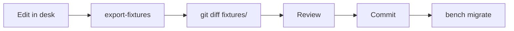

# 15 — Fixtures

## What a Fixture Is

A fixture is a database record exported to a JSON file inside the app, and re-imported automatically on every `bench migrate`. It is how a Frappe app ships configuration data — roles, item groups, price lists, custom fields — rather than requiring an operator to recreate it by hand on each site.

The mechanism has one property that governs everything in this document:

> **Warning — Fixtures Overwrite. Every Migrate. Silently.**
>
> `bench migrate` imports every fixture file and **overwrites** the matching database record. There is no merge, no conflict prompt, no diff, and no log entry naming what changed.
>
> If someone edits a fixture-managed record in the desk and does not export it back into the app, the next `bench migrate` reverts their change without saying so.
>
> This is normal Frappe behaviour, not a Swift defect. But it means: **any record covered by a fixture must be edited in the desk and then exported, or it will not survive.**

---

## Swift's Fixture Declaration

`hooks.py`:

```python
fixtures = [
    {"dt": "Role"},
    {"dt": "Role Profile"},
    {"dt": "Workspace"},
    {"dt": "Module Def"},
    {"dt": "Item Group"},
    {"dt": "Price List"},
    {"dt": "Mode of Payment"},
    {"dt": "POS Profile"},
    {"dt": "Custom Field", "filters": [["dt", "in", ["Sales Invoice"]]]},
]
```

Nine entries. **Only one has a filter.** The rest export every record of their DocType on the site — a fact with real consequences, covered below.

---

## The Nine Fixture Files

All under `swift_core/fixtures/`.

### `role.json` — ~60 records

Every role on the site.

> **Warning — Over-Broad**
> This file contains roughly 60 roles. Swift defines **two**: `Swift Cashier` and `Swift Storekeeper`. The other ~58 are Frappe and ERPNext built-ins — `Accounts Manager`, `Stock User`, `HR Manager`, `System Manager`, and so on.
>
> Migrating Swift onto a site therefore overwrites that site's built-in role definitions with whatever state they were in when the fixture was exported. On a site where an administrator has customised a built-in role, that customisation is lost.

**Should be:**

```python
{"dt": "Role", "filters": [["name", "in", ["Swift Cashier", "Swift Storekeeper"]]]},
```

### `role_profile.json` — 12 records

| Profile | Roles |
|---|---|
| `cashier` | Cashier, Analytics, **Swift Cashier** |
| `storekeeper` | **Swift Storekeeper** |
| `Owner` | ERPNext roles |
| `Manager` | ERPNext roles |
| `Technician` | ERPNext roles |
| `Accountant` | 10 ERPNext accounting roles |
| `HR Officer` | HR User, HR Officer, HR Manager, Interviewer |
| `Accounts`, `Sales`, `Purchase`, `Inventory`, `Manufacturing` | ERPNext role bundles |

Only `cashier` and `storekeeper` grant Swift frontend access. See `14_Permissions.md`.

These are genuinely Swift's own configuration — this file is appropriately scoped, even unfiltered, because Role Profiles are not a DocType that Frappe or ERPNext ships records for.

### `workspace.json`

Desk workspace definitions — the sidebar layout an administrator sees. Unfiltered, so it captures every workspace on the site, including ERPNext's built-in ones.

Does not affect the Swift frontend at all.

### `module_def.json` — 36 records

| Source | Count |
|---|---|
| frappe | 12 |
| erpnext | 22 |
| hrms | 2 |
| **swift_core** | **1** |

> **Warning — Over-Broad**
> Thirty-five of these thirty-six module definitions belong to other apps. Swift owns exactly one: `swift`.
>
> `modules.txt` already declares `swift`, and Frappe creates the Module Def from it during installation. **This fixture is not needed at all** — and by shipping 35 foreign entries, it risks overwriting module state belonging to frappe, erpnext, and hrms on the target site.

**Should be:** removed entirely, or filtered to `[["app_name", "=", "swift_core"]]`.

### `item_group.json` — 9 records

| Item Group | Origin |
|---|---|
| All Item Groups (`is_group: 1`) | ERPNext default |
| Products | ERPNext default |
| Raw Material | ERPNext default |
| Services | ERPNext default |
| Sub Assemblies | ERPNext default |
| Consumable | ERPNext default |
| **Accessories** | Swift |
| **scoters** | Swift |
| **Spare Parts** | Swift |

Six of nine are ERPNext defaults. The three Swift-specific groups reflect the business domain — a scooter retailer selling vehicles, spare parts, and accessories.

> **Note**
> `scoters` is a misspelling of "scooters" in the source data. It is the actual record name. Renaming it means renaming the Item Group in the desk, re-exporting the fixture, and updating any Item that references it — a data migration, not a text edit. Documented here so nobody assumes it is a typo in this document.

`item_group` is a configurable value throughout the codebase, resolved by `_resolve_item_group()` during import. It is never hardcoded.

### `price_list.json` — 4 records

| Price List | Currency | Type |
|---|---|---|
| Standard Selling | EGP | Selling |
| Retail (Egypt) | EGP | Selling |
| Wholesale (Egypt) | EGP | Selling |
| Standard Buying | EGP | Buying |

All EGP. `Standard Selling` and `Standard Buying` are ERPNext defaults with the currency changed; the two Egypt lists are Swift additions.

The active selling list comes from `Swift POS Settings.default_price_list`, resolved through `resolve_config()`. `_resolve_price_list()` handles the import path. Never hardcoded.

### `mode_of_payment.json` — 6 records

| Mode | Type | Default Account |
|---|---|---|
| Cheque | Bank | — |
| Credit Card | Bank | — |
| Wire Transfer | Bank | — |
| Bank Draft | Bank | — |
| **Cash** | **Cash** | `1110 - Cash - S` |
| **Insta pay** | **Cash** | `1110 - Cash - S` |

Four are ERPNext defaults carried along with no account configured. Two are configured for use: `Cash` and `Insta pay`.

> **Warning — Both Payment Modes Post to Cash**
> `Insta pay` is a mobile money service, but it is typed **Cash** and mapped to the same `1110 - Cash - S` account as physical cash.
>
> The operational consequence: at shift close, `_build_closing_from_opening()` computes expected cash from Cash-type payments. **Insta pay receipts count toward the cash the cashier is expected to have in the drawer** — money that is in a bank account, not the till. Every shift with Insta pay sales will show a shortage equal to the Insta pay total.
>
> The fix is a Mode of Payment change (type Bank, its own account), not a code change. Recorded in `04_Database.md` and `18_Future_Roadmap.md`.

> **Warning — Environment-Specific Account**
> `1110 - Cash - S` embeds the company abbreviation `S`. On a site whose company abbreviation differs, this account does not exist and the fixture import creates a Mode of Payment with a broken account link. Payment then fails at invoice submit.
>
> Verify account names against the target site's Chart of Accounts before migrating. This applies to every account reference in the fixture set.

### `pos_profile.json` — 1 record, "Main POS"

| Field | Value | Note |
|---|---|---|
| `company` | `swift` | Environment-specific |
| `warehouse` | `Stores - S` | **Group warehouse — see below** |
| `currency` | EGP | |
| `cost_center` | `Main - S` | Environment-specific |
| `customer` | `Walk-in Customer` | Default POS customer |
| `expense_account` | `5111 - Cost of Goods Sold - S` | Environment-specific |
| `write_off_account` | `5111 - Cost of Goods Sold - S` | Environment-specific |
| `write_off_limit` | 1.0 | Max rounding write-off |
| `income_account` | `""` | **Empty** |
| `print_format` | `POS Invoice` | **Frontend requests `Swift` instead** |
| `selling_price_list` | Standard Selling | |
| `update_stock` | 1 | Required — posts SLE at submit |
| `allow_rate_change` | 0 | Cashier cannot change price |
| `allow_discount_change` | 0 | Cashier cannot discount |
| `allow_partial_payment` | 0 | Full payment required |
| `country` | Egypt | |
| `item_groups` | Spare Parts, Accessories, All Item Groups | |
| `payments` | Cash (default), Insta pay | **both `allow_in_returns: 0`** |

Four things in this record are worth calling out.

**1. The warehouse is a group node.** `Stores - S` has `is_group = 1`. Group warehouses cannot hold stock — ERPNext blocks transactions against them in `stock_ledger_entry.py`. Swift works around this by resolving leaf warehouses beneath the group at transaction time (`_stock_warehouses()`, `_sale_warehouse()`), and `create_return` explicitly clears `set_warehouse` and maps each return row to the warehouse the original line was sold from. See `10_Stock_Workflow.md` and `09_Return_Workflow.md`.

**2. `print_format` says `POS Invoice`, the frontend requests `Swift`.** The POS Profile setting is unused by Swift's print flow — `PaymentModal` builds a `printview` URL with `format=Swift` hardcoded. The two disagree. See `16_Printing.md`.

**3. `income_account` is empty.** ERPNext falls back to the Item's or Item Group's default income account, then the Company default. It works, but it is an implicit dependency: if none of those is configured on the target site, invoice submit fails with an account-not-found error.

**4. Both payment modes have `allow_in_returns: 0`.** Returns therefore cannot be settled through the POS payment rows. The return credit posts against the customer, not as a cash refund line. Consistent with how `create_return` works — it builds a return Sales Invoice, not a payment.

### `custom_field.json` — 1 record

```json
{
  "dt": "Sales Invoice",
  "fieldname": "custom_pos_opening_entry",
  "fieldtype": "Link",
  "options": "POS Opening Entry",
  "insert_after": "pos_profile",
  "read_only": 1,
  "no_copy": 1
}
```

This field links every POS sale back to the shift that produced it. `create_invoice` sets it; `session_invoices` and the shift-close reconciliation read it. It is the join key for all shift reporting.

`read_only: 1` prevents desk editing. `no_copy: 1` stops it being carried into amended or duplicated documents — correct, since a copy belongs to a different shift or none.

**This is the only filtered fixture entry**, restricted to `Sales Invoice`. And that filter is the cause of the next problem.

---

## The Missing Fixtures

Two things this app depends on are **not** version-controlled. Both will be missing on a fresh deployment.

### 1. Three Custom Fields on POS Opening Entry

`api.py` reads and writes three fields that no fixture ships:

| Field | Written by | Purpose |
|---|---|---|
| `custom_device_id` | `session_open` | Binds a shift to one terminal |
| `custom_last_heartbeat` | `session_heartbeat` | Timestamp of last activity |
| `custom_heartbeat_state` | `session_heartbeat` | `idle` / active marker |

The Custom Field fixture is filtered to `[["dt", "in", ["Sales Invoice"]]]`, so these three are excluded.

> **Warning**
> On a fresh site, these fields do not exist. Frappe's `db_set` on a nonexistent field does not create it — the write is lost or errors depending on the call path. Device binding silently stops working, and `allow_multi_device_session` has no effect regardless of its value.
>
> **Fix:** widen the filter and re-export.
>
> ```python
> {"dt": "Custom Field", "filters": [["dt", "in", ["Sales Invoice", "POS Opening Entry"]]]},
> ```
>
> Create the three fields in the desk on a working site first, then export.

### 2. The `Swift` Print Format

The receipt format the frontend requests by name exists **only in the database of whichever site it was created on**.

There is no `{"dt": "Print Format"}` entry in `hooks.py`. Deploy to a new site and `format=Swift` resolves to nothing — Frappe falls back to the standard format, or the print view errors.

> **Warning**
> `11_Deployment.md` step 9 covers recreating this by hand. That step exists only because this fixture is missing. Adding the fixture removes a manual, error-prone deployment step.
>
> **Fix:**
>
> ```python
> {"dt": "Print Format", "filters": [["name", "in", ["Swift"]]]},
> ```
>
> Filter it. An unfiltered `Print Format` export captures every format on the site — dozens of ERPNext built-ins.

### Not Missing, By Design

`Swift POS Settings` is **not** a fixture, and should not be. It is a Single DocType holding site-specific values: company, POS profile, price list, timeouts. Shipping it as a fixture would overwrite each site's own configuration on every migrate.

Configure it per site, after installation. See `11_Deployment.md`.

---

## How `export-fixtures` Works

```bash
bench --site <site-name> export-fixtures
```

For each entry in `hooks.py`:

1. Query the DocType, applying `filters` if present
2. Serialise every matching record to JSON
3. **Overwrite** `swift_core/fixtures/<doctype_snake_case>.json`

Two properties to internalise:

- **It overwrites the file completely.** Uncommitted manual edits to a fixture JSON are destroyed.
- **It exports from the site you name.** Run it against a site with test data and that test data enters the app.

Export from a clean, correctly-configured site. Never from a production site with live transactional records unless you have checked exactly what the filters will capture.

---

## How Fixtures Are Imported

`bench migrate` runs, in order:

1. Schema sync (DocType JSON → database)
2. `[pre_model_sync]` patches — *Swift has none*
3. **Fixture import**
4. `[post_model_sync]` patches — *Swift has none*

Fixture import, per record:

- Record does not exist → **created**
- Record exists → **overwritten** with the fixture's values

No merge. No prompt. No diff. Fields present in the database but absent from the fixture keep their values; fields present in the fixture always win.

---

## Updating a Fixture — Correct Procedure



**1. Edit in the desk.** Not the JSON file. Editing JSON directly and running `export-fixtures` later reverts your edit; editing JSON and skipping export leaves the file and database inconsistent until the next migrate applies the JSON.

**2. Export.**

```bash
bench --site <site-name> export-fixtures
```

**3. Review the diff. Every time.**

```bash
cd apps/swift_core && git diff fixtures/
```

Check for:

- Records you did not intend to change, swept in by an unfiltered entry
- Environment-specific values — account names with a company abbreviation, warehouse names, company names
- Timestamps and `modified` fields churning with no real change

**4. Commit.** Fixture changes are configuration changes. The commit message should say what changed and why, the same as a code change.

**5. Apply.**

```bash
bench --site <site-name> migrate
```

---

## Adding a New Fixture

**1. Create the record** in the desk.

**2. Add a filtered entry** to `hooks.py`:

```python
fixtures = [
    ...
    {"dt": "Print Format", "filters": [["name", "in", ["Swift"]]]},
]
```

> **Warning — Always Filter**
> An unfiltered entry exports every record of that DocType. Swift's `role.json` (~60 records) and `module_def.json` (36 records) are what that looks like. Do not add to the problem.

Filter syntax is standard Frappe:

```python
[["name", "in", ["A", "B"]]]
[["dt", "=", "Sales Invoice"]]
[["app_name", "=", "swift_core"]]
[["custom", "=", 1]]
```

**3. Export, review, commit, migrate** as above.

---

## Deploying Fixture Changes

```bash
# 1. Back up — fixture overwrites are not reversible without one
bench --site <site-name> backup --with-files

# 2. Pull
cd apps/swift_core && git pull && cd ../..

# 3. Preview what will be overwritten (see below)

# 4. Apply
bench --site <site-name> migrate

# 5. Verify in the desk
```

### Previewing the Impact

There is no dry-run mode. To know what a migrate will change, compare the fixture to the live record:

```bash
bench --site <site-name> console
```

```python
>>> import json
>>> fixture = json.load(open("apps/swift_core/swift_core/fixtures/pos_profile.json"))
>>> live = frappe.get_doc("POS Profile", "Main POS")
>>> for k, v in fixture[0].items():
...     if k in live.as_dict() and live.get(k) != v:
...         print(k, "| live:", live.get(k), "| fixture:", v)
```

Do this for any fixture touching a record an operator may have edited — particularly `POS Profile`, which is exactly the kind of record a manager adjusts in the desk.

---

## Conflicts

### An Operator Edited a Fixture-Managed Record

**Symptom:** A configuration change was made in the desk, worked, and then reverted after a deployment.

**Cause:** The change was never exported. `bench migrate` restored the fixture's version.

**Resolution:** Re-apply the change in the desk, run `export-fixtures`, review the diff, commit.

**Prevention:** Treat any fixture-managed record as code. Desk edits are drafts until exported.

### Two Developers Edited the Same Fixture

**Symptom:** Git conflict in a `fixtures/*.json` file.

**Cause:** `export-fixtures` rewrites the whole file, so any two exports conflict across the entire document.

**Resolution:** Do not hand-merge the JSON. Pick one branch's file, apply both intended changes in the desk, and re-export to produce a single clean file.

### Fixture References a Record That Does Not Exist

**Symptom:** `migrate` fails with a `LinkValidationError`, naming an account, company, or warehouse.

**Cause:** An environment-specific value — `1110 - Cash - S`, `Main - S`, `Stores - S`, `swift` — that does not exist on the target site.

**Resolution:** Create the referenced record on the target site with the exact name, or edit the fixture to match the target and accept that the fixture is now site-specific.

**Prevention:** This is the strongest argument for keeping environment-specific configuration in `Swift POS Settings` rather than fixtures. See `18_Future_Roadmap.md`.

### Fixture Import Overwrote a Built-In Role

**Symptom:** A customised ERPNext role reverted after deploying Swift.

**Cause:** The unfiltered `{"dt": "Role"}` entry.

**Resolution:** Re-apply the customisation and filter the fixture to Swift's two roles.

---

## Summary of Known Fixture Issues

| # | Issue | Impact | Fix |
|---|---|---|---|
| 1 | `role.json` unfiltered, ~60 records | Overwrites built-in role definitions | Filter to the two Swift roles |
| 2 | `module_def.json` unfiltered, 35 foreign records | Overwrites frappe/erpnext/hrms module state | Remove, or filter to `swift_core` |
| 3 | `workspace.json` unfiltered | Overwrites built-in desk workspaces | Filter or remove |
| 4 | No `Print Format` fixture | `Swift` receipt missing on new sites | Add, filtered to `["Swift"]` |
| 5 | Three `POS Opening Entry` custom fields not exported | Device binding silently broken on new sites | Widen the Custom Field filter |
| 6 | `Insta pay` typed Cash | Cash reconciliation short every shift | Retype as Bank with its own account |
| 7 | Account names embed the `S` abbreviation | Import fails on differently-named companies | Verify per site, or move to settings |
| 8 | `POS Profile.income_account` empty | Relies on an implicit ERPNext fallback | Set explicitly, or confirm the fallback exists |
| 9 | `POS Profile.print_format` disagrees with the frontend | Setting is inert | Align to `Swift`, or make the frontend read it |

Items 4 and 5 will break a fresh deployment. Items 1–3 will damage the target site's existing configuration. Item 6 causes a daily operational problem. Address them in that order.
