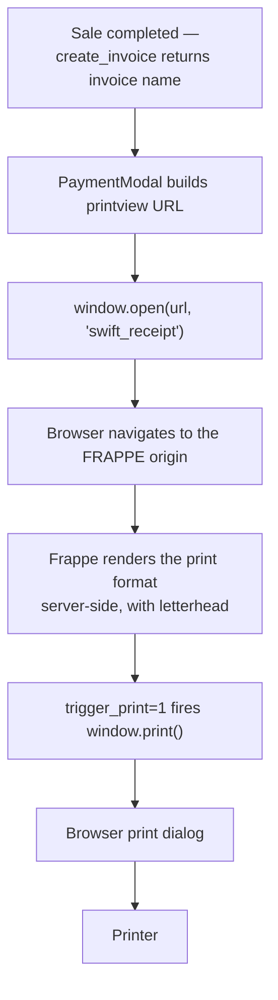

# 16 — Printing

## How Printing Works in Swift

Swift does not render receipts. It opens a browser window pointed at Frappe's built-in print view, and lets the browser's own print dialog do the rest.



The entire client-side implementation is two lines:

```ts
const printUrl = `${env.FRAPPE_URL}/printview?doctype=Sales%20Invoice&name=${encodeURIComponent(invoiceName)}&trigger_print=1&format=Swift&no_letterhead=0`;
window.open(printUrl, "swift_receipt");
```

### The URL Parameters

| Parameter | Value | Effect |
|---|---|---|
| `doctype` | `Sales Invoice` | The document type — URL-encoded space |
| `name` | The invoice name | `encodeURIComponent`-escaped |
| `trigger_print` | `1` | Frappe calls `window.print()` after render |
| `format` | `Swift` | **The print format requested by name** |
| `no_letterhead` | `0` | Letterhead **is** included — this is where the logo comes from |

### Why `window.open` and Not an Iframe

Three reasons, all of which have caused real failures elsewhere:

1. **Cookies.** `/printview` is on the Frappe origin. A top-level navigation sends the `sid` cookie as first-party. In a cross-origin iframe the cookie is third-party and is blocked by default in current browsers.
2. **Asset paths.** The letterhead image is served relative to the Frappe origin. Rendering the HTML inside the app origin breaks the image path.
3. **Print scale.** The browser's print dialog measures the document it is printing. A window prints the receipt; an iframe prints the host page's layout around it.

### The Named Window

```ts
window.open(printUrl, "swift_receipt");
```

The second argument is a window **name**, not a title. Every receipt reuses the same window rather than opening a new tab per sale. Over a busy shift that is the difference between one window and two hundred.

### When It Fires

`PaymentModal.handleDone()`:

```ts
printReceipt();
clearCart();
onClose();
queryClient.invalidateQueries({ queryKey: ["item_search"] });
showToast(...);
```

Print is called **first**, before the cart clears and the modal closes — the invoice name must still be in scope. The order is deliberate; reordering it breaks printing.

> **Note**
> Printing happens after the invoice is already submitted. A print failure — popup blocked, printer offline, format missing — **does not affect the sale**. The invoice exists, stock moved, and the ledger posted. The receipt can be reprinted at any time from the desk. No error path in `PaymentModal` can roll back a completed sale.

---

## The Print Format

### What Exists

A Print Format named exactly **`Swift`**, for `Sales Invoice`, built as a Custom HTML format in the Frappe desk.

### What Is Not in the Repository

> **Warning — The `Swift` Print Format Is Not Version-Controlled**
>
> There is no `{"dt": "Print Format"}` entry in `hooks.py`. The format exists **only in the database of the site where it was created**.
>
> Consequences:
> - A fresh deployment has no `Swift` format. `format=Swift` resolves to nothing and Frappe falls back to the standard Sales Invoice format — a full-page A4 document, not a receipt.
> - Restoring a database backup restores the format; reinstalling the app does not.
> - There is no history of changes to it. An edit that breaks the layout cannot be reverted from git.
>
> `11_Deployment.md` step 9 exists purely because of this. See `15_Fixtures.md` for the fix.

### Adding It to Version Control

```python
fixtures = [
    ...
    {"dt": "Print Format", "filters": [["name", "in", ["Swift"]]]},
]
```

```bash
bench --site <site-name> export-fixtures
cd apps/swift_core && git diff fixtures/
```

Filter it. An unfiltered `Print Format` export captures every format on the site, including dozens of ERPNext built-ins.

### The POS Profile Disagrees

`pos_profile.json` sets:

```json
"print_format": "POS Invoice"
```

The frontend requests `format=Swift`.

> **Warning**
> These two do not agree, and the POS Profile value **wins nowhere** — Swift's print path never reads it. The frontend's hardcoded `format=Swift` is authoritative.
>
> `POS Profile.print_format` is inert configuration. Changing it in the desk has no effect on what the POS prints, which is exactly the kind of setting an operator will change and then be confused by.
>
> Two coherent resolutions:
> 1. Set `POS Profile.print_format = "Swift"` so the configuration matches reality, or
> 2. Have `pos_config()` return the profile's `print_format` and the frontend use it — making the setting real.
>
> Option 2 is the correct one, and is recorded in `18_Future_Roadmap.md`. Option 1 is a one-field change that stops the configuration lying.

### Other Print Formats

Every ERPNext built-in format remains available — `Standard`, `POS Invoice`, and the rest. They can be used from the desk, or by changing the `format` parameter in the URL. Swift's UI only ever requests `Swift`.

**Swift ships no print formats of its own in the repository.** There is no `print_format/` directory and no format JSON in `fixtures/`.

---

## The Logo

The receipt logo comes from Frappe's **Letter Head**, not from any Swift code.

`no_letterhead=0` in the print URL instructs Frappe to include the letterhead. Frappe then resolves it in order:

1. The document's own `letter_head` field, if set
2. The Company's default Letter Head
3. The Letter Head marked `is_default`

### Configuring It

1. Desk → **Letter Head** → New (or edit the existing default)
2. Upload the logo image, or enter HTML in the content field
3. Tick **Is Default** — or set it on the Company record
4. Save

### Where the Image Lives

Uploaded images are stored as `File` records under `sites/<site-name>/public/files/`. They are **files on disk, not database rows**.

> **Warning**
> `bench --site <site-name> backup` without `--with-files` does **not** back up the logo. A restore from a database-only backup produces receipts with a broken image icon where the logo should be.
>
> Always use:
> ```bash
> bench --site <site-name> backup --with-files
> ```

---

## Thermal Printers

> **Note — There Is No Thermal Printer Integration**
>
> Swift has **no ESC/POS driver, no direct printer connection, no serial or USB communication, no cash-drawer kick, and no printer configuration in the application.** This is intentionally not implemented.
>
> Thermal printing works by treating the thermal printer as an ordinary operating-system printer and letting the browser print to it.

### Making It Work

Thermal receipt printing is achieved entirely through OS and browser configuration:

**1. Install the printer driver.** The manufacturer's Windows/macOS/Linux driver, so the printer appears as a normal system printer.

**2. Set the paper size in the driver.** Typically 80mm or 58mm roll. This is a driver setting, not something Swift controls.

**3. Set it as the default printer**, or select it once in the browser's print dialog — Chrome remembers the last-used printer per site.

**4. Size the print format to the paper.** Set an explicit width in the format's CSS:

```css
@media print {
  @page { size: 80mm auto; margin: 0; }
  body  { width: 80mm; font-size: 11px; }
}
```

`size: 80mm auto` is the key — a fixed width with automatic height, so the receipt is as long as its content rather than padded to a page.

**5. Disable browser headers and footers** in the print dialog (Chrome: More settings → uncheck *Headers and footers*), or the receipt carries the page URL and date.

**6. Set margins to none.** Thermal paper has no printable margin to spare.

### What This Means Operationally

| Capability | Status |
|---|---|
| Print to a thermal printer | **Yes** — via the OS print queue |
| Silent printing (no dialog) | **Not implemented** — requires browser kiosk configuration |
| Cash drawer kick | **Not implemented** |
| Direct ESC/POS commands | **Not implemented** |
| Printer status (paper out, offline) | **Not available** to the application |
| Per-terminal printer selection | Browser/OS setting, not application configuration |

Silent printing is the one worth pursuing. Chrome supports it via the `--kiosk-printing` flag, which suppresses the print dialog and prints immediately to the default printer:

```
chrome.exe --kiosk-printing
```

With that flag and the thermal printer set as the system default, `trigger_print=1` produces a receipt with no operator interaction. **This is a deployment configuration, not an application feature** — it must be set on each POS terminal.

---

## Automatic Printing

`trigger_print=1` makes Frappe call `window.print()` as soon as the format finishes rendering. The operator does not click Print.

What still requires interaction:

| Step | Automatic? |
|---|---|
| Opening the print window | Yes — `window.open` |
| Rendering the receipt | Yes — server-side |
| Opening the print dialog | Yes — `trigger_print=1` |
| **Confirming the dialog** | **No — unless kiosk printing is enabled** |
| Closing the print window | No — the window stays open, reused by the next sale |

> **Warning — Popup Blockers**
> `window.open` is called from `handleDone()`, inside the click handler for the Done button. That makes it a **user-initiated** popup, which browsers allow by default.
>
> It will still be blocked if the operator has explicitly blocked popups for the site. The symptom is silent: no window opens, no error appears, and the sale completes normally. The operator sees nothing happen.
>
> **Allow popups for the frontend origin on every POS terminal**, as part of terminal setup.

---

## Reprinting

There is no reprint button in the POS interface. A receipt is printed once, at the moment of sale.

To reprint, open the print view directly with the invoice name:

```
https://<frappe-host>/printview?doctype=Sales%20Invoice&name=ACC-SINV-2026-00187&trigger_print=1&format=Swift&no_letterhead=0
```

Or from the desk: open the Sales Invoice → **Print** → select the `Swift` format.

Both require desk access, which cashiers may or may not have depending on their Role Profile. See `14_Permissions.md`.

A reprint button in the POS would be a small addition — the invoice name is already in the response. Recorded in `18_Future_Roadmap.md`.

---

## Returns Do Not Print

`create_return` returns the credit note's name, but **no print flow is wired to it.** Completing a return produces no printed document.

This is a gap, not a design decision — a customer receiving a refund would reasonably expect a credit note. The same `printview` pattern would work, since a return is an ordinary `Sales Invoice` with `is_return = 1`:

```ts
const url = `${env.FRAPPE_URL}/printview?doctype=Sales%20Invoice&name=${encodeURIComponent(returnInvoice)}&trigger_print=1&format=Swift&no_letterhead=0`;
```

Recorded in `18_Future_Roadmap.md`.

---

## Cross-Origin Considerations

Printing is one of the places where the frontend/backend origin split matters most.

The print window navigates to the **Frappe origin** and must arrive with a valid `sid` cookie, or Frappe returns a login page instead of the receipt.

| Deployment shape | Cookie behaviour | Printing |
|---|---|---|
| Same host, reverse-proxied | First-party | **Works** |
| Shared parent domain | First-party | **Works** |
| Unrelated domains | Third-party in an iframe; first-party in a top-level window | Works **because** Swift uses `window.open` |

> **Note**
> Swift's use of `window.open` rather than an iframe is what keeps printing working in the cross-origin case. A top-level navigation is first-party regardless of where it came from. Do not "improve" this by switching to a hidden iframe — that is precisely the change that breaks it.

Same-origin or shared-parent deployment remains the more robust choice overall. See `11_Deployment.md`.

---

## Known Issues

| # | Issue | Symptom | Cause | Resolution |
|---|---|---|---|---|
| 1 | **Format not version-controlled** | Fresh site prints a full-page A4 invoice | No `Print Format` fixture | Add a filtered fixture, or recreate manually |
| 2 | **POS Profile `print_format` inert** | Changing it in the desk does nothing | Frontend hardcodes `format=Swift` | Align the values, or make the frontend read `pos_config` |
| 3 | **Popup blocked** | Nothing happens on Done; sale still completes | Site-level popup block | Allow popups for the frontend origin |
| 4 | **Logo missing after restore** | Broken image on the receipt | Backup taken without `--with-files` | Restore files, or re-upload the Letter Head image |
| 5 | **Wrong paper size** | Receipt spans pages, or is cut off | Driver/CSS width mismatch | Set `@page { size: 80mm auto }` and match the driver |
| 6 | **Headers and footers printed** | URL and date on the receipt | Browser default | Disable in the print dialog |
| 7 | **Dialog appears on every sale** | Operator must confirm each print | No kiosk printing | Launch Chrome with `--kiosk-printing` |
| 8 | **Returns produce no receipt** | Customer gets no credit note | Not implemented | See above |
| 9 | **No reprint in the POS** | Must use the desk | Not implemented | See above |
| 10 | **Print window shows a login page** | Receipt never renders | `sid` not sent to the Frappe origin | Fix cookie scope — see `11_Deployment.md` |

---

## Terminal Setup Checklist

Per POS terminal, once:

- [ ] Thermal printer driver installed
- [ ] Paper size set in the driver (80mm or 58mm)
- [ ] Printer set as the system default
- [ ] Popups allowed for the frontend origin
- [ ] Headers and footers disabled in the browser print dialog
- [ ] Print margins set to none
- [ ] `--kiosk-printing` configured, if silent printing is wanted
- [ ] Test sale printed and physically checked — width, logo, legibility

None of this is application configuration. It is per-terminal OS and browser setup, and it must be repeated for each new terminal.
