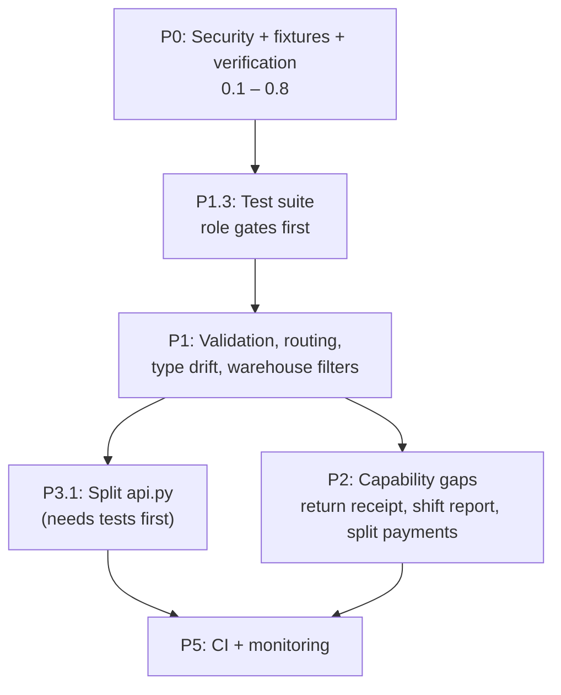

# 18 — Future Roadmap

## About This Document

This is not a wish list. Every item below is grounded in something observable in the codebase — a defect found by reading source, a capability the code demonstrably lacks, or a design choice whose cost is now visible.

Where an item is speculative, it is marked as an idea rather than a plan. Where a timeframe is not something this codebase can tell us, none is given.

> **Note**
> No dates are invented here. Sequencing is expressed as priority tiers, because the actual schedule is a business decision made outside the repository.

---

## Priority 0 — Fix Before Production

These will cause harm on a real deployment. None is a large change.

### 0.1 Remove Cashier Write Access to `Swift POS Settings`

**Now:** `swift_pos_settings.json` grants `read, write, create, delete, email, print, share` to `System Manager`, `Swift Cashier`, **and** `Swift Storekeeper`.

**Impact:** A cashier can, through the desk, repoint the system at a different company, change the price list, or disable device binding.

**Fix:** Reduce both Swift roles to `read`, or remove them entirely — `get_settings()` reads with elevated privileges, so no Swift endpoint needs the user to hold read access. No API endpoint writes to this DocType, so nothing breaks.

**Effort:** One fixture edit plus `bench migrate`.

### 0.2 Export the Three `POS Opening Entry` Custom Fields

**Now:** `custom_device_id`, `custom_last_heartbeat`, and `custom_heartbeat_state` are written by `api.py` but excluded by the Custom Field fixture's filter (`[["dt", "in", ["Sales Invoice"]]]`).

**Impact:** On a fresh site these fields do not exist. Device binding silently stops working and `allow_multi_device_session` has no effect whatever its value.

**Fix:**

```python
{"dt": "Custom Field", "filters": [["dt", "in", ["Sales Invoice", "POS Opening Entry"]]]},
```

Create the fields on a working site, then `export-fixtures`.

### 0.3 Version-Control the `Swift` Print Format

**Now:** No `Print Format` fixture. The format lives only in the database of the site it was made on.

**Impact:** Fresh deployments print full-page A4 invoices instead of receipts. `11_Deployment.md` step 9 exists solely to work around this.

**Fix:**

```python
{"dt": "Print Format", "filters": [["name", "in", ["Swift"]]]},
```

Filter it — an unfiltered export captures every ERPNext built-in format.

### 0.4 Retype `Insta pay` as a Bank Mode of Payment

**Now:** Type `Cash`, account `1110 - Cash - S` — identical to physical cash.

**Impact:** Shift close counts Insta pay receipts toward expected drawer cash. Every shift with Insta pay sales shows a shortage equal to the Insta pay total. This is a daily operational problem that erodes trust in the reconciliation.

**Fix:** Change the type to Bank and give it its own account, then re-export the fixture. Configuration only; no code change.

### 0.5 Filter the Over-Broad Fixtures

**Now:** `role.json` exports ~60 roles (Swift owns 2). `module_def.json` exports 36 module definitions (Swift owns 1). `workspace.json` is unfiltered.

**Impact:** `bench migrate` overwrites role, module, and workspace records belonging to frappe, erpnext, and hrms on the target site — destroying local customisations with no warning.

**Fix:**

```python
{"dt": "Role", "filters": [["name", "in", ["Swift Cashier", "Swift Storekeeper"]]]},
# module_def: remove entirely — modules.txt already declares "swift"
{"dt": "Workspace", "filters": [["module", "=", "Swift"]]},
```

### 0.6 Fix `get_invoice`'s Remaining-Quantity Map

**Now:**

```python
remaining = {row.item_code: abs(flt(row.qty)) for row in returnable.items}
```

**Impact:** When one item appears on two lines of an invoice, the second overwrites the first. The Return screen shows too little returnable quantity and refuses a legitimate return.

**Fix:** Accumulate, exactly as `create_return` already does:

```python
remaining = {}
for row in returnable.items:
	remaining[row.item_code] = remaining.get(row.item_code, 0) + abs(flt(row.qty))
```

**Effort:** Three lines.

### 0.7 Fix the Low-Stock Job

**Now:** `stock/low_stock.py` hardcodes the recipient (`swiftdraft85@gmail.com`), hardcodes the threshold (`<= 2`), applies no company filter, and interpolates item names into HTML with an f-string.

**Impact:** Alerts cannot be redirected without a code change; multi-company sites report the wrong stock; an item named with HTML injects content into recipients' mail clients.

**Fix:** Move recipients and threshold to `Swift POS Settings` (two new fields), filter by `resolve_config()["company"]`, and render with `frappe.render_template` so values are escaped.

### 0.8 Run the Verification Commands

**Now:** `npm run type-check` and `python -m py_compile api.py` have not been run against the current working tree.

**Impact:** Unknown. Three type-drift defects were found by reading source; a build may surface more.

**Fix:** Run both, fix what they report, and make them a required pre-commit step.

---

## Priority 1 — Before Scaling

### 1.1 Add `validate()` to `SwiftPOSSettings`

**Now:**

```python
class SwiftPOSSettings(Document):
	pass
```

Nothing checks that the POS Profile exists, that the price list is a **selling** list, or that the warehouse is usable. A bad value saves cleanly and fails at transaction time, far from where it was introduced. This is why a group warehouse could be configured at all.

**Proposed:** A `validate()` that confirms the POS Profile exists and belongs to the company, that the price list is a selling list, and that the profile's warehouse resolves to at least one leaf warehouse with stock capacity — warning if it does not.

**Value:** Turns a class of late, confusing runtime failures into an immediate, specific save error.

### 1.2 Decide the Fate of `auto_close_inactive_sessions`

**Now:** The function exists, its docstring claims it runs "every 5 minutes via cron," and it is **not registered in `scheduler_events`**. `auto_close_enabled` and `session_timeout_minutes` are inert. `session_heartbeat` writes fields nothing reads.

**Two coherent resolutions — pick one:**

**(a) Enable it.**

```python
scheduler_events = {
    "daily": ["swift_core.stock.low_stock.check_low_stock"],
    "cron": {"*/5 * * * *": ["swift_core.api.auto_close_inactive_sessions"]},
}
```

Requires 0.2 first — the heartbeat fields must exist. **Test against non-production data**: this code has never run in this configuration, and it closes shifts, which is a financially significant action.

**(b) Remove it.** Delete the function, the two settings fields, and the heartbeat write path. Simpler, honest, and removes ~80 lines of code that currently does nothing.

Either way, **fix the docstring in the same commit.** The stale docstring is how this went unnoticed.

### 1.3 Add a Test Suite

**Now:** Zero tests. The only test file is empty scaffolding.

**Impact:** Every check in `13_Coding_Standards.md` is manual. Nothing prevents a regression except the deployment checklist and human attention.

**Proposed starting set** — highest value first, using Frappe's `FrappeTestCase`:

| Area | What to assert |
|---|---|
| Role gates | Every endpoint returns 403 for the wrong role |
| `create_invoice` | Stock deducted, GL posted, `custom_pos_opening_entry` set |
| `create_invoice` | Insufficient stock is refused; nothing is written |
| `create_return` | Warehouse restored per row; quantities clamped |
| `create_return` | Over-return refused; window enforced |
| Importer | Unicode normalization; duplicate collapse; idempotent re-run |
| `_sale_warehouse` | Correct leaf selection; split-warehouse refusal |

The role-gate tests are the single highest-value item, because the gate is the entire authorization model.

Frontend testing would need a runner added — none is configured.

### 1.4 Make `POS Profile.print_format` Real

**Now:** The profile says `POS Invoice`; the frontend hardcodes `format=Swift`. The setting is inert, which is exactly the kind of thing an operator changes and is then confused by.

**Proposed:** Return `print_format` from `pos_config()` and have `PaymentModal` use it. Falls back to `Swift` if unset.

**Value:** Makes an existing setting mean something, and lets different profiles use different receipt layouts.

### 1.5 Fix the Frontend Type Drift

Three defects, all from types disagreeing with the server's actual response:

| Defect | Fix |
|---|---|
| `ClosingCashModal` reads `result.total_expenses`; `closeSession` returns only `{closing_entry, expected_amount, difference}` | Return it from the store, or remove the read |
| `SessionOpenResponse` declares `period_start_time`; the store reads `period_start_date` | Align the type to the server's field name |
| `formatCurrency` defaults to `"USD"`; the system is EGP throughout | Default to the configured currency from `pos_config` |

**Prevention:** Copy field names from the Python `return` statement, not from what seems reasonable.

### 1.6 Complete the Routing

**Now:** `/returns` is not in the `ROUTES` constant and is navigated to by literal string. The protected layout passes no `allowedRoles`, so any authenticated user can load any protected page.

**Impact:** Cosmetic only — the API returns 403 regardless. A storekeeper who reaches `/pos` sees the shell and a wall of permission errors, which reads as a bug.

**Fix:** Add `RETURNS: "/returns"` to `ROUTES`; pass `allowedRoles` on each protected route.

### 1.7 Add a Company Filter to `list_warehouses`

**Now:** `list_warehouses` applies no company filter. `list_import_warehouses` does — the correct behaviour already exists next door.

**Impact:** On a multi-company site, warehouses from other companies appear in the picker.

**Fix:** Filter by `resolve_config()["company"]`, matching `list_import_warehouses`.

### 1.8 Fix the Post-Sale Stock Warning

**Now:** After submit, `create_invoice` reads `Bin` at `config["warehouse"]` — the **group** node, which has no Bin rows. The lookup returns `None → 0`, which is never negative, so `stock_warnings` is effectively always empty.

**Fix:** Read the leaf warehouse each line actually drew from, which `_sale_warehouse` already returned.

**Value:** Makes a currently-dead diagnostic real.

---

## Priority 2 — Capability Gaps

Features the system does not have. Each is stated as what is missing, not as a promise.

### 2.1 Return Receipt

`create_return` returns the credit note's name, but no print flow is wired to it. A customer receiving a refund gets no document.

The existing `printview` pattern works unchanged — a return is an ordinary `Sales Invoice` with `is_return = 1`.

### 2.2 Reprint from the POS

No reprint button. The invoice name is already in the response, so this is a small addition. Currently requires desk access.

### 2.3 Shift Report Screen

`session_invoices(opening_entry)` is **implemented and has no caller**. There is no UI showing a shift's sales, returns, expenses, or totals — the data is available, the screen is not.

### 2.4 Split Payments

`create_invoice` uses `payments[0]` only, with the amount overridden to `grand_total`. Additional rows are ignored. A customer cannot pay part cash, part Insta pay.

Supporting this means accepting multiple payment rows and validating that they sum to `grand_total`.

### 2.5 Serial Number Selection

`add_serial_number` exists with no UI. On a partial return, `create_return` keeps the **first `take`** serials from a set-derived list — quantities and accounting are correct, but the specific serials recorded may not be the physical units returned.

Correct serial-level tracking needs a selection UI on both the sale and return paths.

### 2.6 Discounts

`POS Profile` sets `allow_discount_change: 0` and `allow_rate_change: 0`. There is no discount UI and no discount handling in `create_invoice`. This appears to be a deliberate business rule; changing it is a policy decision before it is a code change.

### 2.7 Customer Management

Every sale uses the profile's `Walk-in Customer` unless a customer name is passed. There is no customer lookup, creation, or history in the UI.

### 2.8 Offline Mode

Swift is entirely online. A network interruption stops sales completely. Offline operation would require local queuing and conflict resolution on reconnect — a substantial change, listed because retail POS systems are commonly expected to have it.

### 2.9 Multi-Company

Several code paths assume one company: `list_warehouses` (1.7), the low-stock job (0.7), and the single `Swift POS Settings` record. Genuine multi-company support means auditing every `resolve_config()` consumer.

### 2.10 Cash Drawer and Silent Printing

No ESC/POS integration and no drawer kick. Silent printing is achievable per terminal via Chrome's `--kiosk-printing`, but that is deployment configuration, not an application capability. See `16_Printing.md`.

---

## Priority 3 — Technical Debt

### 3.1 `api.py` Is 2,783 Lines

Thirty endpoints and roughly fifty helpers in one module. Merge conflicts are likely with more than one developer; navigation is slow; and the file mixes POS, inventory, import, and session concerns.

**Proposed split:**

```
swift_core/api/
├── __init__.py       ← re-export for URL compatibility
├── auth.py
├── session.py
├── sales.py
├── returns.py
├── inventory.py
└── import_export.py
```

**Constraint:** Endpoint URLs are derived from the module path. `swift_core.api.create_invoice` must keep working, so `__init__.py` must re-export everything. Test every endpoint URL after the split — this is exactly the kind of refactor that silently 404s a subset of the API.

**Do this after 1.3.** Refactoring 2,783 lines with no tests is not advisable.

### 3.2 Stale Docstrings

`api.py`'s module docstring references `swift_pos.api.v1.api` and `hooks_snippet.py` — neither exists. `auto_close_inactive_sessions` claims a cron schedule it does not have.

A docstring describing code that does not exist is worse than none. Both should be corrected.

### 3.3 Dead Endpoints

Three endpoints are implemented, gated, and never called by the frontend:

| Endpoint | Status |
|---|---|
| `session_invoices` | Would power the shift report (2.3) |
| `add_serial_number` | Would need a serial UI (2.5) |
| `get_stock_entry` | No consumer |

Each is either the foundation of a planned feature or should be removed. Leaving them undecided means maintaining and securing code nobody uses.

### 3.4 The Two-Copy Workflow

`front/api.py` is a gitignored staging copy that must be manually copied into the bench and followed by `bench restart`. Forgetting either step produces the most confusing failure mode in the project: reading new code while running old code.

Replacing this with a direct bench edit, a symlink, or a scripted sync would eliminate a recurring class of wasted debugging time. See `12_Developer_Guide.md`.

### 3.5 No Patch Precedent

`patches.txt` is empty. No data migration has ever been written or run for this app. The first one will be both the first written and the first run — write it defensively, make it idempotent, and test it against a restored copy of production data.

### 3.6 CommonJS `require` in `lib/axios.ts`

The 401 handler uses `require("@/stores/authStore")` to break a circular import. It works under the Next.js bundler but is inconsistent with the ESM style used everywhere else, and it hides a genuine module cycle rather than resolving it.

---

## Priority 4 — Performance

Stated as observations, not measured problems. **No profiling has been done on this codebase**, so these are candidates for investigation, not confirmed bottlenecks.

| Area | Observation |
|---|---|
| **One document per sale** | `Sales Invoice` per transaction produces more SLE and GL rows than a consolidated approach. This is a deliberate, documented trade-off for immediately-correct books — not a defect. Volume growth is the thing to watch. |
| **Import batch size** | 10 MB `.xlsx` cap, one `Stock Reconciliation` per item, each in its own savepoint. Large imports are slow but safe. Batching reconciliations would be faster and lose the per-item isolation. |
| **`_available_qty` per line** | Sums Bin rows across leaf warehouses for every line of every sale. Fine at counter volumes; worth measuring with many warehouses. |
| **`inventory_list` pagination** | Offset-based (`limit` / `start`). Offset pagination degrades on deep pages. Keyset pagination would scale better if catalogues grow large. |
| **No caching layer** | `resolve_config()` reads settings on every request. Frappe caches Singles, so this is likely cheap — but unmeasured. |
| **Frontend bundle** | No bundle analysis has been run. `next build` reports per-route sizes; nobody has looked. |

**Recommendation:** measure before optimising. Nothing above is known to be a problem.

---

## Priority 5 — Operational Maturity

None of these is configured. All are environment-specific additions rather than code changes.

| Capability | Status | Note |
|---|---|---|
| Error aggregation (Sentry or similar) | Not configured | Errors are only visible in the desk's Error Log |
| Application performance monitoring | Not configured | — |
| Health-check endpoint | Not implemented | `me()` returning 403 is the current liveness proxy |
| Metrics export | Not configured | — |
| Log shipping | Not configured | Logs are local files |
| Alerting on failure | Not configured | The only email Swift sends is the low-stock alert |
| Automated backup verification | Not configured | Backups are taken; restores are untested |
| CI pipeline | Not configured | No automated build, lint, or test on push |
| Staging environment | Not documented | Deployments go from a developer machine to production |

The two with the highest ratio of value to effort are **CI running `npm run type-check` and `py_compile` on every push** (which would have caught the type drift in 1.5), and **automated backup restore testing** (an untested backup is a hypothesis, not a backup).

---

## Known Limitations

Behaviours that are correct by design and are not going to change without an explicit business decision. Listed so nobody files them as bugs.

| Limitation | Reason |
|---|---|
| Returns only by invoice number | Deliberate — prevents fishing for returnable invoices, keeps every return traceable |
| Five-day return window | Business policy, enforced in code, no API override |
| One payment method per sale | `create_invoice` uses `payments[0]` |
| No sale splits across warehouses | One line, one warehouse — keeps returns traceable |
| No `Allow Negative Stock` | Sales **must** fail when stock is insufficient |
| No invoice cancellation endpoint | Returns are the sanctioned reversal; they preserve the audit trail |
| Client state is not persisted | No `persist` middleware anywhere — the server is the source of truth. A stale persisted cart after a submitted invoice would cause double-selling |
| Frontend route guards are cosmetic | The browser is not a trust boundary; the API gate is the control |
| No custom DocTypes | Architectural constraint — every transaction is a native ERPNext document |
| Group warehouse on the POS Profile | Worked around by leaf resolution; changing it is a data migration |

---

## Deprecations

**None.** No API endpoint, field, or behaviour is currently marked deprecated. Every endpoint in `api.py` is either in active use by the frontend or listed in 3.3 as awaiting a decision.

If a deprecation is introduced, the convention should be: mark it in the docstring, keep it working for at least one release, and record it here with its removal target.

---

## Suggested Sequence



**The ordering constraint that matters:** 3.1 (splitting `api.py`) depends on 1.3 (tests). Refactoring 2,783 lines of endpoint code with no test coverage, where a mistake silently 404s an endpoint, is not a defensible risk.

Everything in Priority 0 is small, independent, and should be done first.
